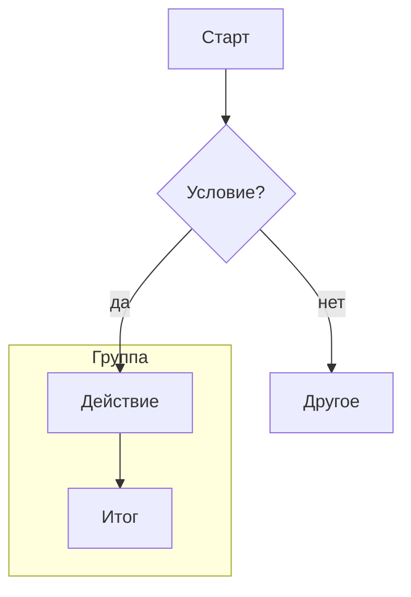
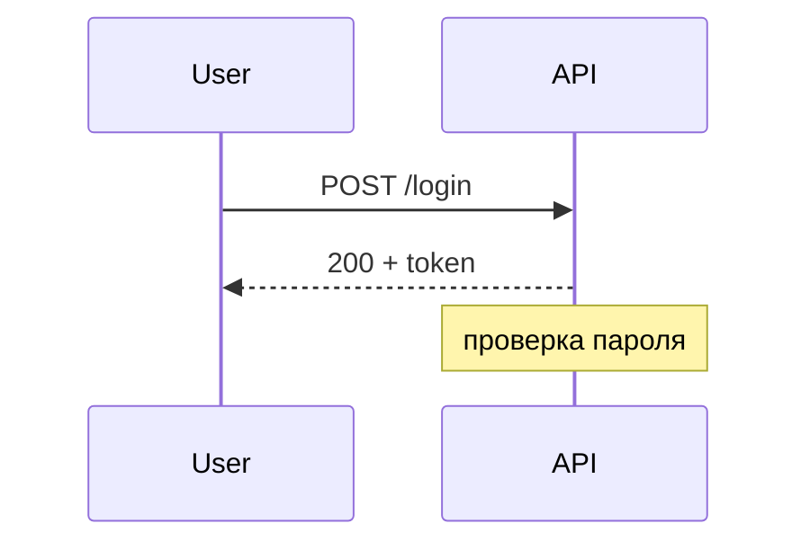
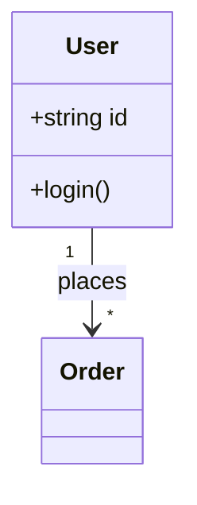
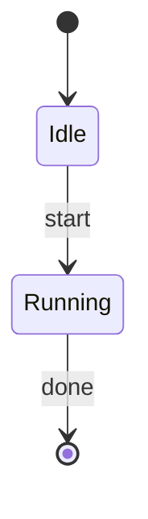
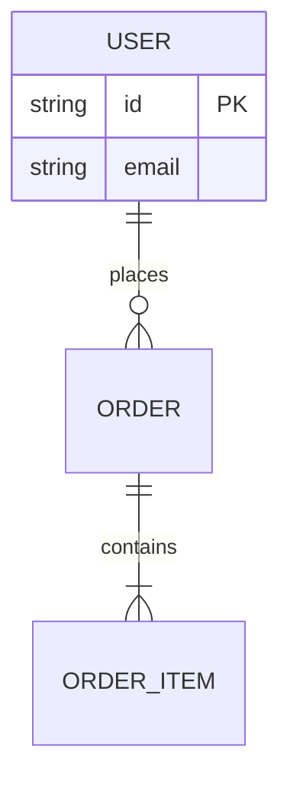
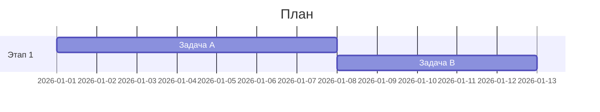

# Навык: Mermaid-диаграммы

Цель — по описанию/исходнику выдать **валидный, читаемый Mermaid** (`.mmd`), который проходит реальный рендер. Синтаксис Mermaid **версионно-зависим** — фиксируй версию. Валидацию/рендер/экспорт см. в скилле `mermaid-rendering`.

**Как пользоваться.** Этот файл — маршрутизатор и свод правил: [выбери тип](#1-выбор-типа--справочника) → открой соответствующий файл из `references/` для точного синтаксиса → собери диаграмму по [правилам качества](#4-правила-качества) → перед сдачей пройди [чек-лист ловушек](#5-ловушки-проверено-рендером) → прогони реальный рендер. Мини-примеры в §2 нужны, чтобы начать без чтения справочника; всё остальное — в `references/`.

## 1. Выбор типа → справочника

| Задача | Тип | Справочник |
|---|---|---|
| Процесс, логика, пайплайн, дерево решений | `flowchart` | [references/flowchart.md](references/flowchart.md) |
| Взаимодействие во времени, API-вызовы, протокол | `sequenceDiagram`, `zenuml` | [references/sequence.md](references/sequence.md) |
| Структура классов/типов, ООП-модель | `classDiagram` | [references/class.md](references/class.md) |
| Состояния и переходы, конечный автомат | `stateDiagram-v2` | [references/state.md](references/state.md) |
| Модель данных, схема БД | `erDiagram` | [references/er.md](references/er.md) |
| План проекта, сроки, вехи | `gantt` | [references/gantt.md](references/gantt.md) |
| Ветки, коммиты, релизная модель | `gitGraph` | [references/gitgraph.md](references/gitgraph.md) |
| Архитектура по C4 (context/container/component) | `C4Context` и др. | [references/c4.md](references/c4.md) |
| Инфраструктура, сервисы и связи, схема из блоков | `architecture-beta`, `block` | [references/architecture.md](references/architecture.md) |
| Иерархия идей, дерево файлов, лента событий, доска задач | `mindmap`, `treeView-beta`, `timeline`, `kanban` | [references/hierarchy.md](references/hierarchy.md) |
| Данные и метрики (доли, ряды, оси, потоки, множества, пакет) | `pie`, `xychart`, `radar-beta`, `quadrantChart`, `sankey-beta`, `treemap-beta`, `venn-beta`, `packet` | [references/charts.md](references/charts.md) |
| Требования, user journey, дорожки, event modeling, Cynefin, Ishikawa, Wardley, EBNF, UML use case | `requirementDiagram`, `journey`, `swimlane-beta`, `usecase-beta` и др. | [references/modeling.md](references/modeling.md) |
| Настройка диаграммы (frontmatter, `%%{init}%%`, layout, math, securityLevel) | — | [references/config.md](references/config.md) |
| Темы и цвета, брендирование | — | [references/theming.md](references/theming.md) |
| Ловушки синтаксиса и типовые AI-ошибки, проверенные рендером | — | [references/gotchas.md](references/gotchas.md) |

Не уверен между близкими типами: процесс → `flowchart`; кто-кому-когда → `sequenceDiagram`; сущности и связи → `erDiagram`; жизненный цикл одного объекта → `stateDiagram-v2`.

## 2. База синтаксиса (хватает для простой диаграммы)

- Первая строка — **тип диаграммы** (`flowchart TD`, `sequenceDiagram`, `classDiagram`…). Опечатка тут (`lowchart`) ломает весь файл: mermaid не определяет тип и падает с `UnknownDiagramError`.
- Комментарии — строки, начинающиеся с `%%`.
- Направление flowchart: `TD`/`TB` (сверху вниз), `LR` (слева направо), `RL`, `BT`.
- Подписи со спецсимволами, скобками, кавычками — **обязательно** в кавычках: `A["Текст (v2) & детали"]`.
- Заголовок и конфиг — через YAML-frontmatter самой диаграммы:
  ```mermaid
  ---
  title: Поток авторизации
  config:
    theme: neutral
  ---
  flowchart LR
      U["Пользователь"] --> API["API"] --> DB[("БД")]
  ```

**flowchart** — процессы и логика:

Узлы: `[прямоуг]` · `(скруглённый)` · `([стадион])` · `{ромб}` · `[(БД)]` · `((круг))`. Связи: `-->` · `---` · `-.->` (пунктир) · `==>` (толстая) · `-->|подпись|`.

**sequenceDiagram** — взаимодействие во времени:

`->>` вызов, `-->>` ответ, `alt/else/end`, `loop/end`, `Note`.

**classDiagram** — структура классов:

Связи: `<|--` наследование, `*--` композиция, `o--` агрегация, `-->` ассоциация.

**stateDiagram-v2** — состояния и переходы:


**erDiagram** — модель данных (следи за кардинальностями):

Кардинальность: `||` ровно один, `o{` ноль-или-много, `|{` один-или-много.

**gantt** — план проекта:


Всё остальное — по таблице §1 в `references/`.

## 3. Группировка, цвета, стили

- **subgraph** — логические группы (парный `end`):
  ```mermaid
  flowchart TD
      subgraph BACKEND["Сервер"]
          API --> DB
      end
  ```
- **classDef + class** — семантические цвета (роль → класс):
  ```mermaid
  flowchart LR
      API --> DB
      classDef service fill:#dae8fc,stroke:#6c8ebf
      class API,DB service
  ```
- **style** — точечный стиль одного узла: `style A fill:#f8cecc,stroke:#b85450`.
- Одинаковая роль → один класс/цвет; текст держи читаемым, граф не перегружай.
- Брендирование и темы целиком — [references/theming.md](references/theming.md).

## 4. Правила качества

- **Тип под задачу** (таблица §1) — половина качества диаграммы.
- **Направление осознанно** (`LR` для длинных цепочек, `TD` для деревьев).
- **Разбивай** большие схемы на несколько диаграмм вместо одного нечитаемого графа.
- **Фиксируй версию Mermaid** — синтаксис версионно-зависим, «беты» появляются и переименовываются.
- **Реальный рендер — окончательный критерий** (скилл `mermaid-rendering`): не отдавай `.mmd`, не прошедший `mmdc`/`mcp-mermaid`.
- **Зелёный рендер ≠ читаемая схема.** Он доказывает только законность синтаксиса. Если можешь посмотреть на готовый PNG/SVG — проверь: не обрезаны ли подписи (сократи или разбей `<br/>`), не слиплись ли узлы и не спутались ли связи (смени `TD`↔`LR`, разнеси по `subgraph`), не вышли ли нелепые пропорции, хватает ли контраста текста к заливке, тот ли вообще выбран тип. Не больше двух кругов правок, после каждого — рендер заново.

## 5. Ловушки (проверено рендером)

Проверено на `@mermaid-js/mermaid-cli` 11.16.0 / `mermaid` 11.16.1. Полный разбор с сообщениями парсера — [references/gotchas.md](references/gotchas.md).

| Ловушка | Что происходит |
|---|---|
| `A[start] --> end` | **Parse error.** `end` зарезервировано — пиши `End`, `[end]` или `"end"` |
| `A[Text (v2)]` | **Parse error** на `PS`. Скобки/кавычки/`#`/`;` в подписи → оборачивай в `A["Text (v2)"]` |
| `lowchart TD` | **UnknownDiagramError** — тип не определён, весь файл невалиден |
| `alt`/`loop`/`subgraph` без `end` | **Parse error** на следующей конструкции |
| `class A myClass`, где `classDef myClass` не объявлен | Рендерится **молча без стиля** — рендер зелёный, диаграмма не та |
| Смешивание синтаксиса разных типов | Parse error либо «пустая» диаграмма |
| Неверная кардинальность ERD | Рендерится, но модель данных врёт — сверяй по `references/er.md` |

Работает штатно: HTML в подписях (`<b>`, `<br/>`), обратные кавычки, кириллица и `&` внутри `["..."]`.

## 6. Источник

Справочники в `references/` дистиллированы из официальной документации `mermaid-js/mermaid` (`docs/syntax`, `docs/config`), каждый пример проверен реальным рендером на mermaid 11.16.1.
