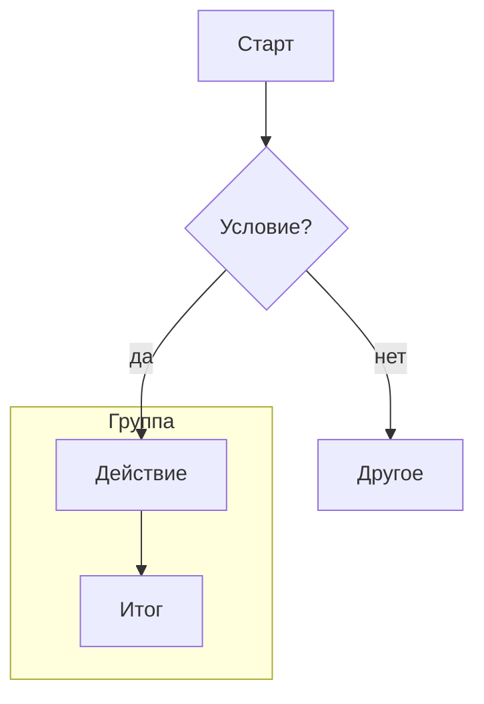
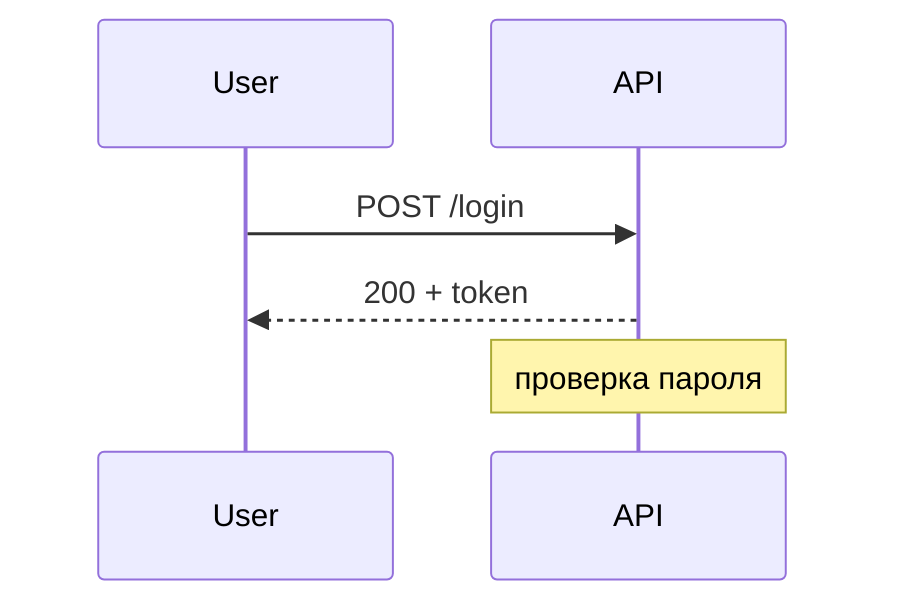
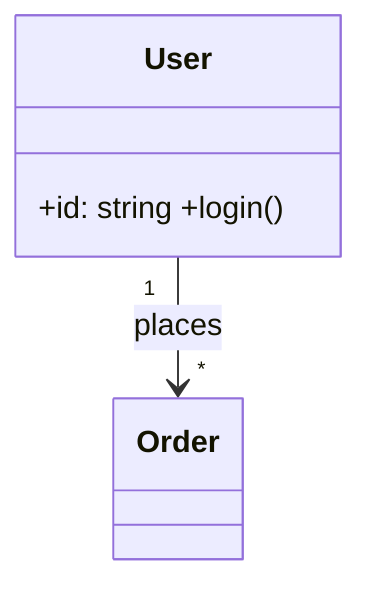
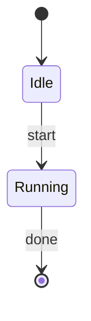
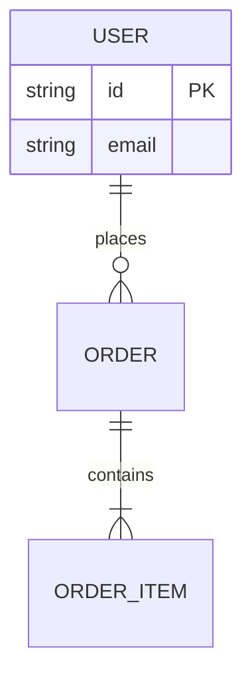
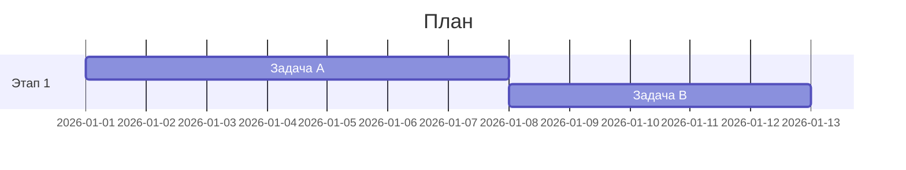

# Навык: Mermaid-диаграммы

Цель — по описанию/исходнику выдать **валидный, читаемый Mermaid** (`.mmd`), который проходит реальный рендер. Синтаксис Mermaid **версионно-зависим** — фиксируй версию. Валидацию/рендер/экспорт см. в скилле `mermaid-rendering`.

## 1. Общий синтаксис
- Первая строка — **тип диаграммы** (`flowchart TD`, `sequenceDiagram`, `classDiagram`…). Опечатка тут (`lowchart`) ломает весь файл.
- Комментарии — строки, начинающиеся с `%%`.
- Направление flowchart: `TD`/`TB` (сверху вниз), `LR` (слева направо), `RL`, `BT`.
- Подписи со спецсимволами, скобками, кавычками — оборачивай в кавычки: `A["Текст (v2) & детали"]`.

## 2. Каталог типов (мини-примеры)

**flowchart** — процессы, логика, пайплайны:

Узлы: `[прямоуг]` · `(скруглённый)` · `([стадион])` · `{ромб}` · `[(БД)]` · `((круг))`. Связи: `-->` · `---` · `-.->` (пунктир) · `==>` (толстая) · `-->|подпись|`.

**sequenceDiagram** — взаимодействие во времени:

`->>` вызов, `-->>` ответ, `alt/else/end`, `loop/end`, `Note`.

**classDiagram** — структура классов/типов:

Связи: `<|--` наследование, `*--` композиция, `o--` агрегация, `-->` ассоциация.

**stateDiagram-v2** — состояния и переходы:


**erDiagram** — модель данных (кардинальности!):

Кардинальность: `||` ровно один, `o{` ноль-или-много, `|{` один-или-много.

**gantt** — план проекта:


Прочие: **pie** (доли), **gitGraph** (ветки/коммиты), **mindmap** (идеи, отступами), **timeline** (события по годам), **journey** (user journey), **quadrantChart** (2×2), **sankey-beta** (потоки), **C4Context** (архитектура C4), **requirementDiagram**, **block-beta**.

## 3. Группировка, цвета, стили
- **subgraph** — логические группы (парный `end`):
  ```mermaid
  subgraph BACKEND["Сервер"]
      API --> DB
  end
  ```
- **classDef + class** — семантические цвета (роль → класс):
  ```mermaid
  classDef service fill:#dae8fc,stroke:#6c8ebf;
  class API,DB service
  ```
- **style** — точечный стиль одного узла: `style A fill:#f8cecc,stroke:#b85450`.
- Одинаковая роль → один класс/цвет; текст держи читаемым, граф не перегружай.

## 4. Частые AI-ошибки (проверяй ВСЕГДА)
- Опечатка заголовка: `lowchart`/`sequbceDiagram` → правь на точный тип.
- `end` в нижнем регистре как текст узла ломает flowchart — пиши `End`, `[End]` или в кавычках.
- Скобки/кавычки/`#`/`;` в подписях без обрамления `["..."]` → синтакс-ошибка.
- Непарные `subgraph … end`; лишние/недостающие `end` в `alt/loop`.
- Неверная кардинальность ERD; смешивание синтаксиса разных типов.
- Слишком широкий граф без `subgraph`/направления → нечитаемо.

## 5. Правила качества
- **Тип под задачу** (процесс→flowchart, время→sequence, данные→ER, классы→class, состояния→state, план→gantt).
- **Направление осознанно** (`LR` для длинных цепочек, `TD` для деревьев).
- **Разбивай** большие схемы на несколько диаграмм/страниц.
- **Реальный рендер — окончательный критерий** (скилл `mermaid-rendering`): не отдавай `.mmd`, не прошедший `mmdc`/`mcp-mermaid`.
