# Architecture (architecture-beta) и Block

Две «схемы из коробок» с ручным управлением расположением: `architecture-beta` (v11.1.0+) — сервисы, группы и рёбра для облачных и CI/CD-архитектур с иконками; `block` — сетка блоков, где автор полностью контролирует позиции. **Не применять**, когда нужен поток управления с ветвлениями и автолейаутом (`flowchart`), последовательность во времени (`sequenceDiagram`) или строгая модель C4 (`C4Context`).

## Минимальный скелет

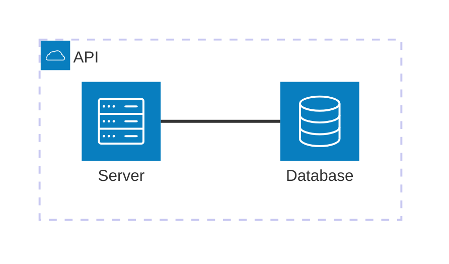

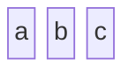

## Синтаксис

Строительные блоки `architecture-beta` — `group`, `service`, `edge`, `junction`. Иконка объявляется в круглых скобках `()`, подпись — в квадратных `[]`. Блоки можно объявлять в любом порядке, но идентификатор должен быть объявлен раньше, чем на него ссылаются.

### Группы

```
group {group id}({icon name})[{title}] (in {parent id})?
```

Опциональное `in {parent id}` вкладывает группу в другую группу.

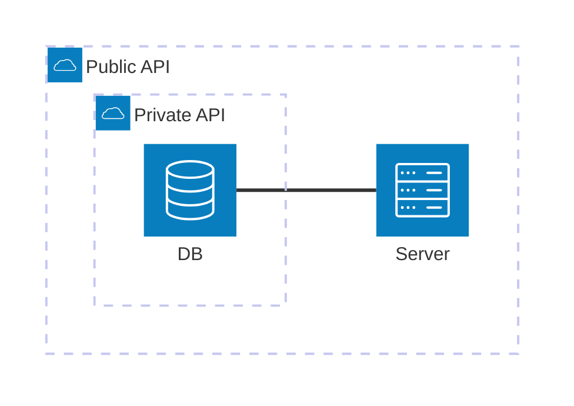

### Сервисы

```
service {service id}({icon name})[{title}] (in {parent id})?
```

Иконка необязательна — `service a[A]` рендерится без неё. Подпись без кавычек допускает только латиницу, цифры и пробелы; всё остальное (кириллица, диакритика, дефис, точка) требует кавычек внутри скобок — `["DB v2 - main"]`.

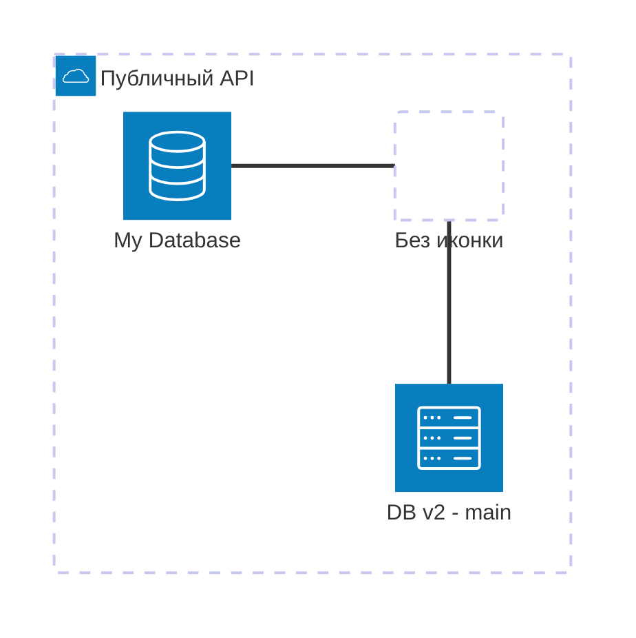

### Рёбра

```
{serviceId}{{group}}?:{T|B|L|R} {<}?--{>}? {T|B|L|R}:{serviceId}{{group}}?
```

- **Сторона выхода** задаётся двоеточием и буквой `L` (left), `R` (right), `T` (top), `B` (bottom): `db:R -- L:server` — ребро выходит справа у `db` и входит слева у `server`. Разные оси дают ребро с изломом 90°: `db:T -- L:server`.
- **Стрелки**: `<` перед направлением слева и/или `>` после направления справа. `subnet:R --> L:gateway` — стрелка входит в `gateway`; `a:R <--> L:b` — двусторонняя.

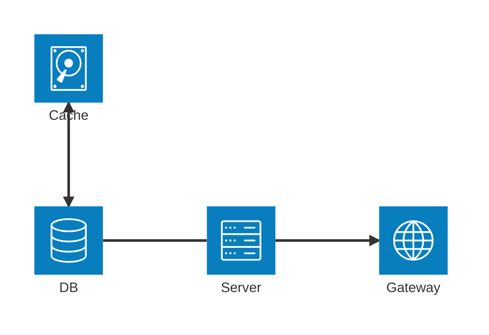

### Рёбра из групп

Модификатор `{group}` после `serviceId` выводит ребро наружу группы — рядом с указанным сервисом:

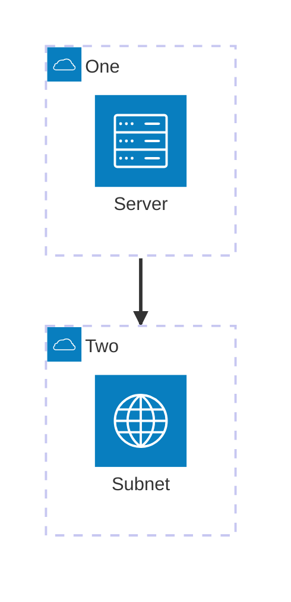

`groupId` в рёбрах использовать **нельзя**; модификатор `{group}` работает только для сервисов, лежащих внутри группы.

### Выравнивание соседей — `align` (v11.16.0+)

Когда несколько сервисов имеют одинаковую топологию рёбер (например, три базы подключены через `R --> L:mcp`), эвристика раскладки может схлопнуть их в одну координату и нарисовать друг поверх друга. Директива `align` объявляет общую строку (одинаковый y) или колонку (одинаковый x) и разносит участников по этой оси.

```
align row {idA} {idB} {idC} ...
align column {idA} {idB} ...
```

Участники должны быть уже объявлены как `service` или `junction`, минимум двое; каждая директива — на своей строке. Порядок перечисления задаёт порядок вдоль оси, зазор регулируется `idealEdgeLengthMultiplier`.

- **`align column`** — когда участники связаны с общим узлом *горизонтальной парой портов* (`R --> L:...`): получается вертикальный стек сбоку.
- **`align row`** — когда связь идёт *вертикальной парой портов* (`B --> T:...`): получается горизонтальный ряд над узлом.


**Сетка.** `align row` фиксирует только y. Чтобы колонки совпали между ярусами, к каждому `align row` добавьте `align column`; колонки можно тянуть через сколько угодно ярусов и через границы групп.


Рёбра между выровненными узлами рисуются прямыми линиями; поперечные — с одним изломом 90°.

### Junction

Junction — узел-развилка на четыре стороны:

```
junction {junction id} (in {parent id})?
```

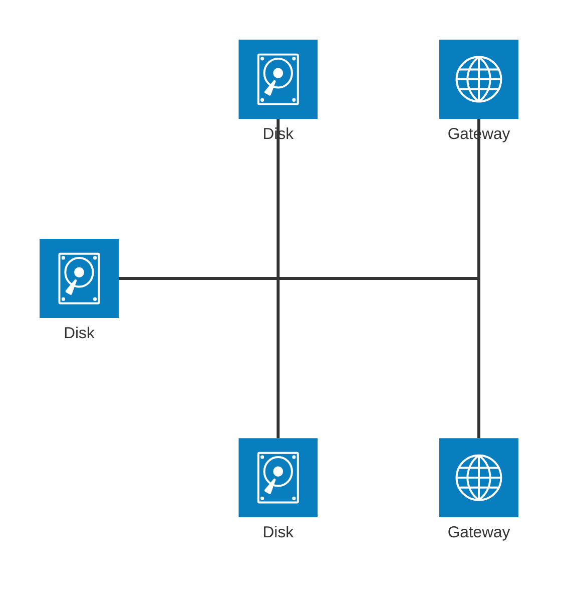

### Иконки

Из коробки доступны `cloud`, `database`, `disk`, `internet`, `server`. После регистрации набора иконок на стороне интегратора (`mermaid.registerIconPacks`) доступны 200 000+ иконок iconify.design в формате `name:icon-name`, где `name` — имя набора при регистрации.

```mermaid
architecture-beta
    group api(logos:aws-lambda)[API]
    service db(logos:aws-aurora)[Database] in api
    service disk1(logos:aws-glacier)[Storage] in api
    service server(logos:aws-ec2)[Server] in api
    db:L -- R:server
    disk1:T -- B:server
```

### Конфигурация architecture

Через frontmatter `config: architecture:` (или `mermaid.initialize({ architecture: {...} })`).

| Опция | Тип | По умолчанию | Что делает |
| --- | --- | --- | --- |
| `randomize` (v11.14.0+) | boolean | `false` | Рандомизировать стартовые позиции узлов перед раскладкой |
| `nodeSeparation` (v11.15.0+) | number | `75` | Минимальный зазор в пикселях между соседями одной группы (pass-through в fcose) |
| `idealEdgeLengthMultiplier` (v11.15.0+) | number | `1.5` | Множитель к `iconSize` для идеальной длины рёбер внутри группы; межгрупповые рёбра не затрагивает |
| `edgeElasticity` (v11.15.0+) | number | `0.45` | Упругость пружины (0–1) на рёбрах внутри группы: выше — узлы ближе |
| `numIter` (v11.15.0+) | number | `2500` | Максимум итераций fcose: больше — лучше раскладка, дольше рендер |
| `seed` (v11.15.0+) | number | `1` | Детерминированное зерно fcose. `0` — нативный `Math.random` (недетерминированно), другое число — другой воспроизводимый вариант |

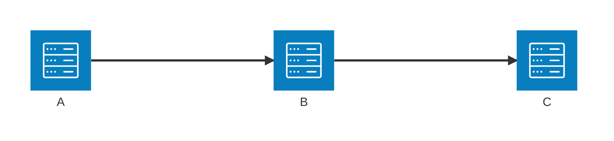

`randomize: false` сам по себе не гарантирует одинаковый рендер — fcose всё равно дёргает `Math.random()` в решателе ограничений; полную фиксацию даёт `seed`.

### Accessibility (architecture)

`accTitle:` и `accDescr:` поддерживаются (проверено рендером на 11.16.1):

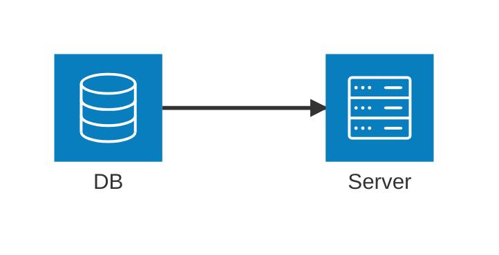

## block

Заголовок — `block` (алиас `block-beta` тоже рендерится). Автор полностью контролирует позиции: блоки укладываются по сетке в порядке записи.

### Колонки и ширина блока

`columns N` задаёт число колонок; блоки переносятся на следующий ряд. `id:N` растягивает блок на `N` колонок.

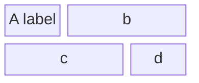

Вертикальную «стопку» делают колонкой из одной ячейки:

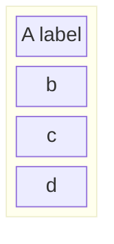

### Составные блоки

Вложенный блок открывается `block` (или `block:id`, `block:id:N` с шириной) и закрывается `end`. У вложенного блока может быть своя `columns`; без неё действует `columns auto`.

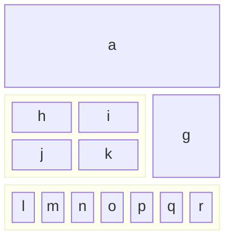

Ширина колонки определяется самым широким блоком в ней.

### Формы блоков

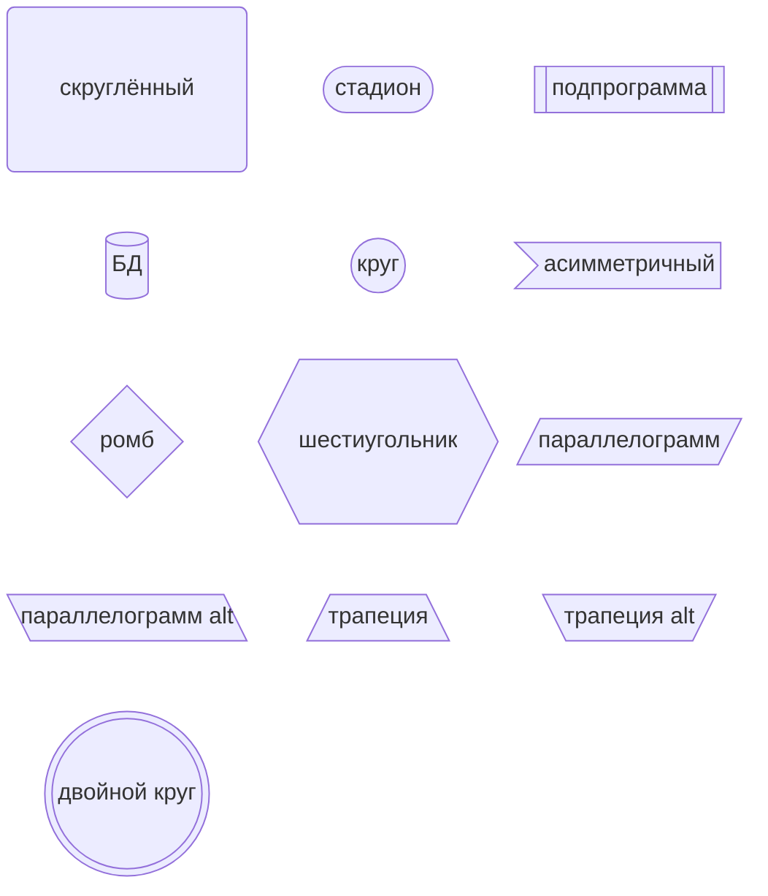

### Block-стрелки и space

Block-стрелка: `id<["Подпись"]>(направление)`. Направления: `right`, `left`, `up`, `down`, `x` (влево-вправо), `y` (вверх-вниз), а также комбинации через запятую — `(x, down)`.

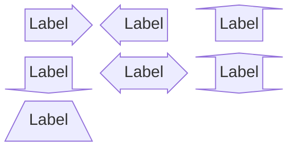

`space` вставляет пустую ячейку, `space:N` — пустоту шириной в `N` колонок.

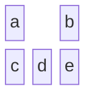

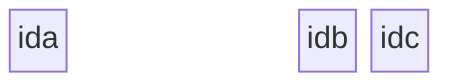

### Связи и подписи

Стрелки те же, что во flowchart: `-->`, `---`; подпись — `-- "текст" -->`. Соединять можно и составной блок по его `id`.

```mermaid
block
columns 1
  db(("DB"))
  arrow<["&nbsp;&nbsp;&nbsp;"]>(down)
  block:ID
    A
    B["A wide one in the middle"]
    C
  end
  space
  D
  ID --> D
  C --> D
  style B fill:#969,stroke:#333,stroke-width:4px
```

```mermaid
block
  columns 4
  A space:2 B
  A-- "X" -->B
```

### Стили и классы

`style <id> <css>` — точечно; `classDef <имя> <css>;` + `class <id[,id2]> <имя>` — переиспользуемо.

```mermaid
block
  columns 3
  A space B
  A-->B
  classDef blue fill:#6e6ce6,stroke:#333,stroke-width:4px;
  class A blue
  style B fill:#bbf,stroke:#f66,stroke-width:2px,color:#fff,stroke-dasharray: 5 5
```

Практический пример — архитектура с классами по ролям:

```mermaid
block
  columns 3
  Frontend arrowRight<[" "]>(right) Backend
  space:2 down<[" "]>(down)
  Disk left<[" "]>(left) Database[("Database")]

  classDef front fill:#696,stroke:#333;
  classDef back fill:#969,stroke:#333;
  class Frontend front
  class Backend,Database back
```

Комментарии — `%%` в начале строки.

## Ловушки

**architecture-beta**

- **Идентификатор должен быть объявлен раньше ссылки на него** — сервис в `in group`, ребро между сервисами. Порядок объявления групп/сервисов/рёбер иначе свободный.
- **`groupId` нельзя использовать как конец ребра.** Наружу группы выводит только модификатор `{group}` на сервисе внутри неё.
- **Наложение сервисов друг на друга** при одинаковой топологии рёбер — известное ограничение эвристики (issue #6120). `nodeSeparation`/`idealEdgeLengthMultiplier`/`edgeElasticity` тут **не помогут**: они лишь тюнят fcose, но не меняют логические позиции. Лечится `align row|column`.
- **Порядок в `align` не должен противоречить направлениям рёбер**: документация предупреждает, что при `a:L --> R:b` (то есть `a` правее `b`) директива `align row a b` конфликтует с ребром и раскладка может не построиться — пишите `align row b a` или убирайте конфликтующее ребро.
- **Длинная однословная подпись** не влезает в строку при маленьком `iconSize` — поднимайте `iconSize` или сокращайте заголовок.
- **`randomize: false` ≠ детерминированный рендер** — фиксируйте `seed`.
- **Кириллица и пунктуация в подписи без кавычек ломают рендер** (проверено на 11.16.1): `service db(database)[База]`, `[Café]`, `[DB v2 - main]` дают Syntax error. Лечится кавычками: `service db(database)["База"]`. Идентификаторы (`service база(...)`) кириллицей писать нельзя вообще — кавычки там не спасают, только латиница.
- **Пустые скобки иконки `service plain()[Plain]` — синтаксическая ошибка** (проверено на 11.16.1). Либо иконка, либо вообще без скобок: `service plain[Plain]`.
- **Иконки вне пяти базовых** (`cloud`, `database`, `disk`, `internet`, `server`) требуют зарегистрированного icon pack; без него `logos:aws-ec2` парсится, но иконка не отрисовывается.

**block**

- **`accTitle:` / `accDescr:` ломают `block`** — parse error `Expecting 'BLOCK_DIAGRAM_KEY', ... got 'acc_title'` (проверено на 11.16.1). В `architecture-beta` и `C4*` они работают, в `block` — нет.
- **Соседние блоки не соединяются напрямую**: чтобы нарисовать стрелку, между блоками нужна пустая ячейка — `A space B` и затем `A --> B`. Запись `A - B` невалидна: связь задаётся только `-->` или `---`.
- **Стиль пишется с двоеточиями и запятыми**: `style A fill#969;` не сработает, правильно `style A fill:#969,stroke:#333;`.
- **Подписи со спецсимволами** оборачивайте в кавычки внутри формы: `B["A wide one in the middle"]`.
- **`columns` действует на текущий уровень вложенности** — у каждого составного блока своя сетка; без явного `columns` внутри работает `columns auto`.

## Источник

Дистиллировано из официальной документации mermaid-js/mermaid (docs/syntax), проверено рендером на mermaid-cli 11.16.0 / mermaid 11.16.1.
