# C4

Архитектура по модели C4 — контекст системы, контейнеры, компоненты, динамика вызовов и развёртывание; синтаксис совместим с C4-PlantUML. **Не применять**, когда нужен автолейаут или произвольный граф: C4 в mermaid помечен как **экспериментальный** (синтаксис и свойства могут меняться), раскладка задаётся порядком строк, а не алгоритмом — для свободных схем берите `flowchart` или `architecture-beta`.

## Минимальный скелет

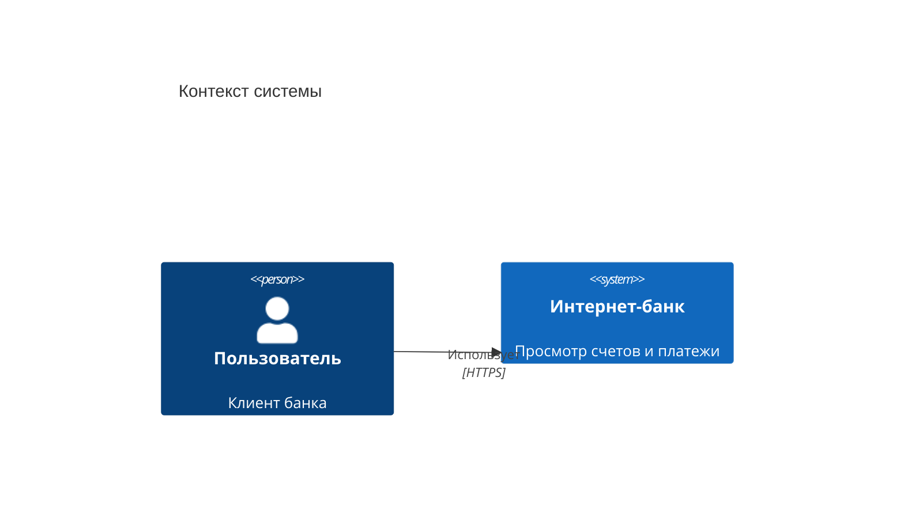

## Синтаксис

### Пять типов диаграмм

Тип задаётся первой строкой, `title <текст>` — необязательный заголовок.

| Заголовок | Уровень C4 |
| --- | --- |
| `C4Context` | System Context — система и её окружение |
| `C4Container` | Container — приложения/хранилища внутри системы |
| `C4Component` | Component — компоненты внутри контейнера |
| `C4Dynamic` | Dynamic — пронумерованная последовательность вызовов |
| `C4Deployment` | Deployment — узлы развёртывания и что на них крутится |

Элементы, границы и связи из разных уровней синтаксически доступны в любом типе (в `C4Component` штатно используются `Container(...)` и `System_Ext(...)` для окружения).

### Элементы уровня Context: Person и System

Сигнатуры: `Person(alias, label, ?descr, ?sprite, ?tags, $link)`, `System(alias, label, ?descr, ?sprite, ?tags, $link)`.

Варианты: суффикс `_Ext` — внешний (серая заливка), `Db` — цилиндр (хранилище), `Queue` — очередь.

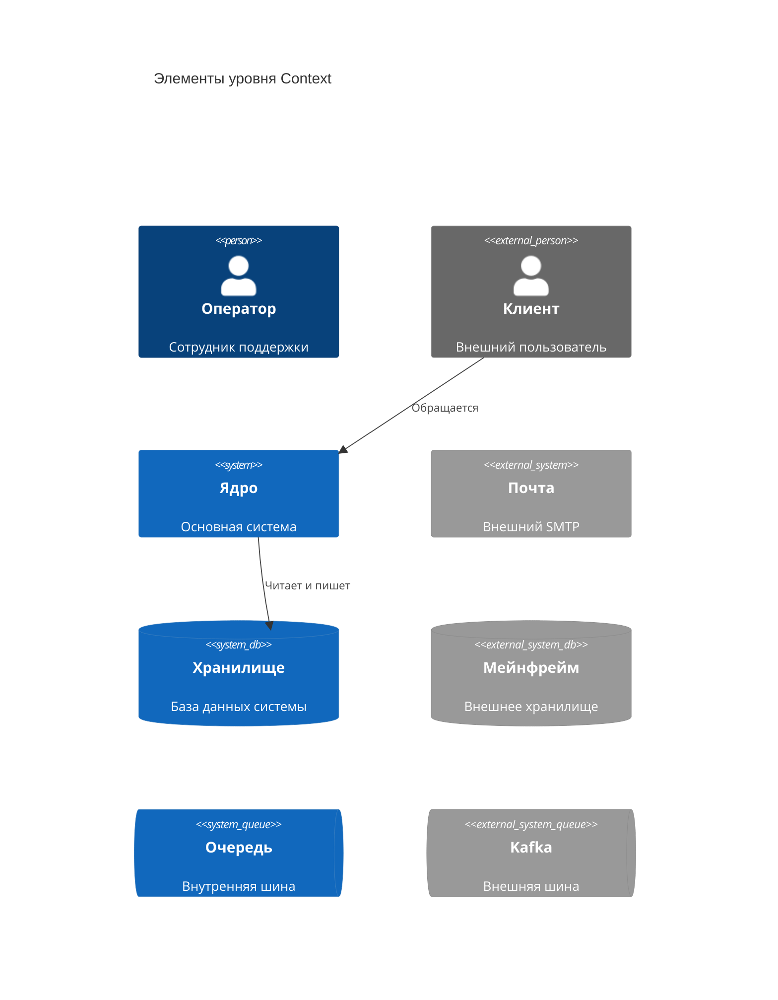

### Container

`Container(alias, label, ?techn, ?descr, ?sprite, ?tags, $link)` — **третий аргумент здесь технология, а не описание** (в отличие от `System`). Варианты: `ContainerDb`, `ContainerQueue`, `Container_Ext`, `ContainerDb_Ext`, `ContainerQueue_Ext`.

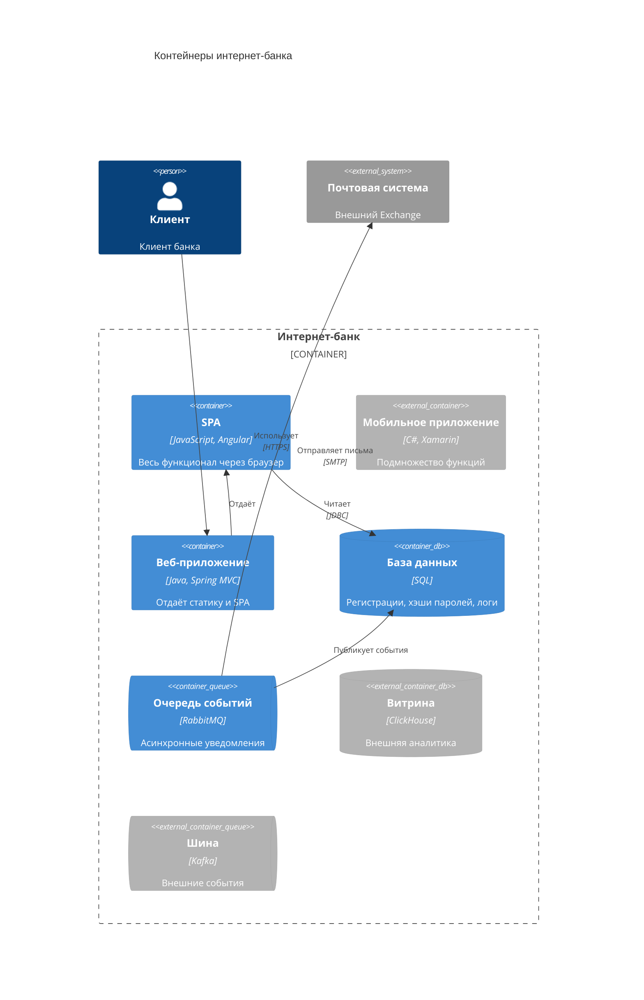

### Component

`Component(alias, label, ?techn, ?descr, ?sprite, ?tags, $link)` плюс `ComponentDb`, `ComponentQueue`, `Component_Ext`, `ComponentDb_Ext`, `ComponentQueue_Ext`.

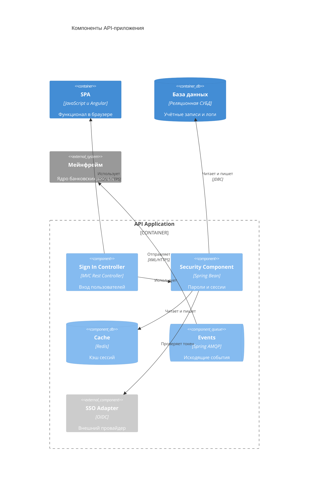

### Границы

Открывающая скобка `{` идёт в той же строке, закрывающая `}` — на своей. Вложенность произвольная.

- `Boundary(alias, label, ?type, ?tags, $link)` — универсальная; `type` печатается меткой типа границы.
- `Enterprise_Boundary(alias, label, ?tags, $link)`
- `System_Boundary(alias, label, ?tags, $link)`
- `Container_Boundary(alias, label, ?tags, $link)`

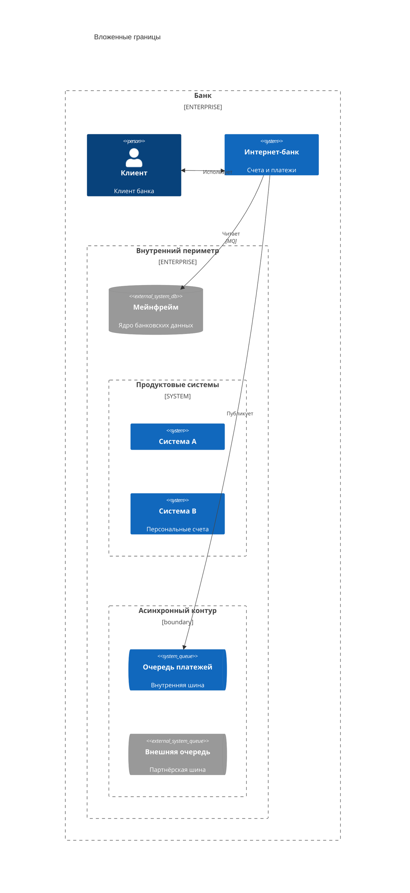

### Deployment

- `Deployment_Node(alias, label, ?type, ?descr, ?sprite, ?tags, $link)`
- `Node(...)` — короткий псевдоним `Deployment_Node`
- `Node_L(...)` — выравнивание влево, `Node_R(...)` — вправо

Узлы вкладываются друг в друга и содержат `Container*`.

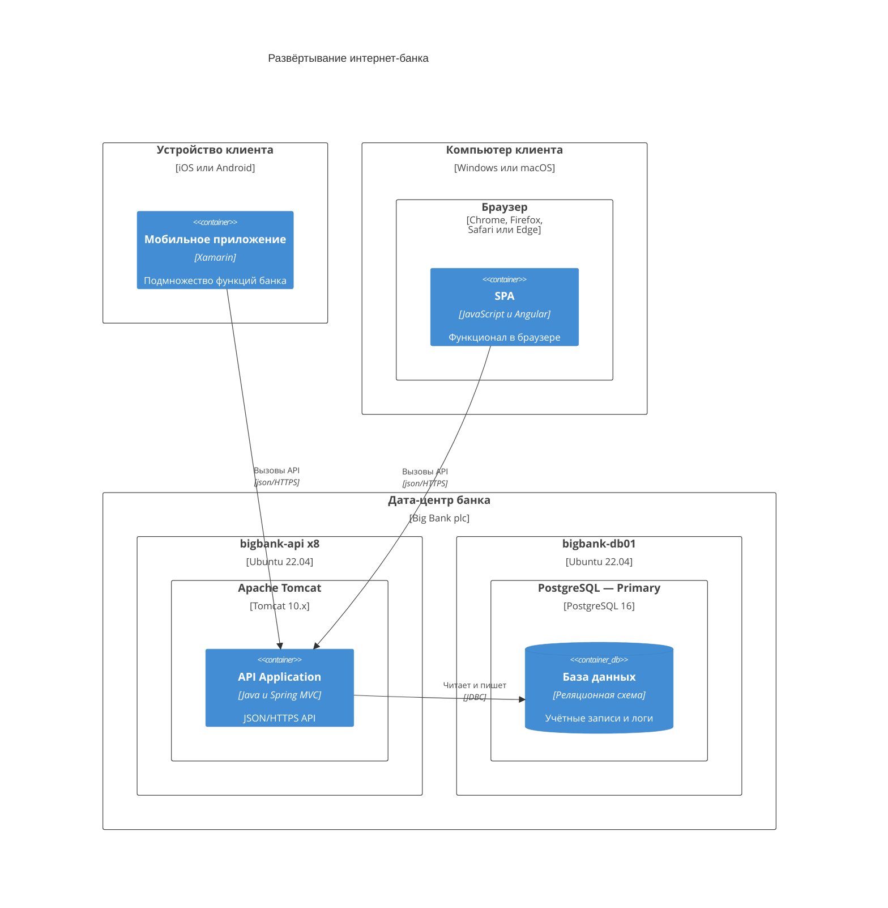

### Dynamic

Связи нумеруются **в порядке их записи**. `RelIndex(index, from, to, label, ?tags, $link)` принимается ради совместимости с C4-PlantUML, но параметр `index` игнорируется.

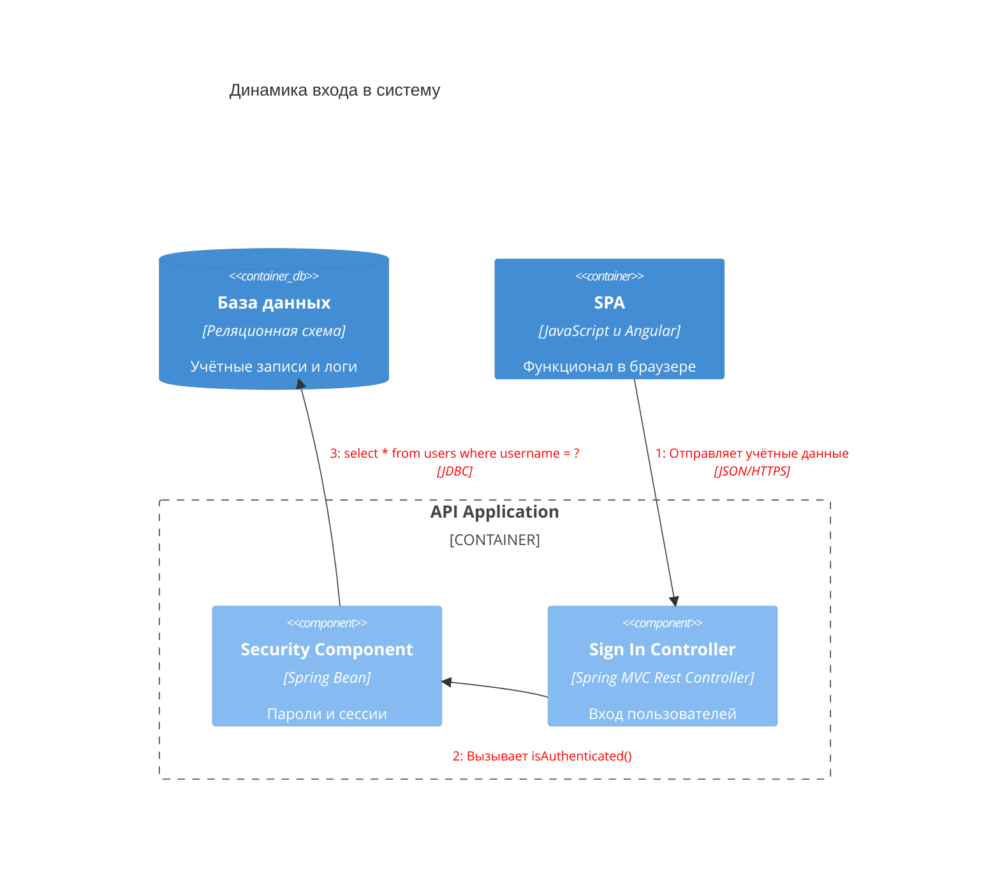

### Связи

`Rel(from, to, label, ?techn, ?descr, ?sprite, ?tags, $link)`.

| Форма | Смысл |
| --- | --- |
| `Rel` | обычная направленная связь |
| `BiRel` | двусторонняя связь |
| `Rel_U` / `Rel_Up` | подсказка «вверх» |
| `Rel_D` / `Rel_Down` | подсказка «вниз» |
| `Rel_L` / `Rel_Left` | подсказка «влево» |
| `Rel_R` / `Rel_Right` | подсказка «вправо» |
| `Rel_Back` | стрелка в обратную сторону |
| `RelIndex` | как `Rel`, индекс игнорируется |

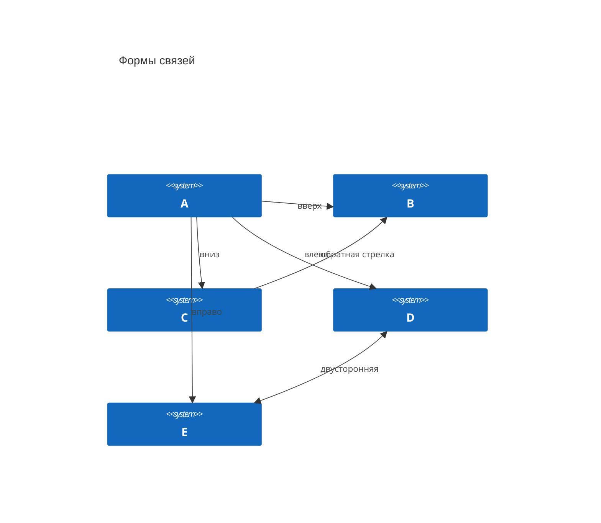

### Стилизация и раскладка

Пишутся **в конце** диаграммы:

- `UpdateElementStyle(elementName, ?bgColor, ?fontColor, ?borderColor, ?shadowing, ?shape, ?sprite, ?techn, ?legendText, ?legendSprite)` — меняет стиль элемента, отдельной записи легенды не создаёт.
- `UpdateRelStyle(from, to, ?textColor, ?lineColor, ?offsetX, ?offsetY)` — цвет связи и **смещение подписи** относительно исходной позиции.
- `UpdateLayoutConfig(?c4ShapeInRow, ?c4BoundaryInRow)` — сколько фигур в ряду (по умолчанию `4`) и сколько границ в ряду (по умолчанию `2`).

Параметры с `?` задаются **позиционно** либо **именованно** через `$`; формы эквивалентны:

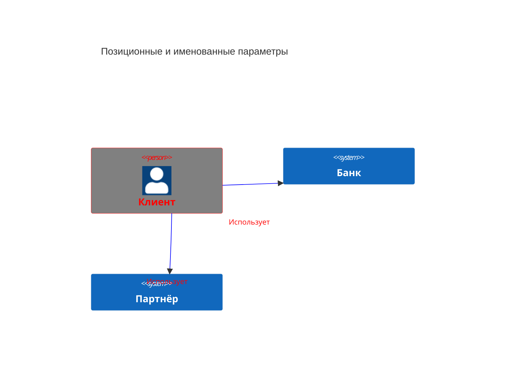

### Перенос текста в элементе

По умолчанию текст элемента (имя, тип, описание) остаётся в одну строку, а элемент растягивается по самой длинной строке. Корневой конфиг `wrap: true` включает перенос по ширине элемента, ширина задаётся `c4.width`.

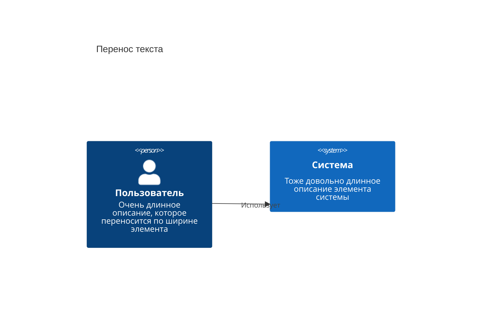

Ручной перенос — тег ` ` внутри подписи.

### Accessibility

`accTitle:` и `accDescr:` поддерживаются (проверено рендером на 11.16.1):

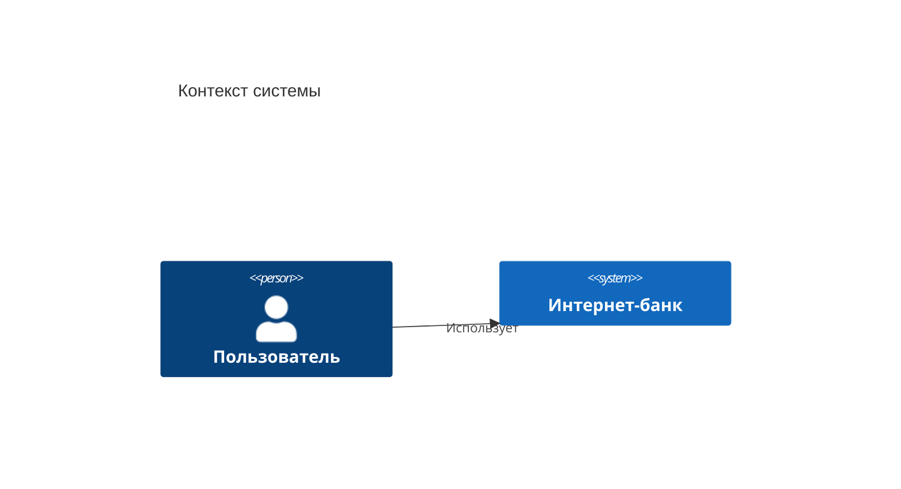

### Что НЕ поддерживается

Разбирается парсером, но игнорируется или не реализовано:

- `sprite`, `tags`, `link`, автоматическая **Legend** — не реализованы (аргументы `$tags=` / `$link=` синтаксически принимаются и ничего не рисуют).
- `AddElementTag(...)`, `AddRelTag(...)` — нет.
- `RoundedBoxShape()`, `EightSidedShape()`, `DashedLine()`, `DottedLine()`, `BoldLine()` — нет.
- Раскладочные операторы `Lay_U`/`Lay_Up`, `Lay_D`/`Lay_Down`, `Lay_L`/`Lay_Left`, `Lay_R`/`Lay_Right` — **не поддерживаются и поддерживаться не планируют**; на 11.16.1 `Lay_U(a, b)` даёт лексическую ошибку и ломает всю диаграмму. Позицию фигур меняют порядком строк и `UpdateLayoutConfig`.

## Ловушки

- **`Lay_*` ломает рендер** — лексическая ошибка (проверено на 11.16.1). Порядок фигур задаётся только порядком объявлений.
- **Раскладка не автоматическая.** Переставляйте строки и крутите `UpdateLayoutConfig($c4ShapeInRow, $c4BoundaryInRow)`, а подписи связей двигайте `$offsetX`/`$offsetY` — иначе они наезжают на стрелки.
- **Третий аргумент разный у разных элементов**: у `System`/`Person` это описание, у `Container`/`Component` — технология, у `Boundary`/`Deployment_Node` — тип. Перепутанные аргументы не ломают рендер, но подписывают элемент неверно.
- **`UpdateElementStyle` / `UpdateRelStyle` только для уже объявленных элементов** и пишутся в конце диаграммы; `updateElementStyle` со строчной буквы — это исторический алиас, который обновляет стиль **связи**, а не элемента, включая смещение подписи. Не используйте его.
- **Цвета C4 фиксированы**: диаграмма не подхватывает темы/скины, разного CSS под разные темы нет — красьте только через `Update*Style`.
- **`\n` не работает** — перенос строки только ` `.
- **Экспериментальный статус**: синтаксис и свойства могут измениться в следующих релизах, пиньте версию mermaid.

## Источник

Дистиллировано из официальной документации mermaid-js/mermaid (docs/syntax), проверено рендером на mermaid-cli 11.16.0 / mermaid 11.16.1.
