# Диаграммы данных и метрик

Восемь типов Mermaid для чисел: `pie`, `xychart`, `radar-beta`, `quadrantChart`, `sankey`, `treemap`, `venn-beta`, `packet`. Применять, когда нужно показать величины и пропорции; НЕ применять для структуры, потоков управления и последовательностей — там `flowchart`, `sequenceDiagram`, `stateDiagram`.

Фактические имена заголовков на mermaid 11.16.1 (проверено рендером):

| Тип | Работает | Не работает |
| --- | --- | --- |
| pie | `pie` | — |
| xychart | `xychart`, `xychart-beta` | — |
| radar | `radar-beta` | `radar` |
| quadrant | `quadrantChart` | — |
| sankey | `sankey`, `sankey-beta` | — |
| treemap | `treemap-beta`, `treemap` | — |
| venn | `venn-beta` | `venn` |
| packet | `packet`, `packet-beta` | — |

---

## pie

Круговая диаграмма долей одного целого. Применять для 2–7 категорий, сумма которых осмысленна как 100%. НЕ применять для сравнения независимых величин (нужен `xychart`), для динамики во времени и для десятков категорий.

### Минимальный скелет

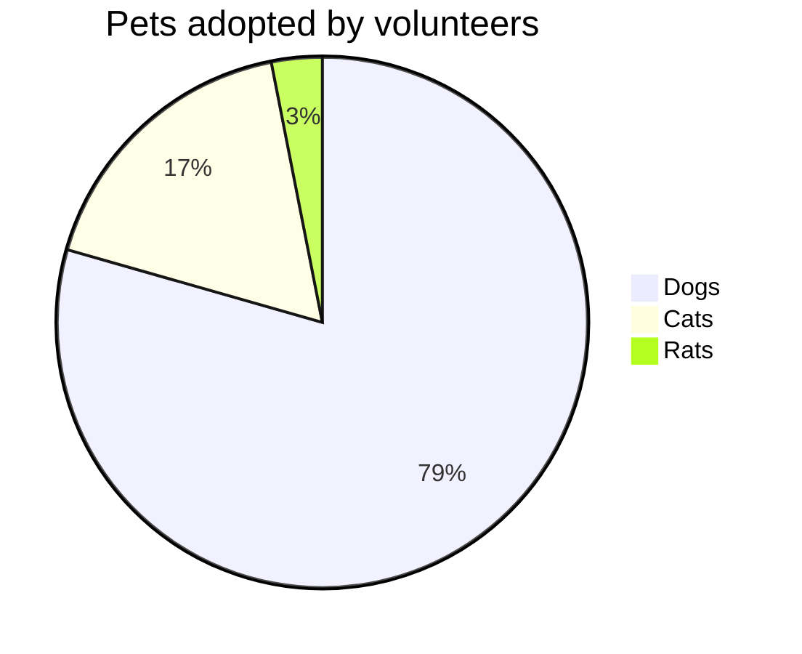
```mermaid
pie title Pets adopted by volunteers
    "Dogs" : 386
    "Cats" : 85
    "Rats" : 15
```

### Синтаксис

Порядок: `pie` [`showData`] → `title <текст>` (опционально) → строки данных. Секторы идут по часовой стрелке в порядке объявления.

- `label` — всегда в двойных кавычках `" "`.
- Разделитель — двоеточие `:`.
- Значение — положительное число, до двух знаков после запятой.

`showData` дописывает числовые значения после текста легенды:

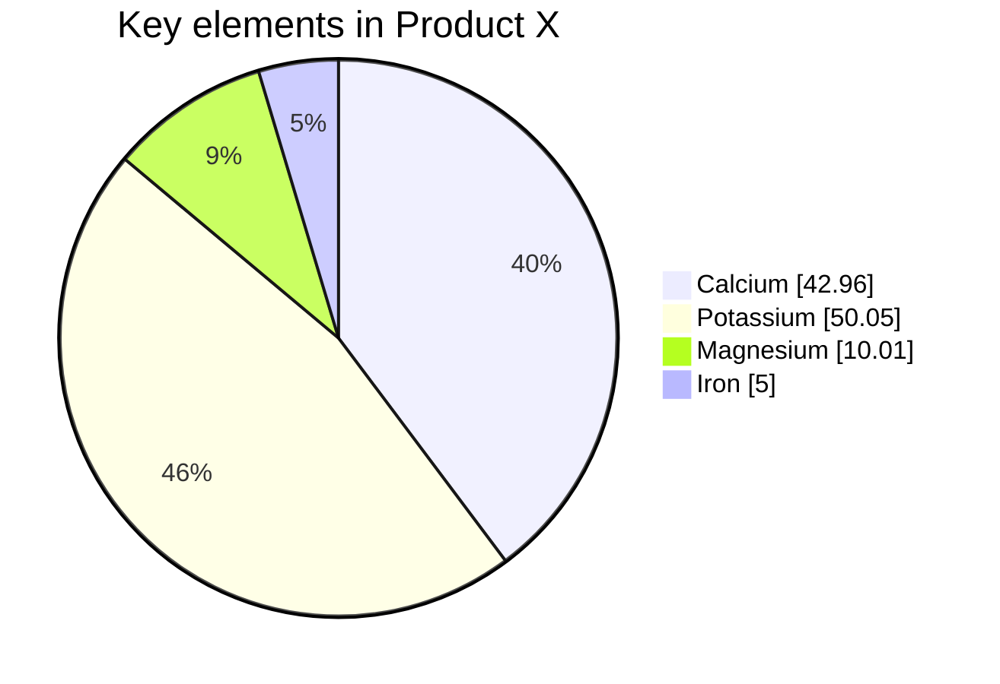
```mermaid
pie showData
    title Key elements in Product X
    "Calcium" : 42.96
    "Potassium" : 50.05
    "Magnesium" : 10.01
    "Iron" : 5
```

### Конфигурация `pie`

| Параметр | Описание | По умолчанию |
| --- | --- | --- |
| `textPosition` | Положение подписи сектора по радиусу: `0.0` — центр, `1.0` — внешний край | `0.75` |
| `donutHole` | Доля внутреннего отверстия (donut-chart). Допустимо `0`–`0.9` (v11.16.0+) | `0` |
| `legendPosition` | Положение легенды: `top`, `bottom`, `left`, `right`, `center` (v11.16.0+) | `right` |
| `highlightSlice` | Подсветить сектор с указанной меткой; значение `hover` — подсвечивать сектор под курсором (v11.16.0+) | — |

Тема настраивается через `themeVariables` (например `pieOuterStrokeWidth`), см. `theming.md`.

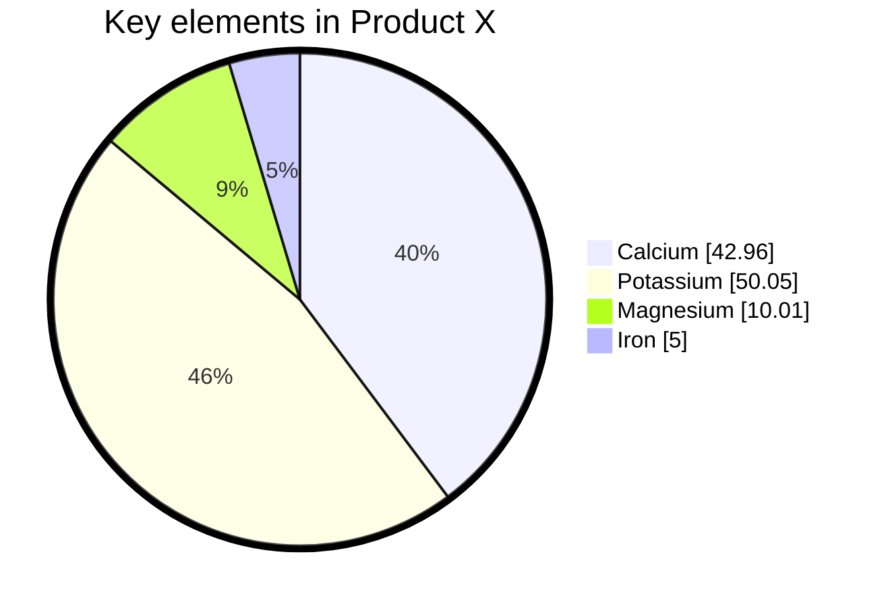
```mermaid
---
config:
  pie:
    textPosition: 0.5
    donutHole: 0.2
    legendPosition: bottom
    highlightSlice: Potassium
  themeVariables:
    pieOuterStrokeWidth: "5px"
---
pie showData
    title Key elements in Product X
    "Calcium" : 42.96
    "Potassium" : 50.05
    "Magnesium" : 10.01
    "Iron" : 5
```

### Ловушки

- Значения должны быть строго положительными. Отрицательное число — синтаксическая ошибка, а не «пустой сектор» (проверено рендером).
- Метка без кавычек не парсится: `Dogs : 386` — ошибка рендера, нужно `"Dogs" : 386` (проверено рендером).
- `showData` пишется в той же строке, что и `pie`. Отдельной строкой ниже (`pie` ↵ `showData`) — синтаксическая ошибка (проверено рендером). А вот `title` можно и в строке `pie title X`, и отдельной строкой ниже — обе формы работают.
- Допустимый диапазон `donutHole` — от `0` до `0.9`.

---

## xychart

Столбчатые и линейные графики по осям X/Y. Применять для рядов чисел: динамика по времени, сравнение категорий, перцентили. НЕ применять для долей целого (`pie`) и для потоков (`sankey`).

### Минимальный скелет

Обязательны только заголовок диаграммы и один набор данных:

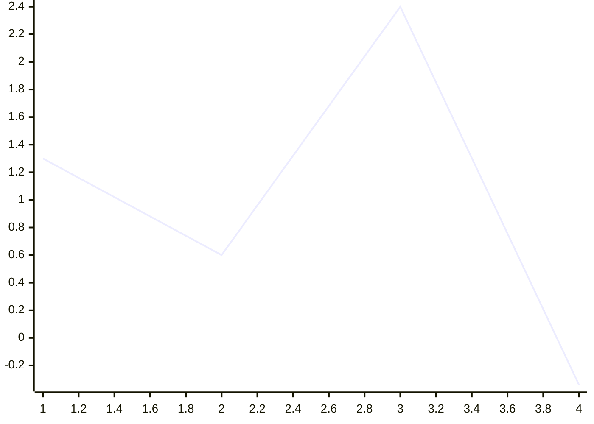
```mermaid
xychart
    line [+1.3, .6, 2.4, -.34]
```

### Синтаксис

Текстовые значения из одного слова можно писать без кавычек; если в тексте есть пробелы — только в `"..."`.

**Ориентация.** По умолчанию вертикальная; горизонтальная — ключевым словом `horizontal` после имени диаграммы:

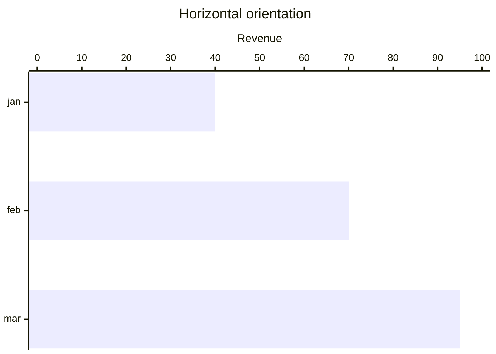
```mermaid
xychart horizontal
    title "Horizontal orientation"
    x-axis [jan, feb, mar]
    y-axis "Revenue" 0 --> 100
    bar [40, 70, 95]
```

**`title`** — короткое описание, всегда рендерится сверху.

**`x-axis`** — категориальная ось (по умолчанию) либо числовой диапазон:

1. `x-axis title min --> max` — числовой диапазон;
2. `x-axis "title with space" [cat1, "cat2 with space", cat3]` — категории.

**`y-axis`** — только числовая:

1. `y-axis title min --> max`;
2. `y-axis title` — только заголовок, диапазон считается автоматически.

Обе оси опциональны — при отсутствии диапазон строится по данным.

**`line`** и **`bar`** — наборы данных, можно смешивать в одной диаграмме:

1. `line [2.3, 45, .98, -3.4]` — любые валидные числа;
2. `line "series name" [2.3, 45, .98, -3.4]` — именованный ряд, попадает в легенду.

**Легенда.** Именованные `line`/`bar` показываются в легенде автоматически; безымянные — не показываются.

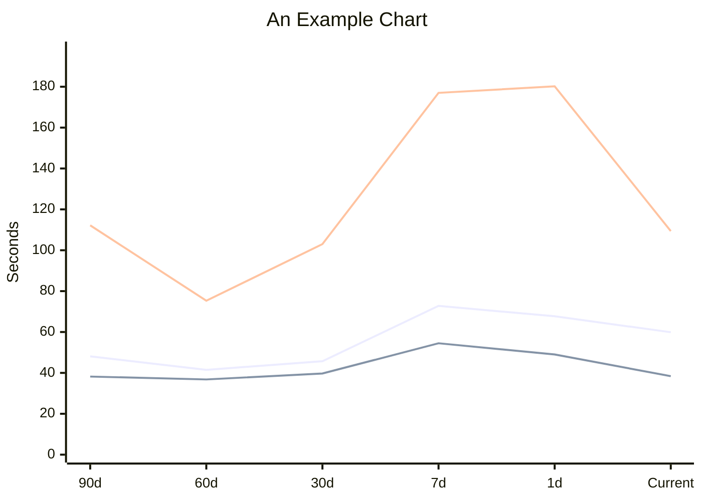
```mermaid
xychart
  title "An Example Chart"
  x-axis ["90d", "60d", "30d", "7d", "1d", "Current"]
  y-axis "Seconds" 0 --> 198.2
  line "avg" [48.1, 41.5, 45.7, 72.8, 67.7, 59.9]
  line "p50" [38.2, 36.8, 39.7, 54.5, 49.0, 38.4]
  line "p95" [112.2, 75.3, 103.0, 177.0, 180.2, 109.4]
```

**Подписи значений на столбцах (v11.14.0+)** — `showDataLabel: true`; чтобы вынести подписи наружу — дополнительно `showDataLabelOutsideBar: true`:

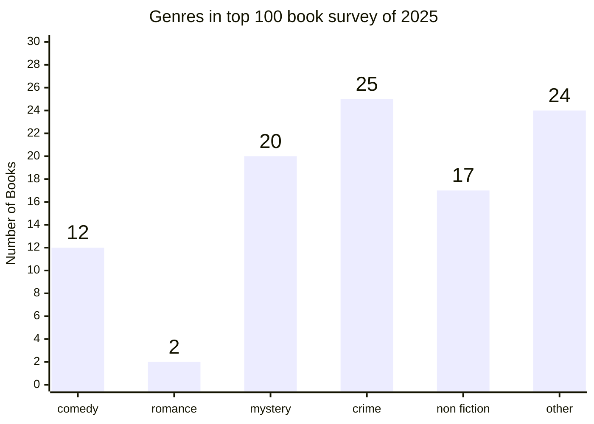
```mermaid
---
config:
    xyChart:
        showDataLabel: true
        showDataLabelOutsideBar: true
---
xychart
    title "Genres in top 100 book survey of 2025"
    x-axis [comedy, romance, mystery, crime, "non fiction", other]
    y-axis "Number of Books" 0 --> 30
    bar [12,2,20,25,17,24]
```

**Текстовые подписи точек линии (v11.16.0+)** — после числа можно указать строку в кавычках. Подписи можно смешивать с обычными значениями:

```mermaid
xychart
    title "Quarterly Performance"
    x-axis [Q1, Q2, Q3, Q4]
    y-axis "Revenue ($M)" 0 --> 100
    line [25 "Launch", 45, 72, 90 "Target Hit"]
```

Подписи точек имеют фиксированный размер шрифта 12px; в вертикальной ориентации рисуются над точкой, в горизонтальной — справа. Поддерживаются только на `line`; на `bar` синтаксис принимается, но подписи игнорируются.

### Конфигурация `xyChart`

| Параметр | Описание | По умолчанию |
| --- | --- | --- |
| `width` | Ширина диаграммы | `700` |
| `height` | Высота диаграммы | `500` |
| `titlePadding` | Отступы заголовка сверху и снизу | `10` |
| `titleFontSize` | Размер шрифта заголовка | `20` |
| `showTitle` | Показывать заголовок | `true` |
| `showLegend` | Показывать легенду для именованных рядов | `true` |
| `legendFontSize` | Размер шрифта легенды | `14` |
| `legendPadding` | Отступ вокруг легенды | `10` |
| `xAxis` / `yAxis` | Конфигурация осей (AxisConfig) | — |
| `chartOrientation` | `'vertical'` или `'horizontal'` | `'vertical'` |
| `plotReservedSpacePercent` | Минимальная доля площади под графики | `50` |
| `showDataLabel` | Показывать значение внутри столбца | `false` |
| `showDataLabelOutsideBar` | Выносить подпись наружу столбца | `false` |

AxisConfig (`xAxis`, `yAxis`): `showLabel` (`true`), `labelFontSize` (`14`), `labelPadding` (`5`), `showTitle` (`true`), `titleFontSize` (`16`), `titlePadding` (`5`), `showTick` (`true`), `tickLength` (`5`), `tickWidth` (`2`), `showAxisLine` (`true`), `axisLineWidth` (`2`), `labelRotation` (`0`, применяется только к нижней оси X).

### Тема

Переменные темы лежат внутри ключа `xyChart` в `themeVariables`: `backgroundColor`, `titleColor`, `dataLabelColor`, `legendTextColor`, `xAxisLabelColor`, `xAxisTitleColor`, `xAxisTickColor`, `xAxisLineColor`, `yAxisLabelColor`, `yAxisTitleColor`, `yAxisTickColor`, `yAxisLineColor`, `plotColorPalette`.

`plotColorPalette` — строка цветов через запятую; цвета применяются к рядам последовательно в порядке объявления:

```mermaid
---
config:
  themeVariables:
    xyChart:
      plotColorPalette: '#000000, #0000FF, #00FF00, #FF0000'
      titleColor: '#ff0000'
---
xychart
title "Different Colors in xyChart"
x-axis "categoriesX" ["Category 1", "Category 2", "Category 3", "Category 4"]
y-axis "valuesY" 0 --> 50
%% Black line
line [10,20,30,40]
%% Blue bar
bar [20,30,25,35]
%% Green bar
bar [15,25,20,30]
%% Red line
line [5,15,25,35]
```

### Ловушки

- Текст с пробелами без кавычек не падает, а **молча склеивается**: `title Sales Revenue Q1` рендерится как `SalesRevenueQ1` (проверено рендером). Всегда берите многословный текст в `"..."`.
- Конфигурация в frontmatter пишется ключом `xyChart` (camelCase). Ключ `xychart` в нижнем регистре **молча игнорируется** — ошибки нет, настройки просто не применяются (проверено рендером: с `xychart: showDataLabel: true` подписи значений не появляются, с `xyChart:` — появляются). При этом имя диаграммы в теле — `xychart` или `xychart-beta`.
- Ось Y не принимает категориальные значения — только числовой диапазон или один заголовок.
- Несовпадение числа значений в `bar`/`line` с числом категорий X не считается ошибкой: лишние категории останутся без данных (проверено рендером).
- `plotColorPalette` — одна строка цветов через запятую, а не YAML-список.
- Легенда появляется только у именованных рядов; безымянный `line [...]` в неё не попадёт.

---

## radar

Лепестковая (паутинная) диаграмма: несколько сущностей по нескольким одинаковым осям. Применять для сравнения профилей (оценки, компетенции, характеристики). НЕ применять для больше чем ~8 осей и для величин с разными единицами измерения. Заголовок — только `radar-beta` (v11.6.0+); `radar` без суффикса не распознаётся.

### Минимальный скелет

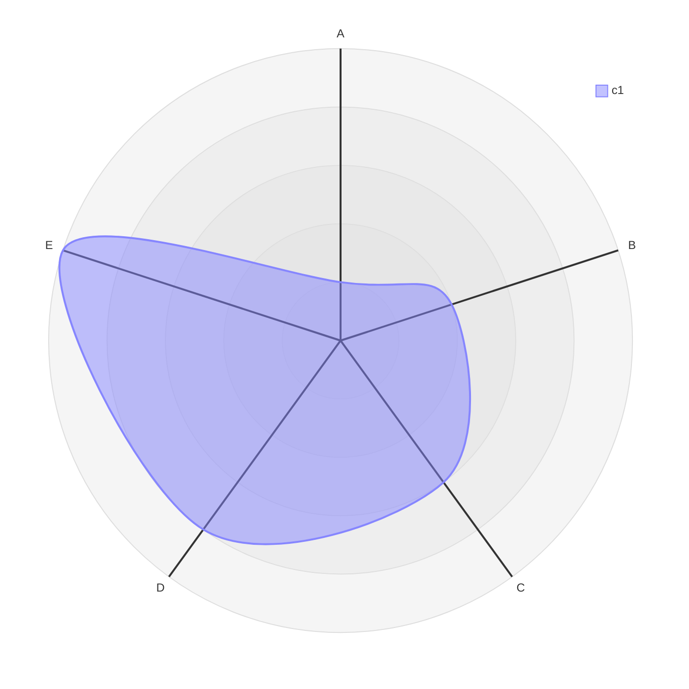
```mermaid
radar-beta
  axis A, B, C, D, E
  curve c1{1,2,3,4,5}
```

### Синтаксис

**`title`** — опциональный заголовок над диаграммой (либо через frontmatter `title:`).

**`axis`** — оси. Каждая ось: идентификатор + опциональная подпись в `["..."]`. В одной строке можно перечислить несколько осей через запятую, строк `axis` может быть несколько.

**`curve`** — кривая: идентификатор, опциональная подпись, значения в `{...}`. Значения задаются либо списком чисел в порядке объявления осей, либо парами `axisId: value` (тогда порядок не важен). В одной строке можно объявить несколько кривых через запятую.

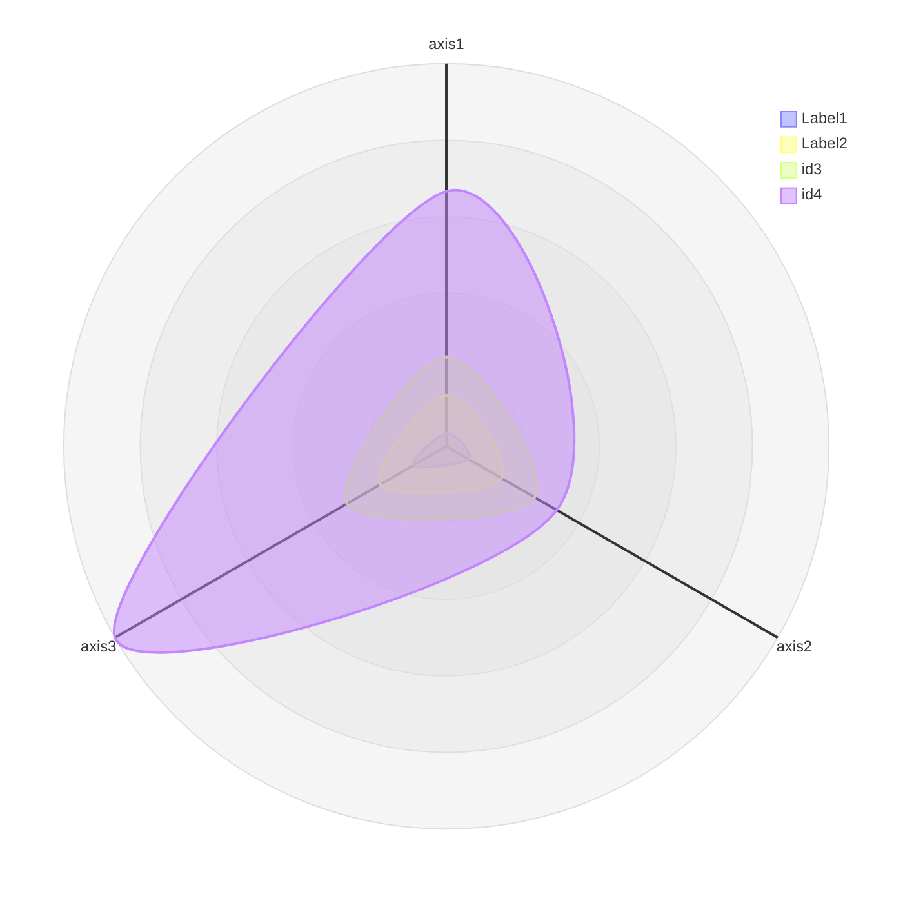
```mermaid
radar-beta
  axis axis1, axis2, axis3
  curve id1["Label1"]{1, 2, 3}
  curve id2["Label2"]{4, 5, 6}, id3{7, 8, 9}
  curve id4{ axis3: 30, axis1: 20, axis2: 10 }
```

**Опции** (отдельными строками в теле диаграммы):

- `showLegend true|false` — легенда, по умолчанию показана;
- `max <число>` — верхняя граница шкалы; по умолчанию считается из данных;
- `min <число>` — нижняя граница, по умолчанию `0`;
- `graticule circle|polygon` — форма сетки, по умолчанию `circle`;
- `ticks <число>` — число концентрических окружностей/многоугольников сетки, по умолчанию `5`.

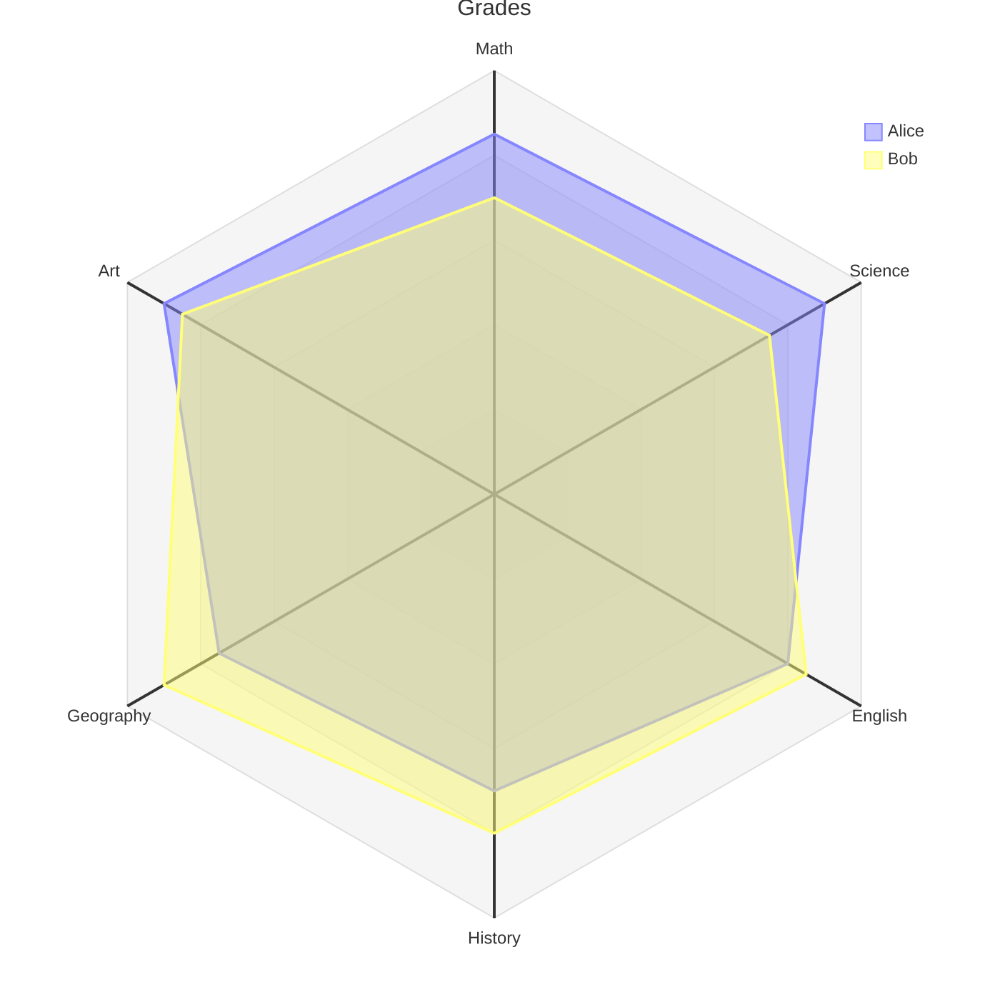
```mermaid
---
title: "Grades"
---
radar-beta
  axis m["Math"], s["Science"], e["English"]
  axis h["History"], g["Geography"], a["Art"]
  curve a["Alice"]{85, 90, 80, 70, 75, 90}
  curve b["Bob"]{70, 75, 85, 80, 90, 85}

  showLegend true
  graticule polygon
  ticks 5
  max 100
  min 0
```

### Конфигурация `radar`

| Параметр | Описание | По умолчанию |
| --- | --- | --- |
| `width` | Ширина | `600` |
| `height` | Высота | `600` |
| `marginTop` / `marginBottom` / `marginLeft` / `marginRight` | Поля | `50` |
| `axisScaleFactor` | Масштаб осей | `1` |
| `axisLabelFactor` | Смещение подписей осей | `1.05` |
| `curveTension` | Натяжение сглаженных кривых | `0.17` |

### Тема

Цвета кривых берутся из общих шкал `cScale0`…`cScale${i}` (обычно до 12), также доступны `fontSize` и `titleColor` — см. `theming.md`. Специфичные переменные лежат внутри ключа `radar` в `themeVariables`: `axisColor` (`black`), `axisStrokeWidth` (`1`), `axisLabelFontSize` (`12px`), `curveOpacity` (`0.7`), `curveStrokeWidth` (`2`), `graticuleColor` (`black`), `graticuleOpacity` (`0.5`), `graticuleStrokeWidth` (`1`), `legendBoxSize` (`10`), `legendFontSize` (`14px`).

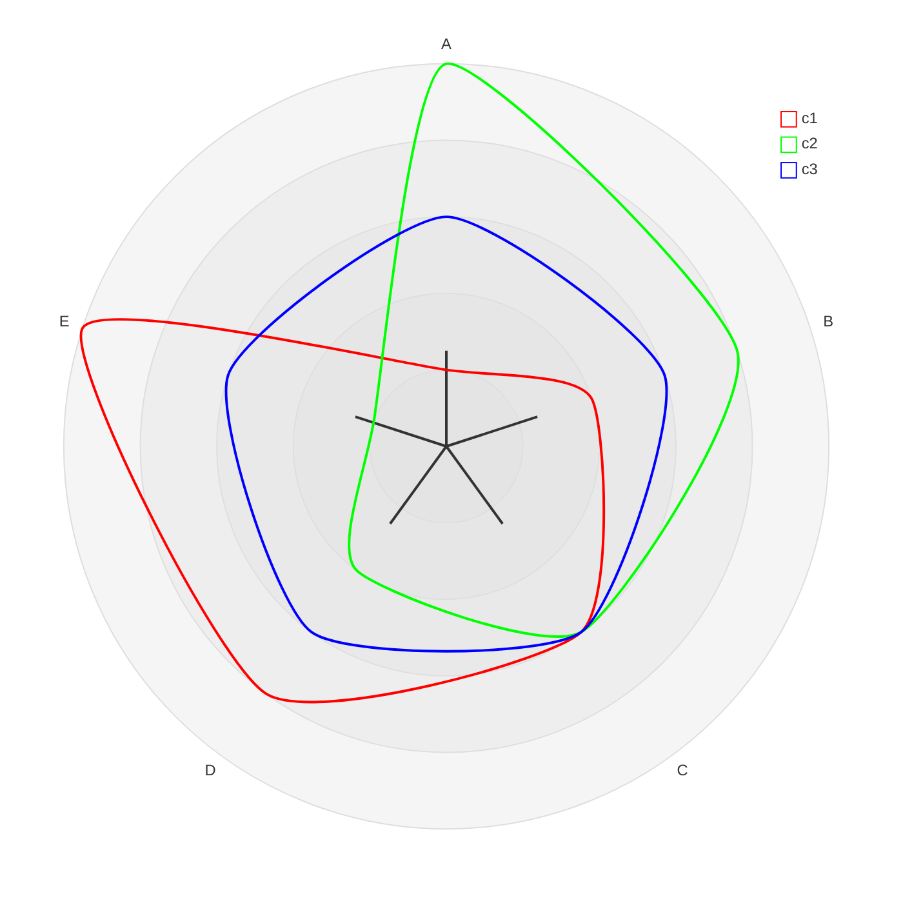
```mermaid
---
config:
  radar:
    axisScaleFactor: 0.25
    curveTension: 0.1
  theme: base
  themeVariables:
    cScale0: "#FF0000"
    cScale1: "#00FF00"
    cScale2: "#0000FF"
    radar:
      curveOpacity: 0
---
radar-beta
  axis A, B, C, D, E
  curve c1{1,2,3,4,5}
  curve c2{5,4,3,2,1}
  curve c3{3,3,3,3,3}
```

### Ловушки

- `radar` без `-beta` не распознаётся на 11.16.1 — рендер падает (проверено).
- Если значений в `curve` меньше, чем осей, ошибки не будет, но **кривая не нарисуется вовсе**: в SVG останутся только сетка, оси и легенда (проверено рендером: `axis A, B, C` + `curve c1{1,2}` → ни одного элемента кривой). Либо перечисляйте значения по числу осей, либо используйте форму `curve id{ axisId: value, ... }`.
- Подпись оси/кривой — только в `["..."]` после идентификатора; идентификатор обязателен.
- Опции (`max`, `min`, `ticks`, `graticule`, `showLegend`) — отдельные строки в теле диаграммы, а не поля конфига.

---

## quadrantChart

Матрица 2×2: точки в координатах X/Y с подписанными квадрантами. Применять для приоритизации (важность/срочность, охват/вовлечённость, риск/выгода). НЕ применять, когда важны абсолютные значения — координаты нормированы в диапазон 0–1.

### Минимальный скелет

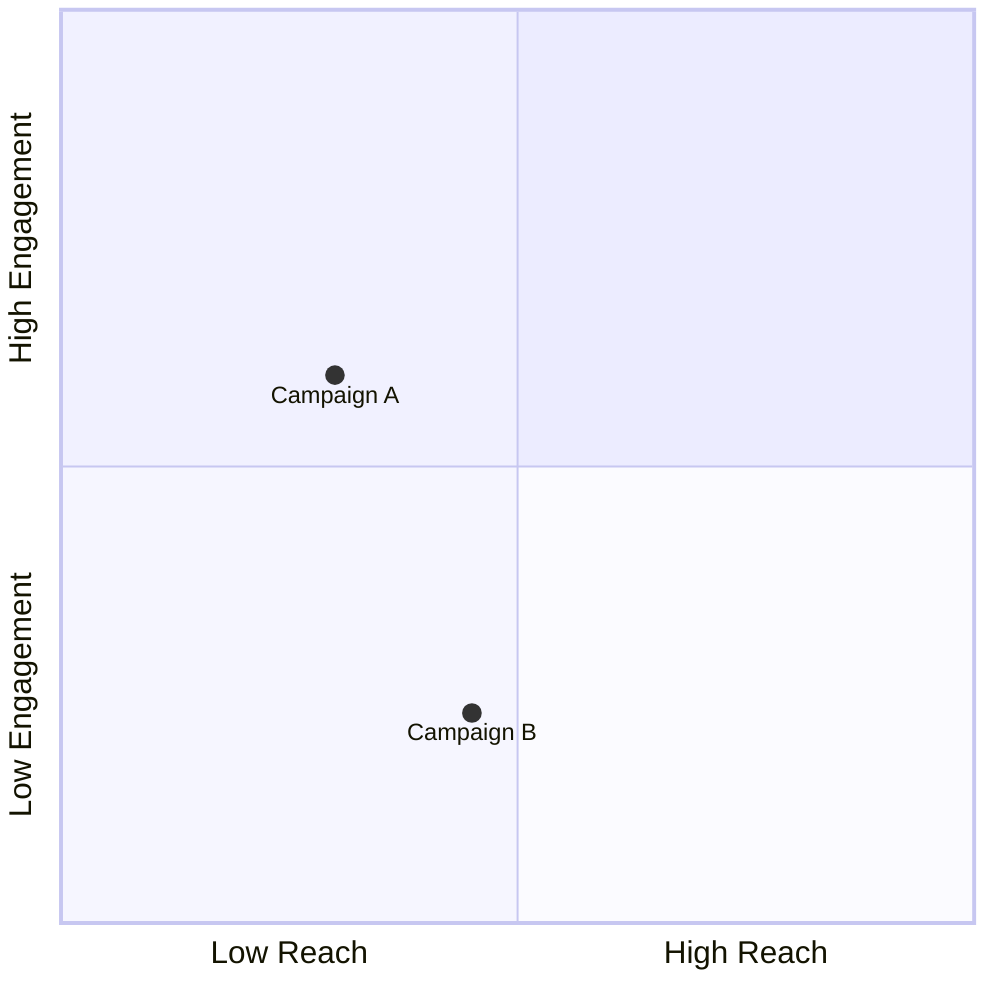
```mermaid
quadrantChart
    x-axis Low Reach --> High Reach
    y-axis Low Engagement --> High Engagement
    Campaign A: [0.3, 0.6]
    Campaign B: [0.45, 0.23]
```

### Синтаксис

**`title`** — заголовок сверху.

**`x-axis`** — подписи горизонтальной оси, слева и справа:

1. `x-axis <текст> --> <текст>` — обе подписи;
2. `x-axis <текст>` — только левая.

**`y-axis`** — подписи вертикальной оси, снизу и сверху:

1. `y-axis <текст снизу> --> <текст сверху>`;
2. `y-axis <текст>` — только нижняя.

**Квадранты** — `quadrant-1` правый верхний, `quadrant-2` левый верхний, `quadrant-3` левый нижний, `quadrant-4` правый нижний.

**Точки** — `<текст>: [x, y]`, где `x` и `y` в диапазоне 0–1.

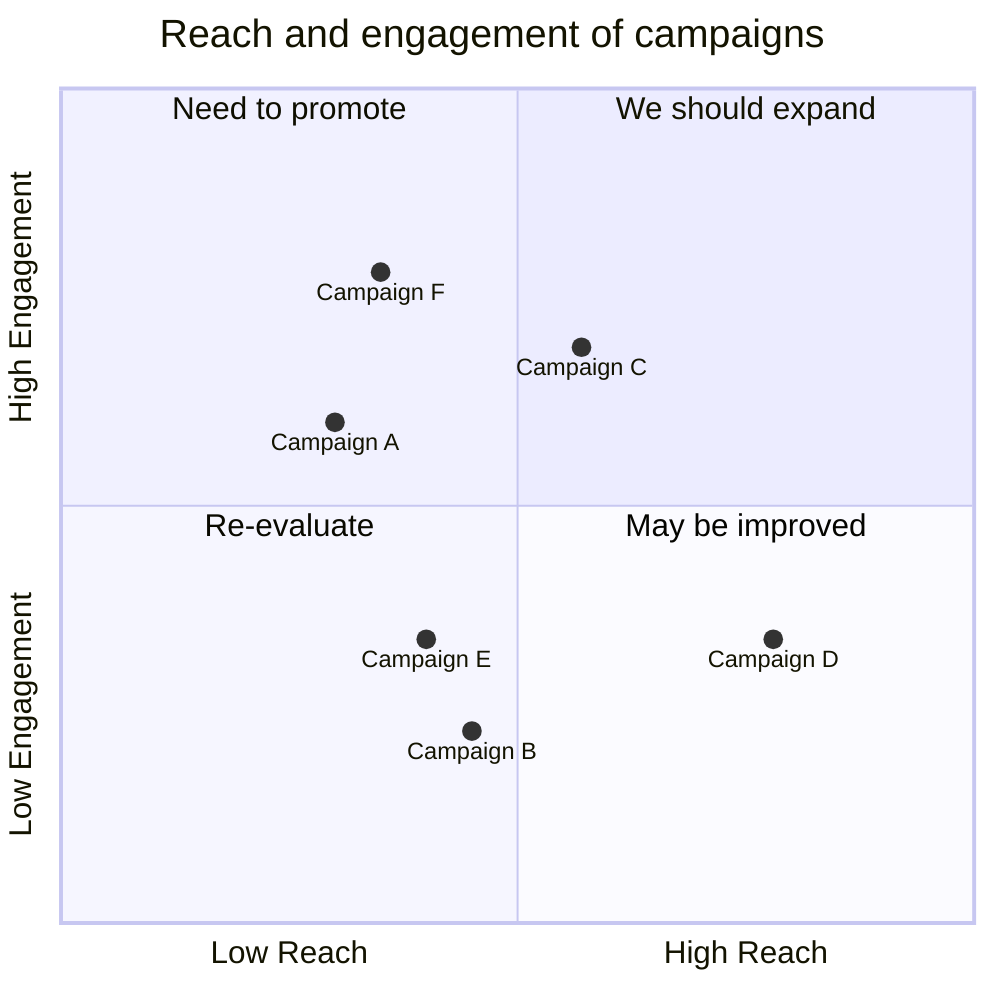
```mermaid
quadrantChart
    title Reach and engagement of campaigns
    x-axis Low Reach --> High Reach
    y-axis Low Engagement --> High Engagement
    quadrant-1 We should expand
    quadrant-2 Need to promote
    quadrant-3 Re-evaluate
    quadrant-4 May be improved
    Campaign A: [0.3, 0.6]
    Campaign B: [0.45, 0.23]
    Campaign C: [0.57, 0.69]
    Campaign D: [0.78, 0.34]
    Campaign E: [0.40, 0.34]
    Campaign F: [0.35, 0.78]
```

Если точек нет, тексты осей и квадрантов рисуются по центру соответствующих квадрантов. Если точки есть — подписи X уезжают вниз диаграммы, подписи Y — к низу своего квадранта, текст квадранта — наверх.

### Стилизация точек

Прямой стиль пишется после координат, стиль через класс — суффиксом `:::className` сразу после имени точки, до двоеточия. Классы объявляются `classDef`.

Доступные свойства: `color` (заливка точки), `radius`, `stroke-width`, `stroke-color` (работает только вместе со `stroke-width`).

Порядок приоритета: прямой стиль → стиль класса → тема.

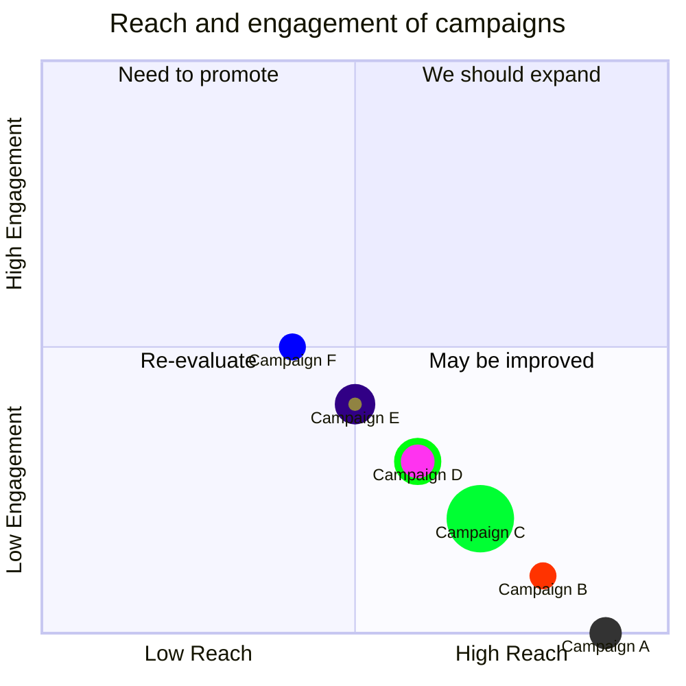
```mermaid
quadrantChart
  title Reach and engagement of campaigns
  x-axis Low Reach --> High Reach
  y-axis Low Engagement --> High Engagement
  quadrant-1 We should expand
  quadrant-2 Need to promote
  quadrant-3 Re-evaluate
  quadrant-4 May be improved
  Campaign A: [0.9, 0.0] radius: 12
  Campaign B:::class1: [0.8, 0.1] color: #ff3300, radius: 10
  Campaign C: [0.7, 0.2] radius: 25, color: #00ff33, stroke-color: #10f0f0
  Campaign D: [0.6, 0.3] radius: 15, stroke-color: #00ff0f, stroke-width: 5px ,color: #ff33f0
  Campaign E:::class2: [0.5, 0.4]
  Campaign F:::class3: [0.4, 0.5] color: #0000ff
  classDef class1 color: #109060
  classDef class2 color: #908342, radius : 10, stroke-color: #310085, stroke-width: 10px
  classDef class3 color: #f00fff, radius : 10
```

### Конфигурация `quadrantChart`

| Параметр | Описание | По умолчанию |
| --- | --- | --- |
| `chartWidth` | Ширина | `500` |
| `chartHeight` | Высота | `500` |
| `titlePadding` | Отступы заголовка | `10` |
| `titleFontSize` | Размер шрифта заголовка | `20` |
| `quadrantPadding` | Внешний отступ вокруг квадрантов | `5` |
| `quadrantTextTopPadding` | Верхний отступ текста квадранта (когда нет точек) | `5` |
| `quadrantLabelFontSize` | Размер шрифта текста квадранта | `16` |
| `quadrantInternalBorderStrokeWidth` | Толщина внутренних границ | `1` |
| `quadrantExternalBorderStrokeWidth` | Толщина внешней рамки | `2` |
| `xAxisLabelPadding` | Отступы подписей X | `5` |
| `xAxisLabelFontSize` | Размер шрифта подписей X | `16` |
| `xAxisPosition` | `top` или `bottom`; при наличии точек всегда снизу | `'top'` |
| `yAxisLabelPadding` | Отступы подписей Y | `5` |
| `yAxisLabelFontSize` | Размер шрифта подписей Y | `16` |
| `yAxisPosition` | `left` или `right` | `'left'` |
| `pointTextPadding` | Отступ между точкой и подписью | `5` |
| `pointLabelFontSize` | Размер шрифта подписи точки | `12` |
| `pointRadius` | Радиус точки | `5` |

### Тема

Переменные (верхний уровень `themeVariables`): `quadrant1Fill`…`quadrant4Fill`, `quadrant1TextFill`…`quadrant4TextFill`, `quadrantPointFill`, `quadrantPointTextFill`, `quadrantXAxisTextFill`, `quadrantYAxisTextFill`, `quadrantInternalBorderStrokeFill`, `quadrantExternalBorderStrokeFill`, `quadrantTitleFill`.

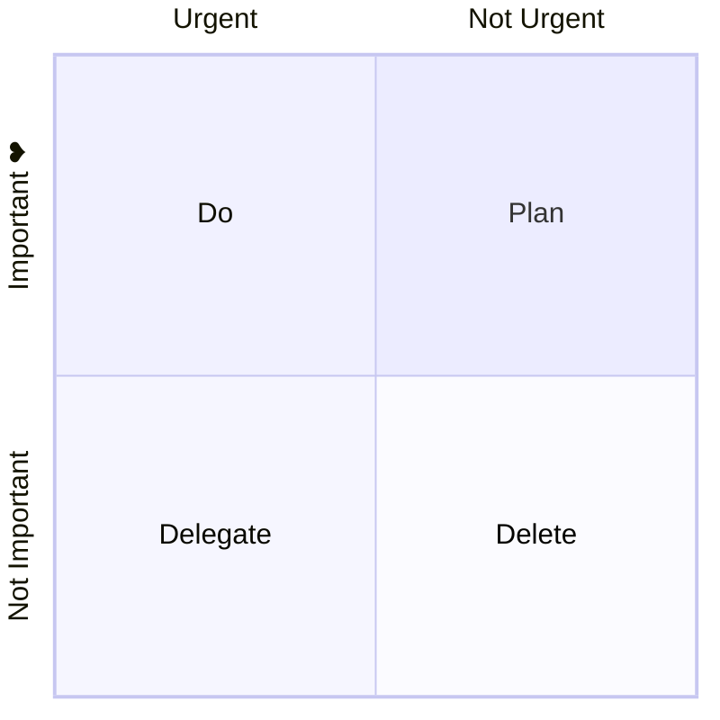
```mermaid
---
config:
  quadrantChart:
    chartWidth: 400
    chartHeight: 400
  themeVariables:
    quadrant1TextFill: "ff0000"
---
quadrantChart
  x-axis Urgent --> Not Urgent
  y-axis Not Important --> "Important ❤"
  quadrant-1 Plan
  quadrant-2 Do
  quadrant-3 Delegate
  quadrant-4 Delete
```

### Ловушки

- Координаты строго в диапазоне 0–1. Значение вроде `[1.5, 0.5]` или `[0.5, 1.2]` — не «точка за краем», а `Lexical error ... Unrecognized text` и полный отказ рендера (проверено).
- Нумерация квадрантов идёт против часовой стрелки от правого верхнего: 1 = ↗, 2 = ↖, 3 = ↙, 4 = ↘.
- `:::class` ставится после имени точки, перед двоеточием: `Campaign B:::class1: [0.8, 0.1]`.
- `stroke-color` без `stroke-width` ни на что не влияет.

---

## sankey

Диаграмма потоков: величины, перетекающие между узлами. Применять для энергобалансов, воронок, распределения бюджета, трафика по источникам. НЕ применять для графов с циклами. Заголовки `sankey` и `sankey-beta` оба работают (v10.3.0+). Синтаксис экспериментальный и может измениться.

### Минимальный скелет

Тело — обычный CSV из трёх колонок `source,target,value`:

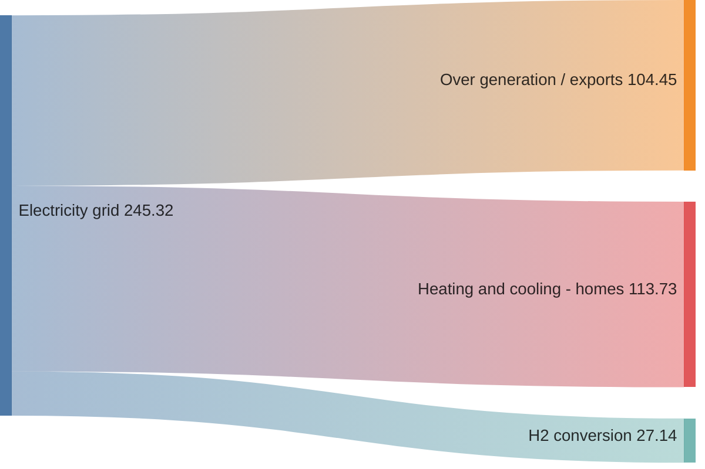
```mermaid
sankey

%% source,target,value
Electricity grid,Over generation / exports,104.453
Electricity grid,Heating and cooling - homes,113.726
Electricity grid,H2 conversion,27.14
```

### Синтаксис

Формат — CSV по RFC 4180 с двумя отличиями: ровно **3 колонки** и **разрешены пустые строки** без запятых (для визуального разделения).

**Пустые строки:**

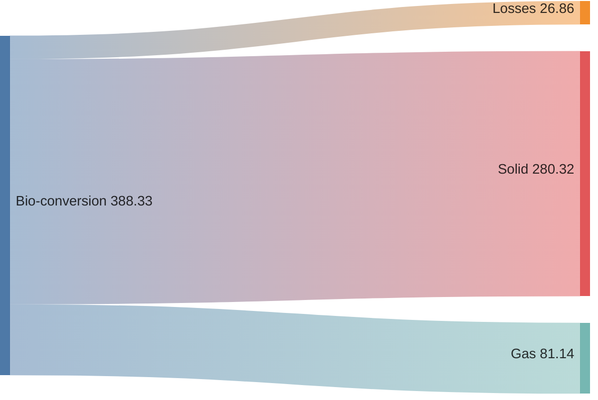
```mermaid
sankey

Bio-conversion,Losses,26.862

Bio-conversion,Solid,280.322

Bio-conversion,Gas,81.144
```

**Запятая внутри значения** — оберните значение в двойные кавычки:

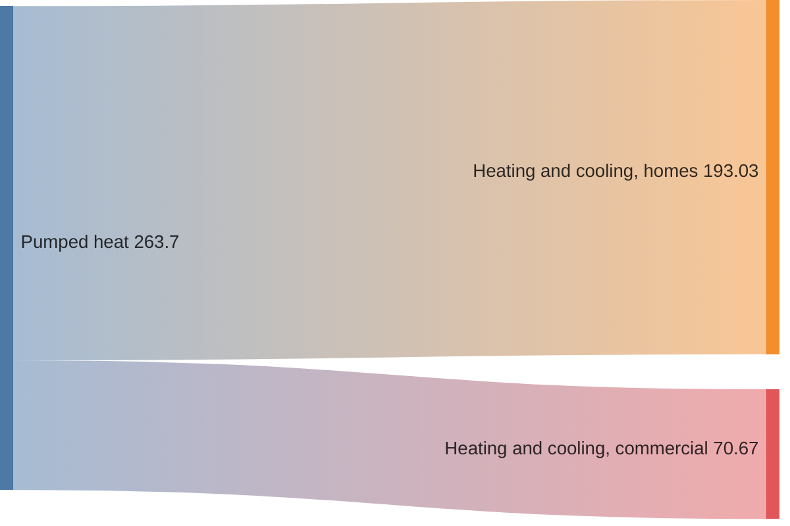
```mermaid
sankey

Pumped heat,"Heating and cooling, homes",193.026
Pumped heat,"Heating and cooling, commercial",70.672
```

**Двойная кавычка внутри значения** — удвойте её внутри закавыченной строки:

```mermaid
sankey

Pumped heat,"Heating and cooling, ""homes""",193.026
Pumped heat,"Heating and cooling, ""commercial""",70.672
```

### Конфигурация `sankey`

| Параметр | Описание | По умолчанию |
| --- | --- | --- |
| `width` / `height` | Размеры диаграммы | `600` / `400` |
| `showValues` | Показывать числовые значения у узлов | `true` |
| `linkColor` | `source`, `target`, `gradient` или hex-код вида `#a1a1a1` | — |
| `nodeAlignment` | `justify`, `center`, `left`, `right` | `justify` |
| `labelStyle` | `legacy` — обычный текст по x-координате; `outlined` — с обводкой-подложкой, позиция по слою относительно центрального узла (v11.15.0+) | `legacy` |
| `nodeWidth` | Ширина прямоугольника узла, px (v11.15.0+) | `10` |
| `nodePadding` | Вертикальный отступ между узлами, px (v11.15.0+) | `12` |
| `nodeColors` | Карта «имя узла → цвет» (hex, `rgb()`, `hsl()`, именованные цвета); неперечисленные узлы берут цвет по умолчанию (v11.15.0+) | — |

```mermaid
---
config:
  sankey:
    showValues: false
    labelStyle: outlined
    nodeWidth: 15
    nodePadding: 20
    linkColor: gradient
    nodeAlignment: left
    nodeColors:
      Electricity grid: "#4e79a7"
      Industry: "#e15759"
      Losses: "#bab0ab"
---
sankey

Electricity grid,Heating and cooling - homes,113.726
Electricity grid,Industry,342.165
Electricity grid,Losses,56.691
```

### Ловушки

- Строго три колонки. Четвёртая колонка (`A,B,5,extra`) ломает разбор (проверено рендером).
- Нечисловое значение — самая опасная ошибка: рендер **не падает**, но геометрия считается как `NaN` (`<path d="M10,NaN...">`, `stroke-width="NaN"`), и диаграмма выходит пустой при нулевом коде ошибки (проверено рендером на `A,B,many`). Валидатор такой файл пропустит — проверяйте картинку глазами.
- Имена узлов сопоставляются по точной строке: `Solar PV` и `Solar  PV` — разные узлы.
- Комментарий `%%` допустим и отдельной строкой, и в конце строки данных — значение при этом читается корректно (проверено рендером).
- Циклы (A→B и B→A) для sankey не предусмотрены — раскладка получится бессмысленной.

---

## treemap

Вложенные прямоугольники: иерархия, где площадь пропорциональна значению. Применять для бюджетов, долей рынка, занимаемого места на диске, состава портфеля. НЕ применять для отрицательных значений, для глубоких иерархий (много уровней плохо читаются) и для очень мелких значений — их подписи не поместятся. Работают оба заголовка: `treemap-beta` и `treemap`; в документации канон — `treemap-beta`.

### Минимальный скелет

```mermaid
treemap-beta
"Category A"
    "Item A1": 10
    "Item A2": 20
"Category B"
    "Item B1": 15
    "Item B2": 25
```

### Синтаксис

- **Узел-раздел (родитель)** — текст в кавычках без значения: `"Section Name"`.
- **Лист со значением** — текст в кавычках, двоеточие, число: `"Leaf Name": value`.
- **Иерархия** — отступами (пробелы или табы).
- **Стилизация** — суффикс `:::className` + `classDef`.

Вложенность произвольной глубины:

```mermaid
treemap-beta
"Products"
    "Electronics"
        "Phones": 50
        "Computers": 30
        "Accessories": 20
    "Clothing"
        "Men's": 40
        "Women's": 40
```

Классы применяются и к разделам, и к листьям (у листа — после значения):

```mermaid
treemap-beta
"Section 1"
    "Leaf 1.1": 12
    "Section 1.2":::class1
      "Leaf 1.2.1": 12
"Section 2"
    "Leaf 2.1": 20:::class1
    "Leaf 2.2": 25
    "Leaf 2.3": 12

classDef class1 fill:red,color:blue,stroke:#FFD600;
```

### Конфигурация `treemap`

| Параметр | Описание | По умолчанию |
| --- | --- | --- |
| `useMaxWidth` | Ширина 100% и масштабирование под контейнер | `true` |
| `padding` | Внутренний отступ между узлами | `10` |
| `diagramPadding` | Отступ вокруг всей диаграммы | `8` |
| `showValues` | Показывать значения | `true` |
| `nodeWidth` | Ширина узлов | `100` |
| `nodeHeight` | Высота узлов | `40` |
| `borderWidth` | Толщина границ | `1` |
| `valueFontSize` | Размер шрифта значений | `12` |
| `labelFontSize` | Размер шрифта подписей | `14` |
| `valueFormat` | Формат значений | `','` |

**`valueFormat`** использует спецификаторы формата D3 плюс несколько распространённых валютных форм: `,` (разделитель тысяч), `$`, `.1f` (один знак после запятой), `.1%` (проценты с одним знаком), `$0,0`, `$.2f`, `$,.2f`.

```mermaid
---
config:
  treemap:
    valueFormat: '$0,0'
    diagramPadding: 20
---
treemap-beta
"Budget"
    "Operations"
        "Salaries": 700000
        "Equipment": 200000
        "Supplies": 100000
    "Marketing"
        "Advertising": 400000
        "Events": 100000
```

Проценты:

```mermaid
---
config:
  treemap:
    valueFormat: '$.1%'
---
treemap-beta
"Market Share"
    "Company A": 0.35
    "Company B": 0.25
    "Company C": 0.15
    "Others": 0.25
```

### Ловушки

- Все имена узлов — в двойных кавычках; голый текст без кавычек не парсится (проверено рендером: `Category A` без кавычек — синтаксическая ошибка).
- Иерархия задаётся ТОЛЬКО отступом. Смешивание табов и пробелов на соседних строках рендер выдерживает (проверено), но читаемость исходника от этого страдает — держите один стиль отступа.
- Значение указывают листья; у раздела значение не пишут — оно суммируется из детей.
- Отрицательные значения для treemap не предусмотрены (документированное ограничение типа).
- `classDef` пишется в теле диаграммы, обычно после дерева.

---

## venn

Пересечения множеств кругами Эйлера—Венна. Применять для 2–3 множеств с осмысленными пересечениями (аудитории, зоны ответственности, «desirable/feasible/viable»). НЕ применять для количественного анализа — площади приблизительны. Только `venn-beta` (v11.12.3+); `venn` без суффикса не распознаётся. Синтаксис новый и может измениться.

### Минимальный скелет

```mermaid
venn-beta
  title "Team overlap"
  set Frontend
  set Backend
  union Frontend,Backend["APIs"]
```

### Синтаксис

- `set <id>` — одно множество.
- `union <id>,<id>[,...]` — пересечение двух и более множеств; все идентификаторы должны быть объявлены выше строками `set`.
- Идентификаторы — голые слова (`A`, `Set_1`) либо строки в кавычках (`"Foo Bar"`).

**Подписи** — синтаксис `["..."]` задаёт отображаемое имя при коротком идентификаторе:

```mermaid
venn-beta
  set A["Alpha"]
  set B["Beta"]
  union A,B["AB"]
```

**Пересечения высокой арности** — `union` принимает три и более имени; попарные пересечения дорисовываются автоматически, чтобы у общей области была видимая зона:

```mermaid
venn-beta
  set Desirable
  set Feasible
  set Viable
  union Desirable,Feasible,Viable["Innovation"]
```

**Размеры** — суффикс `:N` у множества или пересечения:

```mermaid
venn-beta
  set A["Alpha"]:20
  set B["Beta"]:12
  union A,B["AB"]:3
```

**Текстовые узлы** — `text` размещает подписи внутри множества или пересечения; строка `text` с отступом привязывается к ближайшему предыдущему `set`/`union`. Подпись задаётся тем же `["..."]`:

```mermaid
venn-beta
  set A["Frontend"]
    text A1["React"]
    text A2["Design Systems"]
  set B["Backend"]
    text B1["API"]
  union A,B["Shared"]
    text AB1["OpenAPI"]
```

**Стилизация** — `style <id>[,<id>] <свойства>` для множеств, пересечений и текстовых узлов. Свойства: `fill`, `color` (цвет текста), `stroke`, `stroke-width`, `fill-opacity`:

```mermaid
venn-beta
  set A["Alpha"]:20
    text A1["React"]
    text A2["Design Systems"]
  set B["Beta"]:12
  union A,B["AB"]:3
  style A fill:#ff6b6b
  style A,B color:#333
  style A1 color:red
```

### Ловушки

- `venn` без `-beta` не распознаётся на 11.16.1 — рендер падает (проверено).
- `union` по идентификатору, не объявленному строкой `set` выше, — ошибка рендера (проверено: `set A` + `union A,Zzz["AZ"]` падает).
- В `style A,B ...` перечисление через запятую — это адрес пересечения `A,B` (как в примере документации), а не «A и B по отдельности».
- Размер `:N` пишется после подписи: `set A["Alpha"]:20`.
- `text` привязывается к ближайшему предыдущему `set`/`union` — порядок строк важен.

---

## packet

Схема бинарного пакета: поля по битовым позициям. Применять для описания сетевых протоколов и бинарных форматов. НЕ применять для чего-либо, кроме побитовой раскладки. Работают оба заголовка: `packet` и `packet-beta` (v11.0.0+).

### Минимальный скелет

```mermaid
packet
0-15: "Source Port"
16-31: "Destination Port"
```

### Синтаксис

Каждая строка после заголовка — поле пакета. Диапазон задаёт битовые позиции, описание — в двойных кавычках.

- `start: "Block name"` — однобитовое поле;
- `start-end: "Block name"` — многобитовое поле;
- `title <текст>` — заголовок (либо через frontmatter `title:`).

**Счётчик битов (v11.7.0+)** — `+<count>` задаёт длину поля, начало берётся автоматически от конца предыдущего. Формы можно смешивать:

```mermaid
packet
title UDP Packet
+16: "Source Port"
+16: "Destination Port"
32-47: "Length"
48-63: "Checksum"
64-95: "Data (variable length)"
```

Полный пример с явными диапазонами и однобитовыми флагами:

```mermaid
---
title: "TCP Packet"
---
packet
0-15: "Source Port"
16-31: "Destination Port"
32-63: "Sequence Number"
64-95: "Acknowledgment Number"
96-99: "Data Offset"
100-105: "Reserved"
106: "URG"
107: "ACK"
108: "PSH"
109: "RST"
110: "SYN"
111: "FIN"
112-127: "Window"
128-143: "Checksum"
144-159: "Urgent Pointer"
160-191: "(Options and Padding)"
192-255: "Data (variable length)"
```

### Конфигурация

Конфиг лежит в ключе `packet`; параметр `showBits` включает подписи битовых позиций:

```mermaid
---
config:
  packet:
    showBits: true
---
packet
0-15: "Source Port"
16-31: "Destination Port"
32-63: "Sequence Number"
```

Переменные темы `packet` (`byteFontSize`, `startByteColor`, `endByteColor`, `labelColor`, `labelFontSize`, `titleColor`, `titleFontSize`, `blockStrokeColor`, `blockStrokeWidth`, `blockFillColor`) в официальной документации помечены как **неработающие**: значения не пробрасываются в функцию стилей из-за бага mermaid. Раздел с ними в исходной документации закомментирован — не рассчитывайте на них.

### Ловушки

- Диапазоны должны идти подряд, без разрывов: `0-15` затем `32-47` (пропущены биты 16–31) — ошибка рендера (проверено).
- Описание поля обязательно в двойных кавычках: `0-15: Src` — ошибка рендера (проверено).
- `+<count>` продолжает с конца предыдущего поля; при смеси `+N` и явных диапазонов следите, чтобы явный диапазон начинался ровно там, где кончилось предыдущее поле.
- Комментарий `%%` работает и в конце строки поля (`0-15: "Src" %% inline`), и отдельной строкой (проверено рендером).

---

## Источник

Дистиллировано из официальной документации mermaid-js/mermaid (docs/syntax), проверено рендером на mermaid-cli 11.16.0 / mermaid 11.16.1.
