# Class diagram

Статическая структура ООП-системы: классы, их атрибуты и методы, связи между ними (наследование, композиция, зависимости), а также модель данных. НЕ применять для описания поведения во времени (`stateDiagram-v2`, `sequenceDiagram`), для потока управления (`flowchart`) и для реляционной схемы БД с ключами (`erDiagram`).

## Минимальный скелет

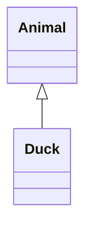

## Синтаксис

### Объявление класса

Два способа: явно через ключевое слово `class` или неявно — через связь, которая объявляет сразу оба класса.

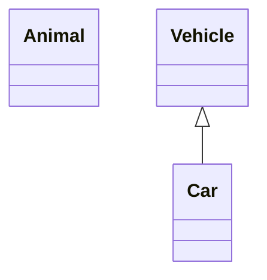

Имя класса состоит только из буквенно-цифровых символов (в том числе Unicode), подчёркиваний и дефисов (`-`).

### Метки класса

Если нужно отображаемое имя, отличное от идентификатора, — квадратные скобки с кавычками. Внутри метки допустимы любые символы.

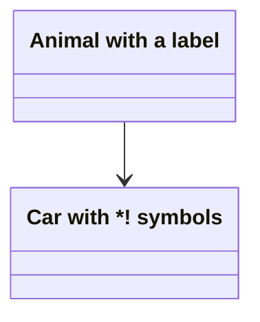

Альтернатива — обратные кавычки вокруг самого имени класса (тогда имя и метка совпадают, и по этому имени класс дальше и адресуется):

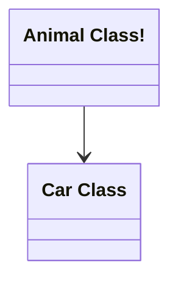

### Члены класса

Mermaid различает атрибуты и методы по наличию круглых скобок `()`: с ними — метод, без них — атрибут.

Способ 1 — по одному члену на строку, через двоеточие после имени класса:

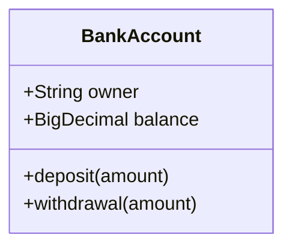

Способ 2 — блоком в фигурных скобках. Результат идентичен.


### Тип возвращаемого значения

Указывается после закрывающей `)`. **Между `)` и типом обязателен пробел.**

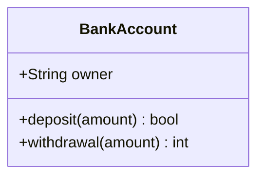

### Generics

Обобщённый тип заключается в тильды `~`. Работает и в имени класса, и в типах членов, и в типах возврата. Вложенность (`List~List~int~~`, аналог `List<List<int>>`) поддерживается; дженерики с запятой (`Map<K, V>`) — **не поддерживаются**.

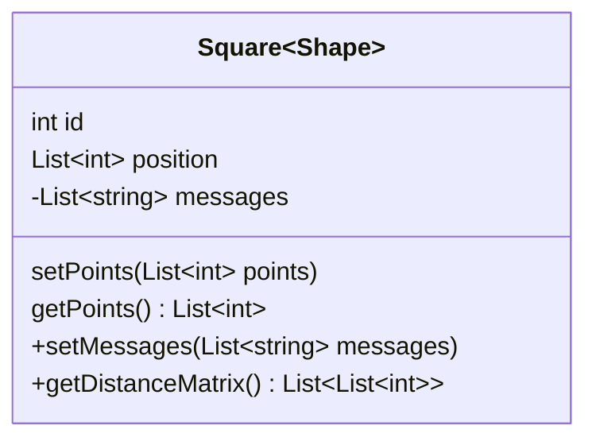

Тип-параметр НЕ входит в имя класса: везде, где нужно сослаться на класс (связи, `style`, `click`), пишется `Square`, а не `Square~Shape~`. Следствие: два класса с одинаковым именем и разными дженериками невозможны.

### Видимость и классификаторы

Префикс перед именем члена:

| Символ | Видимость        |
| ------ | ---------------- |
| `+`    | Public           |
| `-`    | Private          |
| `#`    | Protected        |
| `~`    | Package/Internal |

Классификаторы дописываются в самый конец строки члена (после `()` или после типа возврата):

- `*` — абстрактный метод: `someAbstractMethod()*`, `someAbstractMethod() int*`
- `$` — статический метод или поле: `someStaticMethod()$`, `someStaticMethod() String$`, `String someField$`

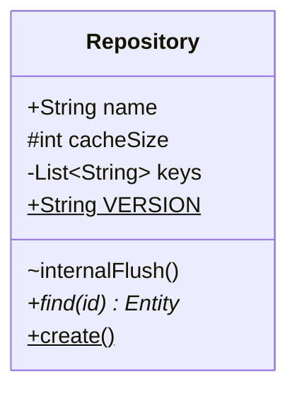

### Связи

Формат: `[classA][Arrow][ClassB]`. Восемь типов:

| Тип     | Значение      |
| ------- | ------------- |
| `<\|--` | Inheritance   |
| `*--`   | Composition   |
| `o--`   | Aggregation   |
| `-->`   | Association   |
| `--`    | Link (Solid)  |
| `..>`   | Dependency    |
| `..\|>` | Realization   |
| `..`    | Link (Dashed) |

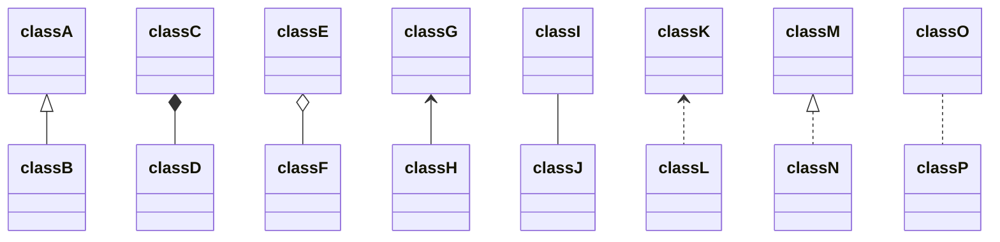

Стрелка может смотреть в обратную сторону — тогда наконечник переносится в конец связи:

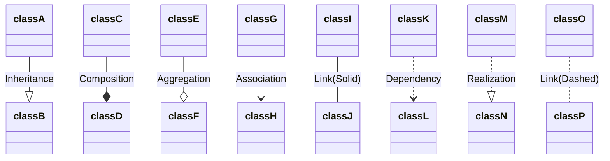

### Подписи связей

Формат: `[classA][Arrow][ClassB]:LabelText`.

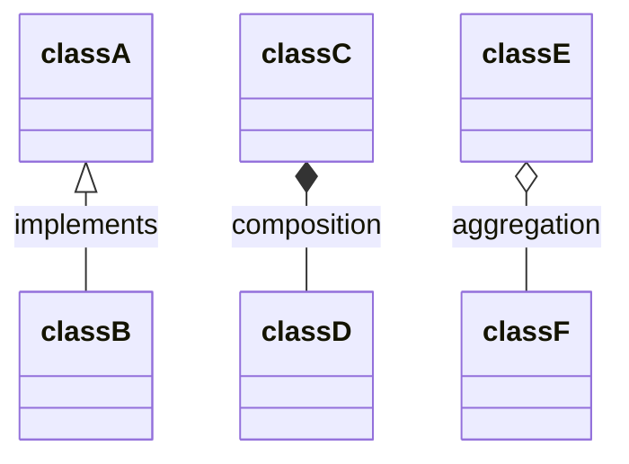

### Двусторонние связи

Связь N:M собирается как `[Relation Type][Link][Relation Type]`.

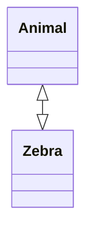

`Relation Type` — один из: `<|` (Inheritance), `*` (Composition), `o` (Aggregation), `>` и `<` (Association), `|>` (Realization).
`Link` — `--` (сплошная) или `..` (пунктир).

### Lollipop-интерфейсы

Особый тип связи, рисующий «леденец» на классе: `bar ()-- foo` или `foo --() bar`. Интерфейс — тот, кто со стороны `()`; он присоединяется к классу.

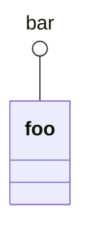

Каждый объявленный интерфейс уникален и не предназначен для переиспользования между классами / нескольких рёбер к нему.

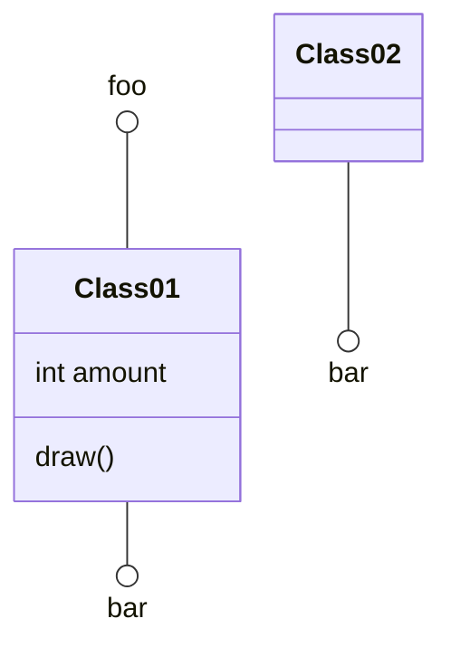

### Кардинальность (multiplicity)

Текст в двойных кавычках перед и/или после стрелки: `[classA] "cardinality1" [Arrow] "cardinality2" [ClassB]:LabelText`.

Варианты: `1` (ровно один), `0..1` (ноль или один), `1..*` (один и более), `*` (много), `n` (n, где n>1), `0..n`, `1..n`.

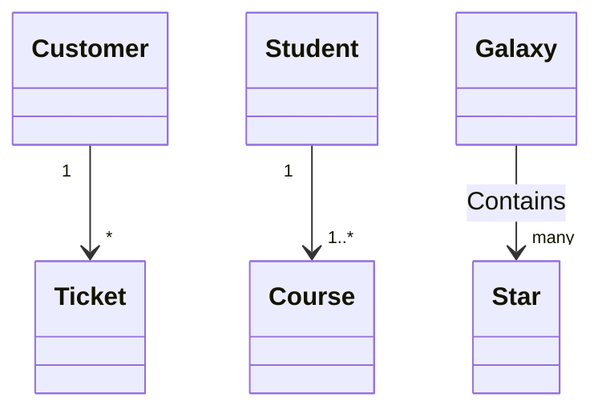

### Аннотации класса

Маркеры вида `<<Interface>>`, `<<Abstract>>`, `<<Service>>`, `<<Enumeration>>` — метаданные о природе класса. Три равнозначных способа записи.

Inline при объявлении:

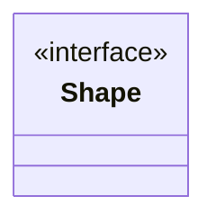

Отдельной строкой после объявления:

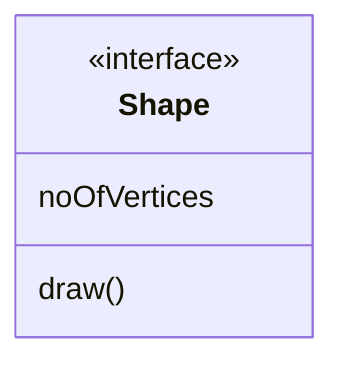

Внутри тела класса:

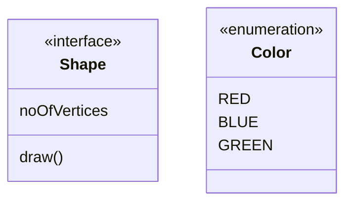

### Namespace

Группировка классов.

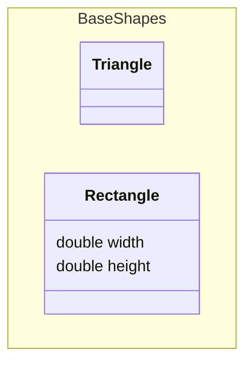

**Метка namespace (v11.15.0+)** — квадратные скобки, как у класса. Метка заменяет имя на рендере, но внутренне для связей и вложенности используется имя.

```mermaid
classDiagram
    namespace Auth["Authentication Service"] {
        class UserService {
            +login()
            +logout()
        }
    }
```

**Вложенные namespace (v11.15.0+)** — два способа. Точечная нотация автоматически создаёт промежуточные namespace (`A.B.C` создаст `A` и `A.B`, если их ещё нет):

```mermaid
classDiagram
    namespace Company.Engineering.Backend {
        class Developer {
            +writeCode()
        }
    }
    namespace Company.Engineering.Frontend {
        class Designer {
            +createMockup()
        }
    }
    namespace Company.Engineering {
        class TechLead {
            +planSprint()
        }
    }
    TechLead --> Developer : leads
    TechLead --> Designer : leads
```

Синтаксическая вложенность — блок namespace внутри блока namespace. Оба способа комбинируются.

```mermaid
classDiagram
    namespace Platform {
        namespace Auth {
            class UserService {
                +login()
            }
        }
        namespace Data {
            class Repository {
                +find()
            }
        }
        class Gateway {
            +route()
        }
    }
    Gateway --> UserService : delegates
    Gateway --> Repository : delegates
```

**Компактный режим (`hierarchicalNamespaces: false`).** По умолчанию `hierarchicalNamespaces: true` — каждый сегмент точечного или вложенного имени рисуется своим кластером. При `false` рисуются только явно объявленные namespace, каждый — одной плоской рамкой с полным именем; автоматически созданные промежуточные предки пропускаются, а классы из них переносятся в ближайший объявленный namespace.

```mermaid
---
config:
  class:
    hierarchicalNamespaces: false
---
classDiagram
    namespace Company.Engineering.Backend {
        class Developer {
            +writeCode()
        }
    }
    namespace Company.Engineering.Frontend {
        class Designer {
            +createMockup()
        }
    }
    namespace Company {
        class CEO {
            +makeDecisions()
        }
    }
    CEO --> Developer : oversees
    CEO --> Designer : oversees
```

### Направление

`direction TB | BT | LR | RL` — отдельной строкой в теле диаграммы.

```mermaid
classDiagram
    direction RL
    class Student {
        -idCard : IdCard
    }
    class IdCard{
        -id : int
        -name : string
    }
    class Bike{
        -id : int
    }
    Student "1" --o "1" IdCard : carries
    Student "1" --o "1" Bike : rides
```

### Заметки

`note "текст"` — общая заметка; `note for <CLASS NAME> "текст"` — заметка к конкретному классу. Многострочность внутри кавычек — через `<br>`.

```mermaid
classDiagram
    note "This is a general note"
    note for MyClass "This is a note for a class"
    note for Duck "can fly<br>can swim<br>can dive"
    class MyClass{
    }
    class Duck
```

### Комментарии

Отдельной строкой, начинающейся с `%%`. Весь текст до конца строки игнорируется парсером, включая валидный синтаксис диаграммы.

```mermaid
classDiagram
%% This whole line is a comment classDiagram class Shape <<interface>>
    class Shape{
        <<interface>>
        draw()
    }
```

### Интерактивность

Клик по узлу открывает ссылку в новой вкладке либо вызывает JS-колбэк. Работает при `securityLevel='loose'` и отключён при `securityLevel='strict'`. Объявляется отдельными строками после объявления классов.

```
action className "reference" "tooltip"
click className call callback() "tooltip"
click className href "url" "tooltip"
```

- `action` — `link` или `callback`;
- `className` — id узла;
- `reference` — URL либо имя функции;
- `tooltip` (необязательно) — подсказка при наведении (стилизуется классом `.mermaidTooltip`);
- колбэк вызывается с nodeId в качестве параметра.

Ссылки:

```mermaid
classDiagram
    class Shape
    link Shape "https://www.github.com" "This is a tooltip for a link"
    class Shape2
    click Shape2 href "https://www.github.com" "This is a tooltip for a link"
```

Колбэки:

```mermaid
classDiagram
    class Shape
    callback Shape "callbackFunction" "This is a tooltip for a callback"
    class Shape2
    click Shape2 call callbackFunction() "This is a tooltip for a callback"
```

### Стилизация отдельного узла

Ключевое слово `style` + CSS-пары через запятую. Заметки и namespace индивидуально не стилизуются (но подчиняются теме).

```mermaid
classDiagram
    class Animal
    class Mineral
    style Animal fill:#f9f,stroke:#333,stroke-width:4px
    style Mineral fill:#bbf,stroke:#f66,stroke-width:2px,color:#fff,stroke-dasharray: 5 5
```

### classDef и применение классов стилей

Определение: `classDef className fill:#f9f,stroke:#333,stroke-width:4px;`
Сразу нескольким именам: `classDef firstClassName,secondClassName font-size:12pt;`

Применение через `cssClass` (второй аргумент — имя стиля; список узлов перечисляется в кавычках через запятую):

```mermaid
classDiagram
    class Animal
    class Mineral
    classDef someclass fill:#f96,stroke:#333
    cssClass "Animal,Mineral" someclass
```

Короткая форма — оператор `:::` прямо в объявлении класса:

```mermaid
classDiagram
    class Animal:::someclass
    classDef someclass fill:#f96
```

Работает и с телом класса:

```mermaid
classDiagram
    class Animal:::someclass {
        -int sizeInFeet
        -canEat()
    }
    classDef someclass fill:#f96
```

**Класс `default`** применяется ко всем узлам; конкретные стили и классы, объявленные после, его переопределяют.

```mermaid
classDiagram
    class Animal:::pink
    class Mineral
    classDef default fill:#f96,color:red
    classDef pink color:#f9f
```

Оператор `:::` также умеет ссылаться на CSS-класс, предопределённый во внешних стилях страницы (например, `.styleClass > * > g { fill: #ff0000; }`):

```mermaid
classDiagram
    class Animal:::styleClass
```

### Accessibility

`accTitle:` — доступный заголовок, `accDescr:` — доступное описание (многострочное — блоком `accDescr { ... }`).

```mermaid
classDiagram
    accTitle: Domain model of the billing service
    accDescr: Invoice aggregates line items and is paid by a customer.
    Invoice "1" *-- "1..*" LineItem
    Customer "1" --> "*" Invoice
```

### Конфигурация класс-диаграммы

Задаётся frontmatter-блоком `config: class:` перед `classDiagram` (или глобально — см. `config.md`; палитра — `theming.md`).

| Параметр                 | Описание                                                                       | По умолчанию |
| ------------------------ | ------------------------------------------------------------------------------ | ------------ |
| `hideEmptyMembersBox`    | Скрывает пустой блок членов у класса                                            | `false`      |
| `hierarchicalNamespaces` | Рисовать каждый сегмент имени namespace отдельным кластером (иначе — компактно) | `true`       |

```mermaid
---
config:
  class:
    hideEmptyMembersBox: true
---
classDiagram
    class Duck
```

## Ловушки

- **Пробел перед типом возврата обязателен.** `+deposit(amount)bool` не распознаётся как тип возврата — нужно `+deposit(amount) bool`.
- **Дженерик не часть имени класса.** После `class Square~Shape~` во всех связях, `style`, `click`, `cssClass` используйте `Square`. Два класса с одинаковым именем и разными тип-параметрами невозможны.
- **Дженерики с запятой не поддерживаются** — `List~List~K, V~~` сломает парсер; такие типы придётся упрощать.
- **Спецсимволы в имени класса.** Разрешены только буквы/цифры/`_`/`-`. Всё остальное — либо через метку `class Foo["A *! label"]`, либо через обратные кавычки `` class `Animal Class!` ``.
- **Комментарий `%%` только на своей строке**, иначе часть синтаксиса будет съедена.
- **`cssClass` нельзя совмещать с оператором `:::` в строке связи**: краткая форма `:::` не добавляется одновременно с оператором связи — навешивайте класс в отдельном объявлении `class X:::style`.
- **Заметки и namespace не стилизуются** через `style`/`classDef` индивидуально — только через тему.
- **Интерактивность отключена при `securityLevel='strict'`** (значение по умолчанию во многих интеграциях): `click`/`callback` молча не сработают.
- **Lollipop-интерфейс уникален** — не рассчитывайте, что один `bar` корректно соберёт несколько рёбер от разных классов.

## Источник

Дистиллировано из официальной документации mermaid-js/mermaid (docs/syntax), проверено рендером на mermaid-cli 11.16.0 / mermaid 11.16.1.
