# Конфигурация (config)

Применять, когда диаграмме нужен нестандартный вид или движок: тема, шрифт, layout-алгоритм, `look: handDrawn`, формулы KaTeX, настройки конкретного типа диаграммы, accessibility-подписи. НЕ применять, когда достаточно дефолтов: лишний `config:` делает диаграмму хрупкой и непереносимой между рендерерами (GitHub, mermaid.live, mmdc поддерживают разный набор ключей).

## Минимальный скелет

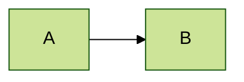

## Синтаксис

### Три источника конфигурации и их приоритет

Итоговый **render config** собирается так (каждый следующий перекрывает предыдущий):

1. **Дефолтная конфигурация** mermaid.
2. **siteConfig** — вызов `mermaid.initialize({...})`. Делается интегратором сайта **один раз**, действует на все диаграммы страницы. Автор диаграммы им не управляет. Перед рендером каждой диаграммы конфиг сбрасывается к siteConfig (`configApi.reset`).
3. **Frontmatter `config:`** (v10.5.0+) — YAML-блок в начале самой диаграммы. **Рекомендуемый способ для автора.**
4. **Директива `%%{init: ...}%%`** — устарела с v10.5.0, но работает и **перекрывает frontmatter** (проверено рендером на 11.16.1: frontmatter `theme: forest` + директива `theme: dark` дают dark).

Что выбирать:

| Задача | Способ |
|---|---|
| `.mmd`-файл, блок в Markdown, артефакт для другого инструмента | frontmatter `config:` |
| Единый стиль всех диаграмм сайта/приложения | `mermaid.initialize` (siteConfig) |
| Легаси-код, чужой сниппет | директива `%%{init}%%` — читать умей, писать новое не надо |

Ключи из списка `secure` не переопределяются ни frontmatter'ом, ни директивой — только через `initialize` (см. ниже).

### Frontmatter

YAML-блок между двумя строками `---` **в самом начале** текста диаграммы. Поддерживает два верхнеуровневых ключа: `title` и `config`.

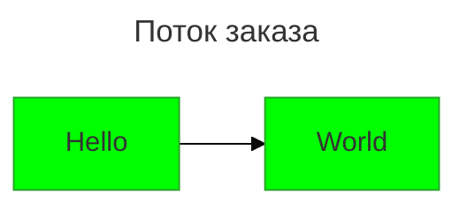

`title` рисуется как заголовок диаграммы и не требует `config:`.

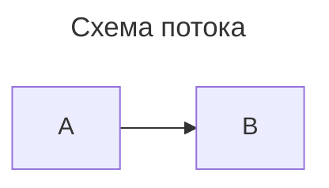

### Директива `%%{init: ...}%%`

Директива начинается и заканчивается `%%`, внутри — JSON-объект с корнем `init`. Общие настройки лежат на верхнем уровне, настройки конкретного типа диаграммы — на уровень глубже под именем типа:

```text
%%{
  init: {
    "theme": "dark",
    "fontFamily": "monospace",
    "logLevel": "info",
    "htmlLabels": true,
    "flowchart": { "curve": "linear" },
    "sequence": { "mirrorActors": true }
  }
}%%
```

Однострочная форма: `%%{init: { ... } }%%`. Ключи `init` и `initialize` эквивалентны; несколько директив склеиваются в один объект, побеждает последнее значение ключа.

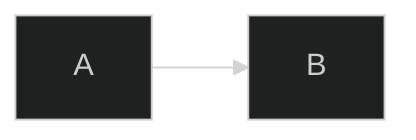

Здесь итоговый конфиг — `{"logLevel":"fatal","theme":"dark"}`.

Настройка конкретного типа диаграммы через директиву:

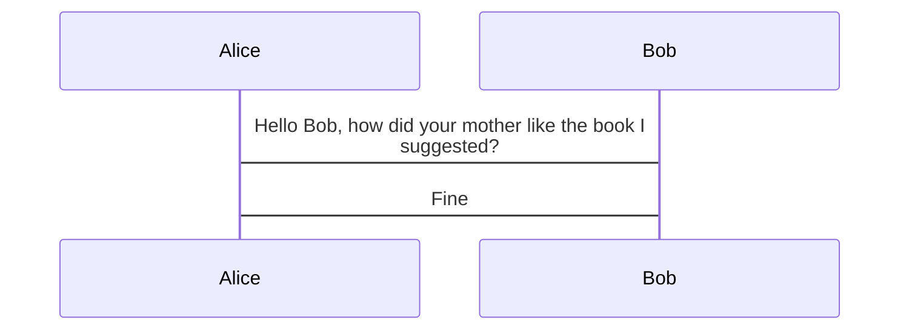

### securityLevel и защищённые ключи

`securityLevel` — уровень доверия к тексту диаграммы: `strict` (по умолчанию), `loose`, `antiscript`, `sandbox`.

- `strict` / `antiscript` / `sandbox` — из текста вырезаются `<script>`, URL в `click ... href` прогоняются через санитайзер.
- `loose` — сырой HTML в подписях разрешён, `click`-интерактивность работает.
- `sandbox` — диаграмма рендерится внутри iframe, ссылки принудительно открываются с `target="_top"`.

Часть ключей объявлена «защищёнными» и **меняется только через `mermaid.initialize`**; во frontmatter и в директиве они молча игнорируются. Дефолтный список `secure`:

```text
["secure", "securityLevel", "startOnLoad", "maxTextSize", "suppressErrorRendering", "maxEdges"]
```

Проверено рендером: `config: { maxTextSize: 10 }` во frontmatter не обрезает диаграмму — ключ проигнорирован. Интегратор сайта может расширить этот список своим `secure: [...]`, запретив авторам ещё больше ключей.

### Layout-алгоритмы

`layout` выбирает движок раскладки. Значения: `dagre` (по умолчанию), `elk`, `tidy-tree`, `cose-bilkent`.

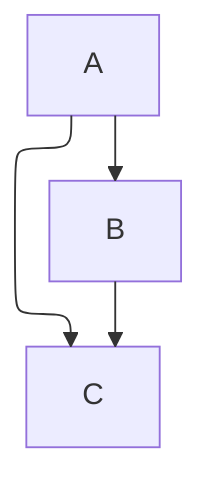

Опции ELK живут в отдельной секции `elk`:

| Ключ | Значения | Смысл |
|---|---|---|
| `nodePlacementStrategy` | `SIMPLE`, `NETWORK_SIMPLEX`, `LINEAR_SEGMENTS`, `BRANDES_KOEPF` (по умолчанию) | как расставляются узлы внутри слоя |
| `mergeEdges` | boolean | разрешить рёбрам делить общий путь |
| `cycleBreakingStrategy` | `GREEDY`, `DEPTH_FIRST`, `INTERACTIVE`, `MODEL_ORDER`, `GREEDY_MODEL_ORDER` | как разрывать циклы |
| `considerModelOrder` | `NONE`, `NODES_AND_EDGES`, `PREFER_EDGES`, `PREFER_NODES` | насколько сохранять порядок из текста |
| `forceNodeModelOrder` | boolean | жёстко сохранять порядок узлов |

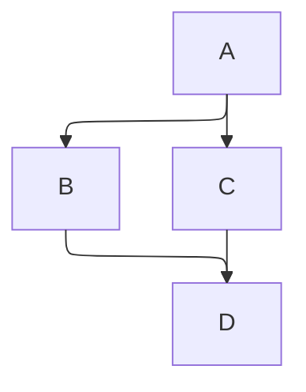

### tidy-tree

`tidy-tree` раскладывает узлы непересекающимся деревом и сам подбирает интервалы. Поддерживается в первую очередь для `mindmap`.

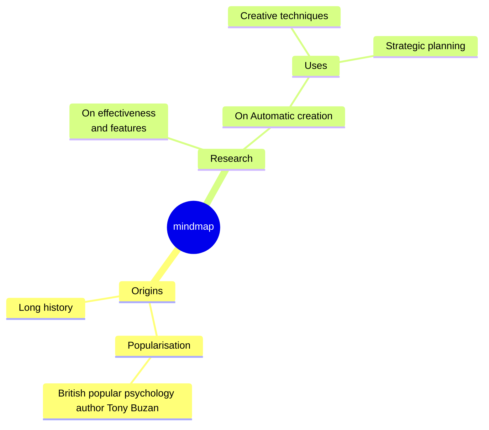

### look и handDrawn

`look` задаёт визуальный стиль отрисовки: `classic` (по умолчанию), `handDrawn`, `neo`. Для `handDrawn` есть `handDrawnSeed` — seed «рукописного» шума; `0` (дефолт) означает случайный seed, поэтому для воспроизводимого SVG его задают явно.

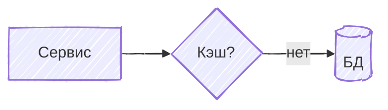

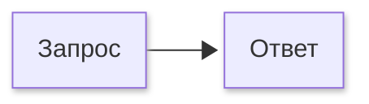

### theme, fontFamily, fontSize

`theme` — одна из встроенных тем, `themeVariables` — точечная перекраска (работает **только** с `theme: base`), `themeCSS` — сырой CSS поверх темы. Подробности и таблица переменных — см. `theming.md`.

`fontFamily` — любое валидное CSS-значение `font-family`, применяется ко всему тексту диаграммы. `fontSize` — число (px). `altFontFamily` — запасное семейство.

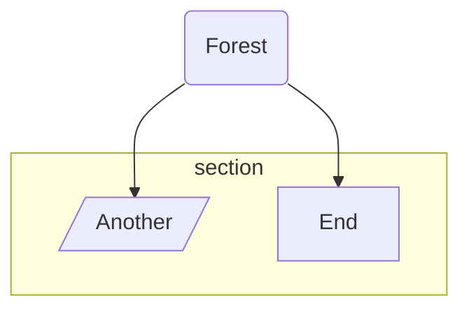

### Математика (KaTeX, v10.9.0+)

Формула оборачивается в `$$ ... $$`. Поддерживается **только** во flowchart и sequence.

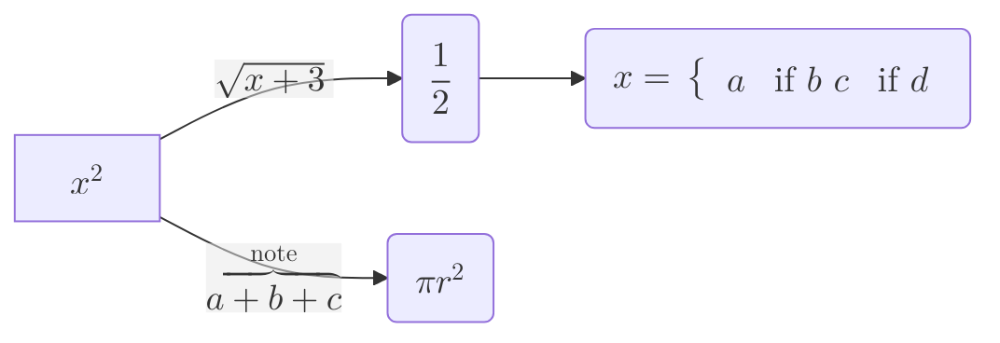

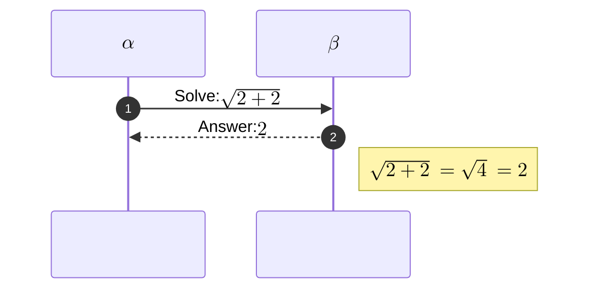

По умолчанию формулы рендерятся через MathML. Два site-level ключа меняют это поведение (оба требуют, чтобы интегратор сам подключил CSS KaTeX — в mermaid он не входит):

- `legacyMathML: true` — откат на CSS-рендеринг KaTeX там, где браузер не умеет MathML.
- `forceLegacyMathML: true` — **всегда** использовать стили KaTeX, игнорируя `legacyMathML`. Рекомендуется, если важна одинаковая картинка на всех ОС и браузерах (реализации MathML различаются).

### Ограничители размера

- `maxTextSize` — максимальная длина текста диаграммы, по умолчанию `50000`.
- `maxEdges` — максимальное число рёбер, по умолчанию `500`. Большие графы падают с ошибкой именно об этот лимит.

Оба ключа защищённые: поднять лимит можно только через `mermaid.initialize`, не из диаграммы.

### Accessibility: accTitle и accDescr

Работают во всех основных типах диаграмм и превращаются в `<title>`/`<desc>` SVG со связкой `aria-labelledby` / `aria-describedby` (проверено на выводе mmdc).

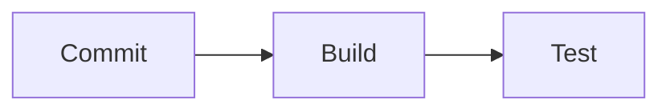

Однострочная форма описания — `accDescr: текст`. Многострочная — блок `accDescr { ... }`.

### Настройки конкретного типа диаграммы

Секция называется по типу диаграммы: `flowchart`, `sequence`, `gantt`, `journey`, `timeline`, `class`, `state`, `er`, `pie`, `quadrantChart`, `xyChart`, `requirement`, `architecture`, `mindmap`, `kanban`, `gitGraph`, `c4`, `sankey`, `packet`, `block`, `treeView`, `radar`, `venn`, `cynefin`, `railroad`, `ishikawa`, `swimlane`, `eventmodeling`, `wardley-beta`.

Ходовые ключи flowchart (подробности по самой диаграмме — `flowchart.md`): `curve` (`basis`, `bumpX`, `bumpY`, `cardinal`, `catmullRom`, `linear`, `monotoneX`, `monotoneY`, `natural`, `step`, `stepAfter`, `stepBefore`, `rounded`), `nodeSpacing`, `rankSpacing`, `diagramPadding`, `padding`, `wrappingWidth`, `titleTopMargin`, `subGraphTitleMargin`, `defaultRenderer` (`dagre-d3` / `dagre-wrapper` / `elk`), `inheritDir` (по умолчанию `false`; `true` — подграфы без явного направления наследуют глобальное).

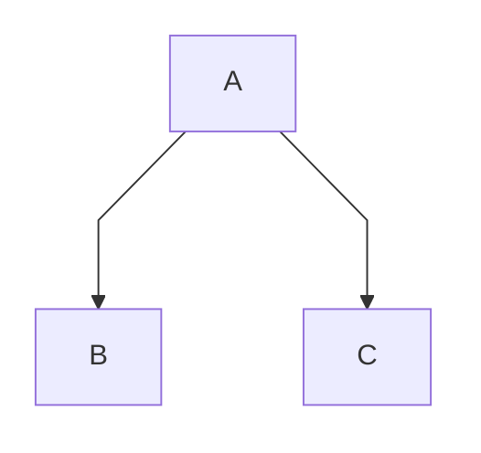

Ключи конкретных типов разобраны в их файлах (`sequence` — `sequence.md`, `gantt` — `gantt.md`, `pie`/`xyChart`/`radar`/`quadrantChart`/`sankey`/`treemap`/`packet` — `charts.md`, `treeView`/`kanban`/`timeline`/`mindmap` — `hierarchy.md` и т. д.); здесь — только общий механизм. У всех типов есть общие `useWidth` и `useMaxWidth` (при `true` SVG растягивается на 100% ширины контейнера).

Полный список ключей — в `defaultConfig.ts` mermaid; здесь перечислено только реально ходовое.

### Прочие глобальные ключи

| Ключ | Значения / дефолт | Смысл |
|---|---|---|
| `htmlLabels` | boolean | рендерить подписи как HTML. Корневой ключ имеет приоритет над `flowchart.htmlLabels`, который **устарел с v11.12.3+** |
| `logLevel` | `trace`/0, `debug`/1, `info`/2, `warn`/3, `error`/4, `fatal`/5 (дефолт) | объём логов |
| `startOnLoad` | boolean | рендерить ли диаграммы при загрузке страницы (защищённый ключ) |
| `arrowMarkerAbsolute` | boolean | абсолютные пути к маркерам стрелок вместо якорей (важно при `<base>`) |
| `deterministicIds` | boolean, дефолт `false` | детерминированные id узлов в SVG — чтобы файл не менялся в git при неизменном содержимом |
| `deterministicIDSeed` | строка | seed для `deterministicIds` |
| `suppressErrorRendering` | boolean | не вставлять «Syntax error»-диаграмму в DOM (защищённый ключ) |
| `darkMode` | boolean | влияет на то, как вычисляются производные цвета темы |
| `wrap` / `markdownAutoWrap` | boolean | перенос текста |
| `dompurifyConfig` | объект | конфиг санитайзера DOMPurify |
| `secure` | массив строк | какие ключи запретить менять из диаграммы (только через `initialize`) |

## Ловушки

- **Frontmatter обязан быть первым.** `---`-блок после строки с типом диаграммы ломает парсер: `Parse error ... Expecting 'SEMI', 'NEWLINE', 'SPACE', got 'LINK'` (проверено).
- **`themeVariables` без `theme: base` молча игнорируются.** Проверено: `theme: default` + `primaryColor: '#00ff00'` даёт байт-в-байт тот же SVG, что и вовсе без `themeVariables`.
- **Директива перекрывает frontmatter**, а не наоборот. Смешивать оба способа в одной диаграмме — источник «почему тема не та».
- **Защищённые ключи молча не работают** из диаграммы: `securityLevel`, `maxTextSize`, `maxEdges`, `startOnLoad`, `secure`, `suppressErrorRendering`. Ошибки не будет — просто ничего не произойдёт.
- **Ключ ELK называется `nodePlacementStrategy`**, а не `nodePlacement.strategy`. Опечатка не вызывает ошибку — раскладка просто остаётся дефолтной.
- **JSON в директиве должен быть валидными парами ключ-значение в кавычках**, иначе директива целиком игнорируется без ошибки. Одинарные кавычки допускаются.
- **`layout: tidy-tree` рассчитан на `mindmap`.** На других типах эффекта может не быть.
- **Формулы `$$...$$` работают только во flowchart и sequence.** В остальных типах это просто текст.
- **Комбинация `theme` + `themeCSS` не заменяет тему**, а накладывается поверх — переопределяйте только те селекторы, что нужны.
- **YAML во frontmatter не терпит табов** и требует ровных отступов пробелами; сломанный YAML роняет всю диаграмму, а не только конфиг.
- **`fontFamily` внутри `themeVariables` и `fontFamily` на верхнем уровне — разные ключи.** Для сплошной смены шрифта задавайте верхнеуровневый.

## Источник

Дистиллировано из официальной документации mermaid-js/mermaid (docs/syntax), проверено рендером на mermaid-cli 11.16.0 / mermaid 11.16.1.
