# ER-диаграмма (erDiagram)

Применять для модели данных: сущности, их атрибуты и связи с кардинальностями (логическая модель или схема реляционной БД). НЕ применять для потока управления и порядка шагов (`flowchart`), для обмена сообщениями во времени (`sequenceDiagram`) и для структуры классов с методами и наследованием (`classDiagram`).

## Минимальный скелет

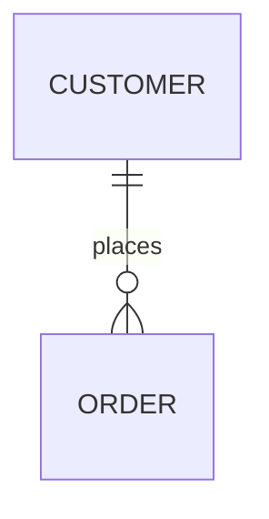

## Синтаксис

### Форма выражения

```
<first-entity> [<relationship> <second-entity> : <relationship-label>]
```

- `first-entity` — имя сущности. Поддерживаются любые unicode-символы; пробелы допустимы, если имя взято в двойные кавычки (`"name with space"`).
- `relationship` — кардинальность обеих сторон + тип идентификации.
- `second-entity` — имя второй сущности.
- `relationship-label` — подпись связи с точки зрения **первой** сущности (`PROPERTY ||--|{ ROOM : contains` читается как «property содержит одну и более room»).

Обязательна только `first-entity` — так рисуют сущность без связей. Но если указана хоть одна из остальных частей, обязательны **все** (включая `:` и подпись).

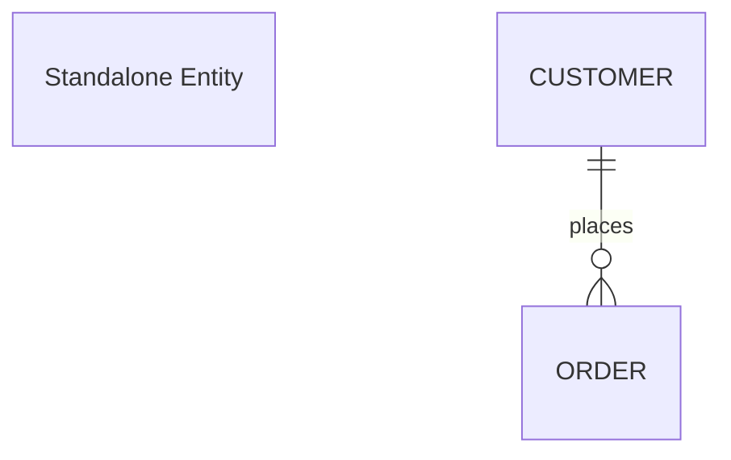

### Кардинальности

В маркере два символа: **внешний** задаёт максимум, **внутренний** — минимум. Нотация — «воронья лапка» (crow's foot).

| Слева | Справа | Значение |
| :---: | :----: | -------- |
| `\|o` | `o\|` | Ноль или один |
| `\|\|` | `\|\|` | Ровно один |
| `}o` | `o{` | Ноль или более (без верхней границы) |
| `}\|` | `\|{` | Один или более (без верхней границы) |

Словесные алиасы (пишутся вместо символьного маркера, работают с обеих сторон):

| Алиас | Эквивалент |
| ----- | ---------- |
| `one or zero`, `zero or one` | Ноль или один |
| `only one`, `1` | Ровно один |
| `one or more`, `one or many`, `many(1)`, `1+` | Один или более |
| `zero or more`, `zero or many`, `many(0)`, `0+` | Ноль или более |

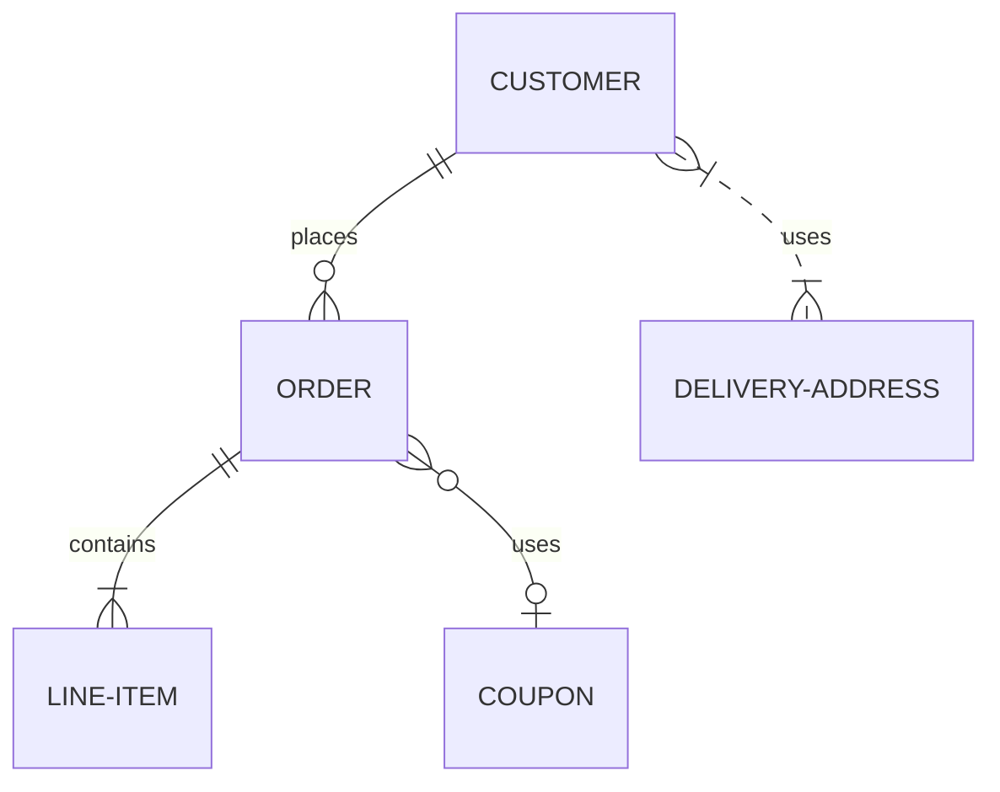

### Идентификация связи

Связь бывает *identifying* (сплошная линия) и *non-identifying* (пунктир). Identifying означает, что дочерняя сущность не существует без родительской.

| Значение | Смысл | Алиас-слово |
| :------: | ----- | ----------- |
| `--` | identifying, сплошная линия | `to` |
| `..` | non-identifying, пунктир | `optionally to` |

Символьная и словесная записи взаимозаменяемы:

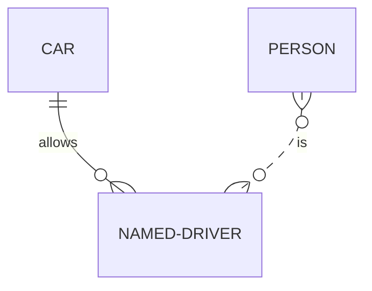


### Атрибуты

Атрибуты описываются блоком `{ ... }` после имени сущности; каждая строка — пара `type name`.

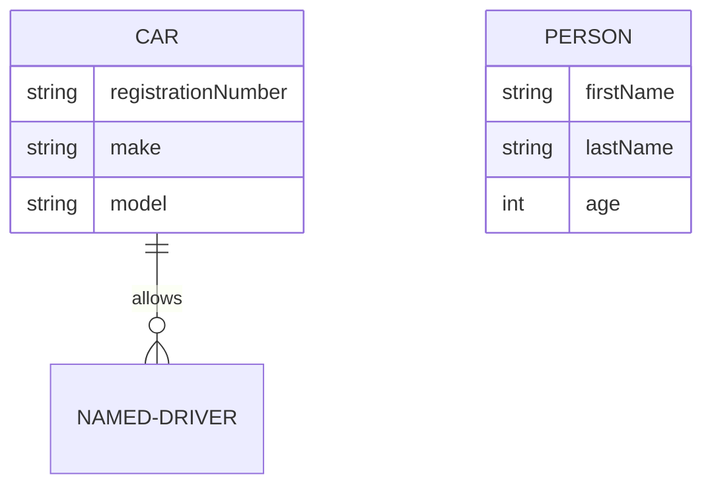

Правила для `type` и `name`:

- `type` начинается с буквы; далее допустимы цифры, дефисы, подчёркивания, круглые и квадратные скобки (`string(99)`, `string[]`, `decimal(10-2)`).
- `name` — те же правила, плюс может начинаться со звёздочки `*` как альтернативный способ пометить первичный ключ.
- Закрытого списка типов нет — mermaid не валидирует имена типов.

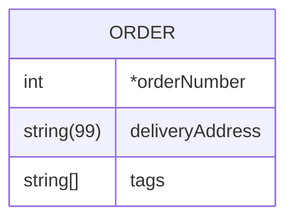

#### Опциональные (nullable) типы — v11.16.0+

`type` может заканчиваться на `?`:

```mermaid
erDiagram
    PERSON {
        string firstName
        string? middleName
        string lastName
    }
```

#### Ключи и комментарии к атрибутам

Ключ — `PK`, `FK` или `UK` (Primary / Foreign / Unique Key) после имени атрибута; несколько ключей перечисляются через запятую (`PK, FK`). Комментарий — строка в двойных кавычках в самом конце строки атрибута. Markdown и unicode в *ключах* не поддерживаются.

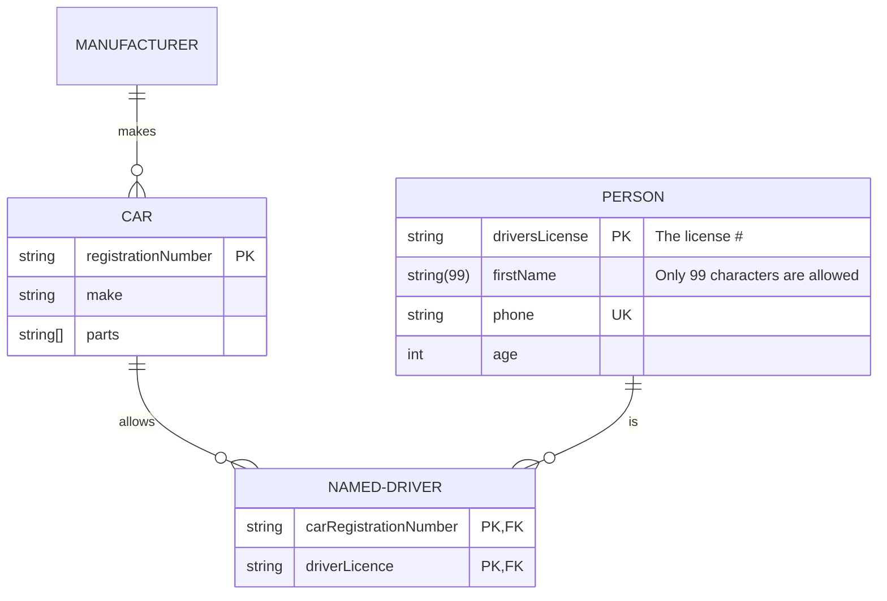

### Алиасы сущностей

Алиас задаётся квадратными скобками после идентификатора и показывается на диаграмме вместо идентификатора. В связях используется по-прежнему идентификатор.

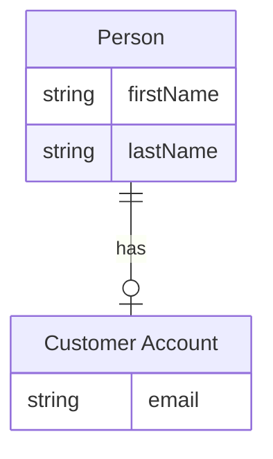

### Unicode и Markdown в подписях

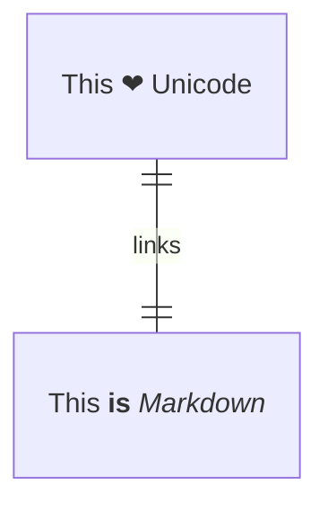

### Направление (direction)

`direction` задаёт ориентацию диаграммы: `TB` (сверху вниз, по умолчанию), `BT`, `LR`, `RL`.

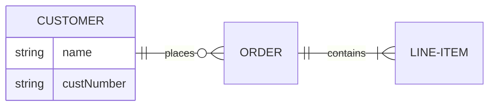

### Группировка: subgraph

`subgraph` собирает сущности в логические блоки; блоки вкладываются друг в друга.

```
subgraph title
    graph definition
end
```

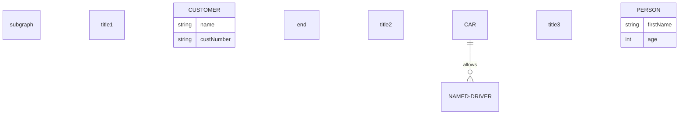

У подграфа всегда есть `id` и опционально `title`:

- одно слово — служит и id, и заголовком: `subgraph title1`;
- несколько слов — в кавычках, значение используется и как id, и как заголовок: `subgraph "Customer Domain"`;
- явный id с отдельным заголовком в квадратных скобках: `subgraph id1 [Customers]`; заголовок из нескольких слов — обязательно в кавычках внутри скобок: `subgraph id1 ["Customer domain"]`.

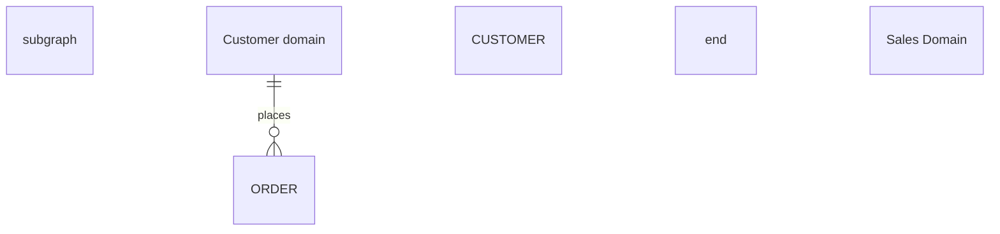

Подграф ссылается **только по id**, никогда по заголовку; id с пробелами — в кавычках (`"Customer Domain" ||--o{ ORDER : contains`). Связи можно строить и от подграфа к подграфу, и от подграфа к сущности:

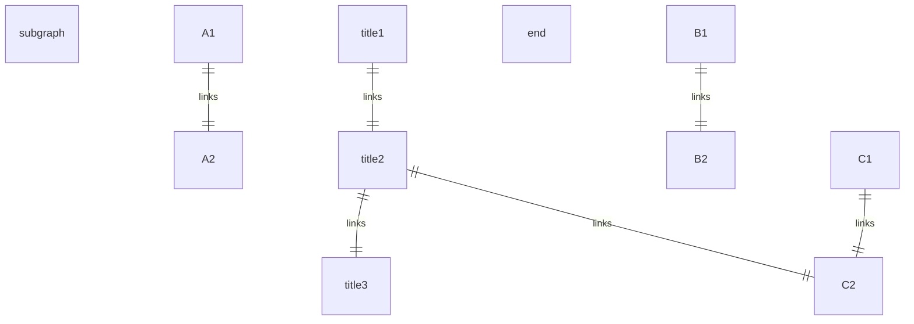

Подграф может задавать собственное направление:

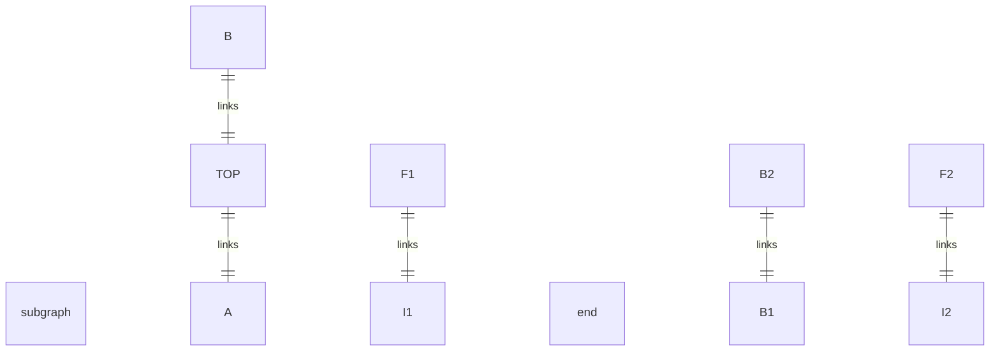

### Стили: style

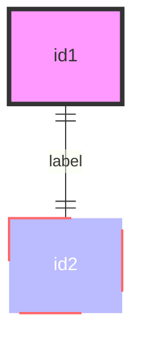

Стиль можно применить к списку узлов одним выражением: `style nodeId1,nodeId2 styleList`.

### Стили: classDef и class

```
classDef className fill:#f9f,stroke:#333,stroke-width:4px
classDef firstClassName,secondClassName font-size:12pt
class nodeId1 className
class nodeId1,nodeId2 className
class nodeId1,nodeId2 className1,className2
```

Короткая форма — оператор `:::` прямо на узле (в том числе внутри выражения связи и перед блоком атрибутов); несколько классов перечисляются через запятую: `nodeId:::className1,className2`.

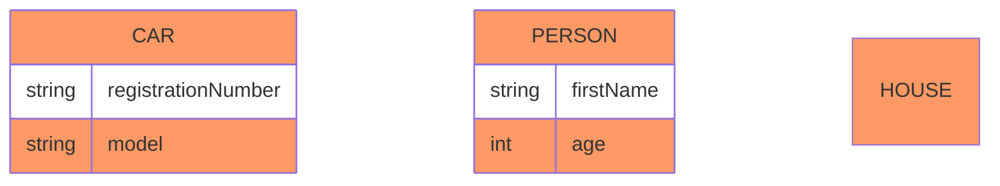

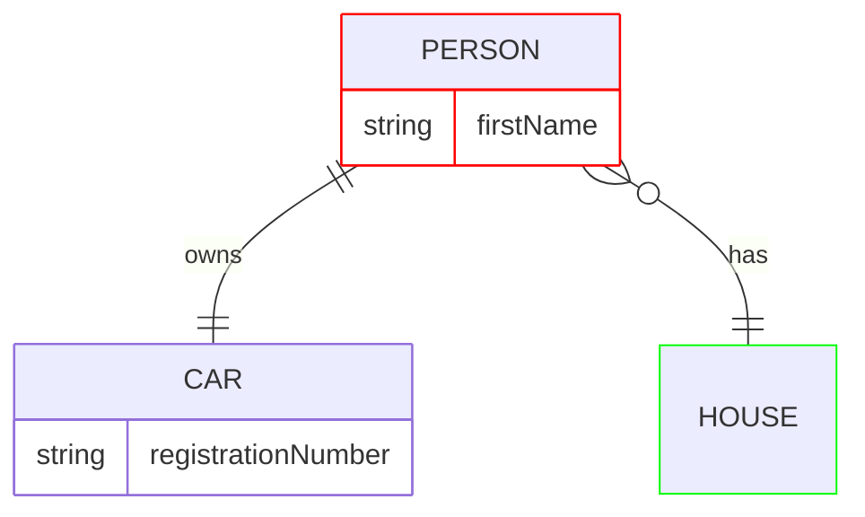

Класс с именем `default` применяется ко всем узлам без явного класса; `style` и именованные классы перекрывают его.

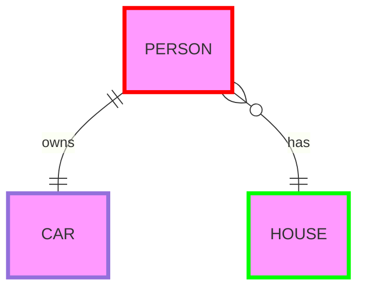

### Конфигурация

Заголовок и настройки — через YAML-frontmatter диаграммы. Раскладка по умолчанию — dagre; для крупных схем доступна ELK (`layout: elk`). Тема и цвета — см. `theming.md`, общий конфиг — `config.md`.

```mermaid
---
title: Order example
config:
    layout: elk
---
erDiagram
    CUSTOMER ||--o{ ORDER : places
    ORDER ||--|{ LINE-ITEM : contains
    CUSTOMER }|..|{ DELIVERY-ADDRESS : uses
```

## Ловушки

- **Связь без подписи не парсится.** `A ||--|| B` → `Expecting 'COLON', 'STYLE_SEPARATOR', got 'NEWLINE'`. Либо пиши полностью `A ||--|| B : label`, либо оставляй только сущность.
- **Тип атрибута обязан начинаться с буквы.** `1string x` → `Expecting 'BLOCK_STOP', 'ATTRIBUTE_WORD', got '1'`.
- **Имя атрибута — одно слово.** `string first name` → `Expecting 'ATTRIBUTE_WORD', '?', got 'BLOCK_STOP'`. Пробелы уводи в комментарий: `string firstName "first name"`.
- **Двойные кавычки внутри комментария к атрибуту запрещены** — экранирования нет, `"say ""hi"""` даёт parse error.
- **Маркер кардинальности несимметричен.** Слева пишутся формы `|o`, `||`, `}o`, `}|`, справа — зеркальные `o|`, `||`, `o{`, `|{`. Перепутанная сторона (`A o{--o{ B`) рисует «лапку», направленную не туда.
- **Подграф адресуется по id, а не по заголовку**; при `subgraph id1 [Customers]` в связях пишется `id1`, а id с пробелами — только в кавычках.
- **Заголовок подграфа из нескольких слов без кавычек не парсится.** Пример из официальной документации `subgraph id1 [title 1]` падает на 11.16.1: `Expecting 'SQE', got 'ENTITY_ONE'`. Пиши `subgraph id1 ["title 1"]`.
- **Имя сущности с пробелами — в двойных кавычках.** То же для алиаса: `a["Customer Account"]`.
- **`--` и `..` — единственные разделители.** Одинарный дефис или три точки не распознаются.

## Источник

Дистиллировано из официальной документации mermaid-js/mermaid (docs/syntax), проверено рендером на mermaid-cli 11.16.0 / mermaid 11.16.1.
