# Flowchart

Применять для процессов, алгоритмов, потоков данных, архитектурных схем и деревьев решений — везде, где важны узлы и связи между ними. НЕ применять, когда важен порядок во времени и участники обмена (`sequenceDiagram`), состояния объекта (`stateDiagram-v2`), структура классов (`classDiagram`) или сроки (`gantt`).

## Минимальный скелет

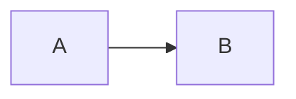

## Синтаксис

### Объявление и направление

Ключевое слово — `flowchart` (синоним `graph`; `flowchart-elk` сразу включает elk-раскладку). Далее направление:

| Код | Смысл |
| --- | --- |
| `TB` | сверху вниз |
| `TD` | то же самое, top-down |
| `BT` | снизу вверх |
| `LR` | слева направо |
| `RL` | справа налево |

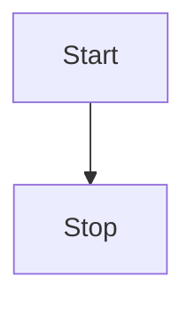

Точка с запятой в конце выражения необязательна. Между вершиной и связью допустим один пробел, но между вершиной и её текстом или связью и её текстом пробела быть не должно.

### Узлы и подписи

`id` без подписи отображается как есть. Подпись задаётся в скобках формы; если узел описан несколько раз, побеждает последняя подпись, а в дальнейших связях текст можно опускать.

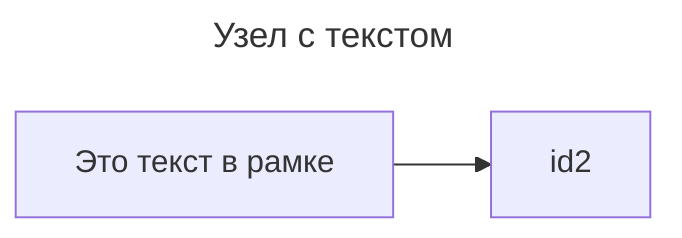

Unicode оборачивается в двойные кавычки:

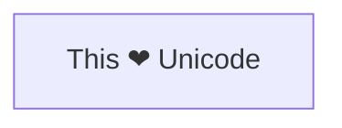

### Классические формы узлов

| Форма | Синтаксис |
| --- | --- |
| Прямоугольник | `id[текст]` |
| Скруглённый | `id(текст)` |
| Стадион (pill) | `id([текст])` |
| Подпрограмма | `id[[текст]]` |
| Цилиндр (БД) | `id[(текст)]` |
| Круг | `id((текст))` |
| Двойной круг | `id(((текст)))` |
| Асимметричный (флаг) | `id>текст]` |
| Ромб (решение) | `id{текст}` |
| Шестиугольник | `id{{текст}}` |
| Параллелограмм | `id[/текст/]` |
| Параллелограмм alt | `id[\текст\]` |
| Трапеция | `id[/текст\]` |
| Трапеция alt | `id[\текст/]` |

Зеркальной версии асимметричной формы (`id>текст]`) нет.

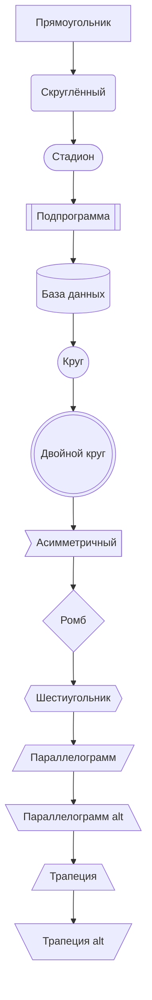

### Расширенный синтаксис форм `@{ ... }` (v11.3.0+)

Общая форма метаданных узла: `id@{ shape: <имя>, label: "<текст>" }`. `A@{ shape: rect }` рендерится так же, как `A["A"]`. Можно задать только подпись: `A@{ label: "Текст" }`.

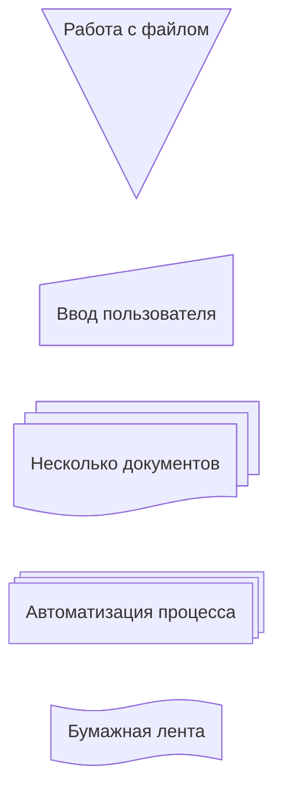

Полный каталог форм, доступных в mermaid 11.16.1 (48 шт.). Годится и короткое имя, и любой алиас:

| Семантика | Форма | Короткое имя | Алиасы |
| --- | --- | --- | --- |
| Process | Rectangle | `rect` | `proc`, `process`, `rectangle` |
| Event | Rounded Rectangle | `rounded` | `event` |
| Terminal Point | Stadium | `stadium` | `terminal`, `pill` |
| Subprocess | Framed Rectangle | `fr-rect` | `subprocess`, `subproc`, `framed-rectangle`, `subroutine` |
| Database | Cylinder | `cyl` | `db`, `database`, `cylinder` |
| Data Store | Data Store | `datastore` | `data-store` |
| Start | Circle | `circle` | `circ` |
| Bang | Bang | `bang` | `bang` |
| Cloud | Cloud | `cloud` | `cloud` |
| Decision | Diamond | `diam` | `decision`, `diamond`, `question` |
| Prepare Conditional | Hexagon | `hex` | `hexagon`, `prepare` |
| Data Input/Output | Lean Right | `lean-r` | `lean-right`, `in-out` |
| Data Input/Output | Lean Left | `lean-l` | `lean-left`, `out-in` |
| Priority Action | Trapezoid Base Bottom | `trap-b` | `priority`, `trapezoid-bottom`, `trapezoid` |
| Manual Operation | Trapezoid Base Top | `trap-t` | `manual`, `trapezoid-top`, `inv-trapezoid` |
| Stop | Double Circle | `dbl-circ` | `double-circle` |
| Text Block | Text Block | `text` | — |
| Card | Notched Rectangle | `notch-rect` | `card`, `notched-rectangle` |
| Lined/Shaded Process | Lined Rectangle | `lin-rect` | `lined-rectangle`, `lined-process`, `lin-proc`, `shaded-process` |
| Start | Small Circle | `sm-circ` | `start`, `small-circle` |
| Stop | Framed Circle | `fr-circ` | `stop`, `framed-circle` |
| Fork/Join | Filled Rectangle | `fork` | `join` |
| Collate | Hourglass | `hourglass` | `hourglass`, `collate` |
| Comment | Curly Brace | `brace` | `comment`, `brace-l` |
| Comment Right | Curly Brace | `brace-r` | — |
| Comment (обе скобки) | Curly Braces | `braces` | — |
| Com Link | Lightning Bolt | `bolt` | `com-link`, `lightning-bolt` |
| Document | Document | `doc` | `doc`, `document` |
| Delay | Half-Rounded Rectangle | `delay` | `half-rounded-rectangle` |
| Direct Access Storage | Horizontal Cylinder | `h-cyl` | `das`, `horizontal-cylinder` |
| Disk Storage | Lined Cylinder | `lin-cyl` | `disk`, `lined-cylinder` |
| Display | Curved Trapezoid | `curv-trap` | `curved-trapezoid`, `display` |
| Divided Process | Divided Rectangle | `div-rect` | `div-proc`, `divided-rectangle`, `divided-process` |
| Extract | Triangle | `tri` | `extract`, `triangle` |
| Internal Storage | Window Pane | `win-pane` | `internal-storage`, `window-pane` |
| Junction | Filled Circle | `f-circ` | `junction`, `filled-circle` |
| Loop Limit | Trapezoidal Pentagon | `notch-pent` | `loop-limit`, `notched-pentagon` |
| Manual File | Flipped Triangle | `flip-tri` | `manual-file`, `flipped-triangle` |
| Manual Input | Sloped Rectangle | `sl-rect` | `manual-input`, `sloped-rectangle` |
| Multi-Document | Stacked Document | `docs` | `documents`, `st-doc`, `stacked-document` |
| Multi-Process | Stacked Rectangle | `st-rect` | `procs`, `processes`, `stacked-rectangle` |
| Stored Data | Bow Tie Rectangle | `bow-rect` | `stored-data`, `bow-tie-rectangle` |
| Summary | Crossed Circle | `cross-circ` | `summary`, `crossed-circle` |
| Tagged Document | Tagged Document | `tag-doc` | `tag-doc`, `tagged-document` |
| Tagged Process | Tagged Rectangle | `tag-rect` | `tagged-rectangle`, `tag-proc`, `tagged-process` |
| Paper Tape | Flag | `flag` | `paper-tape` |
| Odd | Odd | `odd` | — |
| Lined Document | Lined Document | `lin-doc` | `lined-document` |

Формы `browser`, `bucket`, `console`, `folder` и `person` есть в свежей документации, но **не поддерживаются в mermaid 11.16.1** — парсер падает с `Error: No such shape: <имя>`.

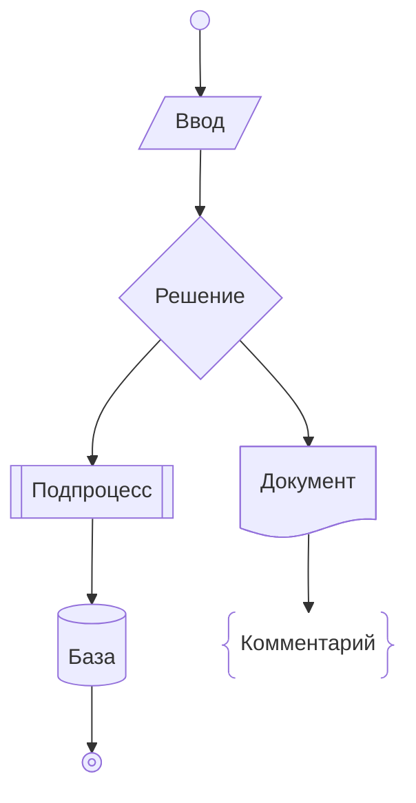

### Иконки и изображения в узлах (v11.3.0+)

`icon` требует зарегистрированного icon-pack (см. `config/icons.md` в документации mermaid). Параметры: `icon` — имя иконки, `form` — фон (`square`, `circle`, `rounded`; без него фона нет), `label` — подпись (без неё подписи нет), `pos` — позиция подписи (`t`, `b`; по умолчанию снизу), `h` — высота (по умолчанию и минимум 48).

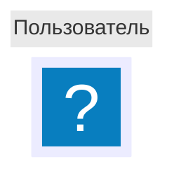

`image` вставляет картинку по URL. Параметры: `img` — URL, `label`, `pos` (`t`/`b`), `w` и `h` (по умолчанию натуральные размеры), `constraint` (`on`/`off`, по умолчанию `off`) — при `on` картинка задаёт размер узла и сохраняет исходные пропорции, подстраивая `w` под `h`.

```mermaid
flowchart TD
  %% картинка с сохранением пропорций
  A@{ img: "https://mermaid.js.org/favicon.svg", label: "Подпись к картинке", pos: "t", h: 60, constraint: "on" }
```

### FontAwesome в подписях

Синтаксис — `fa:имя-иконки` прямо в тексте узла. Поддерживаемые префиксы: `fa`, `fab`, `fas`, `far`, `fal`, `fad`; для платных кастомных иконок — `fak`. Работает либо через зарегистрированный FontAwesome icon-pack (v11.7.0+), либо через подключённый на странице CSS FontAwesome (при отсутствии пакета происходит фолбэк на CSS).

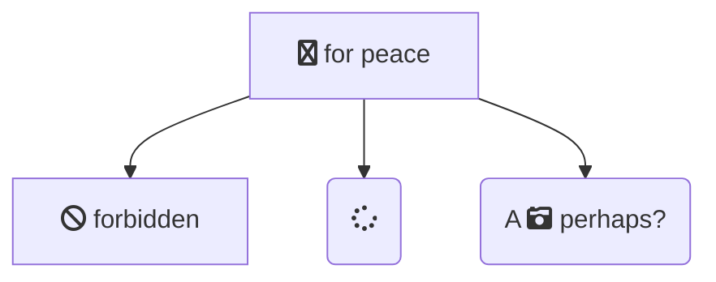

### Markdown-строки

Двойные кавычки плюс обратные апострофы: `"` + backtick + текст + backtick + `"`. Даёт `**жирный**`, `*курсив*`, автоперенос длинного текста и перенос строки по обычному переводу строки (вместо `<br>`). Работает в подписях узлов, связей и subgraph.

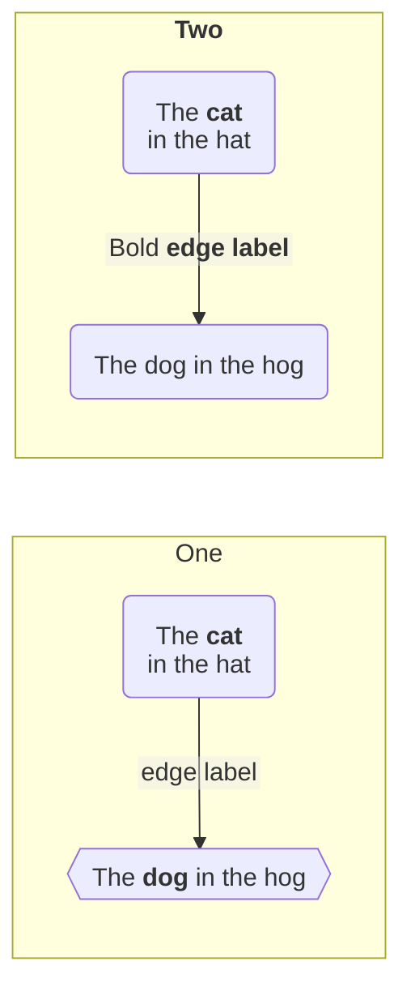

Автоперенос отключается конфигом `markdownAutoWrap: false`:

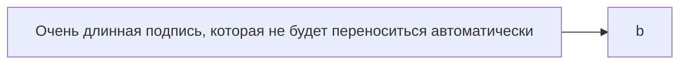

### Связи: типы линий и наконечники

| Вид | Синтаксис |
| --- | --- |
| Стрелка | `A --> B` |
| Открытая линия | `A --- B` |
| Пунктир | `A -.-> B` |
| Толстая | `A ==> B` |
| Невидимая | `A ~~~ B` |
| Круглый наконечник | `A --o B` |
| Крестовой наконечник | `A --x B` |
| Двусторонняя стрелка | `A <--> B` |
| Двусторонний круг | `A o--o B` |
| Двусторонний крест | `A x--x B` |

Невидимая связь `~~~` полезна для управления раскладкой без рисования линии.

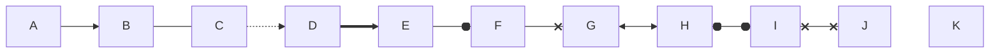

### Длина связи

Каждый узел получает ранг (вертикальный или горизонтальный уровень). Лишние дефисы/точки/знаки равенства заставляют связь охватить больше рангов:

| Длина | 1 | 2 | 3 |
| --- | :---: | :---: | :---: |
| Обычная | `---` | `----` | `-----` |
| Обычная со стрелкой | `-->` | `--->` | `---->` |
| Толстая | `===` | `====` | `=====` |
| Толстая со стрелкой | `==>` | `===>` | `====>` |
| Пунктир | `-.-` | `-..-` | `-...-` |
| Пунктир со стрелкой | `-.->` | `-..->` | `-...->` |

Движок раскладки вправе сделать связь ещё длиннее, чем запрошено.

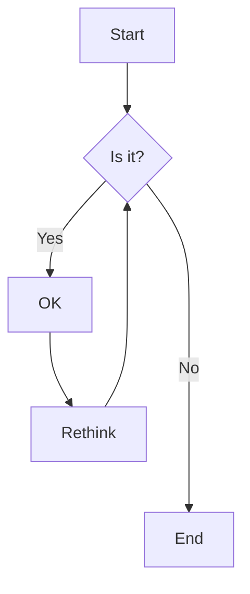

Если подпись стоит посреди связи, лишние символы добавляются в **правую** часть:


### Подписи на связях

Два способа: текст внутри самой связи (`A-- текст ---B`, `A-- текст -->B`, `A-. текст .-> B`, `A == текст ==> B`) или в вертикальных чертах после связи (`A---|текст|B`, `A-->|текст|B`).

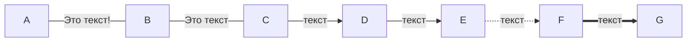

### Цепочки и множественные связи

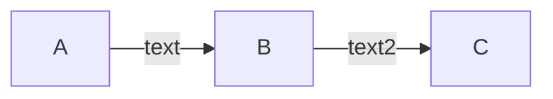

Оператор `&` объединяет несколько узлов в одной связи:

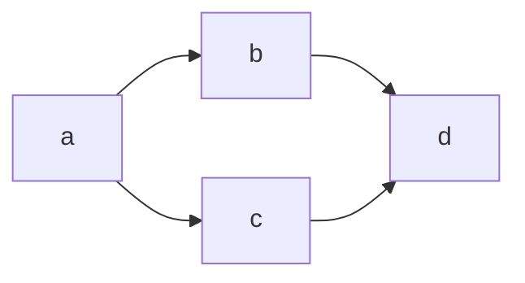

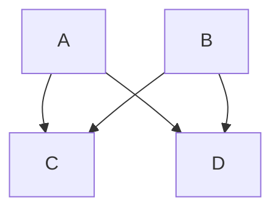

### ID связей, анимация и curve

ID приписывается перед связью через `@`: `A e1@--> B`. По ID связь можно стилизовать и анимировать.


Включение анимации метаданными связи:

```mermaid
flowchart LR
  A e1@==> B
  e1@{ animate: true }
```

Скорости анимации — `fast` и `slow`; выбор скорости сам включает анимацию (`{ animation: fast }` эквивалентно `{ animate: true, animation: fast }`).

```mermaid
flowchart LR
  A e1@--> B
  e1@{ animation: fast }
```

Анимация через класс. Запятые внутри значения свойства (например в `stroke-dasharray`) экранируются как `\,`, потому что запятая — разделитель свойств:

```mermaid
flowchart LR
  A e1@--> B
  classDef animate stroke-dasharray: 9\,5,stroke-dashoffset: 900,animation: dash 25s linear infinite;
  class e1 animate
```

Кривая отдельной связи по её ID (v11.10.0+). Уровень связи перекрывает уровень диаграммы; при нескольких изменениях одной связи применяется последнее:

```mermaid
flowchart LR
    A e1@==> B
    A e2@--> C
    e1@{ curve: linear }
    e2@{ curve: natural }
```

### Subgraph

```mermaid
flowchart TB
    c1-->a2
    subgraph one
    a1-->a2
    end
    subgraph two
    b1-->b2
    end
    subgraph three
    c1-->c2
    end
```

Явный id задаётся как `subgraph id [Заголовок]`; сам subgraph можно использовать как конец связи:

```mermaid
flowchart TB
    c1-->a2
    subgraph ide1 [one]
    a1-->a2
    end
    subgraph two
    b1-->b2
    end
    ide1 --> two
    two --> c1
```

### Направление внутри subgraph

```mermaid
flowchart LR
  subgraph TOP
    direction TB
    subgraph B1
        direction RL
        i1 -->f1
    end
    subgraph B2
        direction BT
        i2 -->f2
    end
  end
  A --> TOP --> B
  B1 --> B2
```

Ограничение: если узел внутри subgraph связан с чем-то снаружи, собственный `direction` игнорируется и subgraph наследует направление родителя.

```mermaid
flowchart LR
    subgraph subgraph1
        direction TB
        top1[top] --> bottom1[bottom]
    end
    subgraph subgraph2
        direction TB
        top2[top] --> bottom2[bottom]
    end
    %% ^ Подграфы идентичны, различаются только связи к ним:

    %% Связь *к* subgraph1: направление subgraph1 сохраняется
    outside --> subgraph1
    %% Связь *внутрь* subgraph2:
    %% subgraph2 наследует направление корневого графа (LR)
    outside ---> top2
```

### Схлопнутый subgraph

Метаданные `id@{ view: collapsed }` на id подграфа сворачивают его в один компактный узел с заголовком подграфа. `view: expanded` — значение по умолчанию.

```mermaid
flowchart TD
    Start --> one
    subgraph one [My Group]
        A --> B
        B --> C
    end
    one --> Fin
    one@{ view: collapsed }
```

При схлопывании: внутренние узлы скрываются; связи, пересекающие границу подграфа, перенаправляются на схлопнутый узел; полностью внутренние связи отбрасываются (иначе стали бы петлями); для вложенных подграфов схлопывание разрешается на **самого внешнего** схлопнутого предка.

### Стили узлов и связей

`style <id> <css-свойства>` — стиль конкретного узла (работает и для subgraph по его id):

```mermaid
flowchart LR
    id1(Start)-->id2(Stop)
    style id1 fill:#f9f,stroke:#333,stroke-width:4px
    style id2 fill:#bbf,stroke:#f66,stroke-width:2px,color:#fff,stroke-dasharray: 5 5
```

`classDef` определяет класс, `class` — навешивает его. Формы: `classDef имя свойства;`, `classDef имя1,имя2 свойства;`, `class id1 имя;`, `class id1,id2 имя;`. Класс с именем `default` применяется ко всем узлам без явного класса.

```mermaid
flowchart LR
    A --> B --> C
    classDef hot fill:#fee,stroke:#c00,stroke-width:2px
    classDef cold,mild font-size:12pt
    class A,B hot
    class C cold
```

Короткая форма — оператор `:::` прямо на узле, в том числе в связке с `&`:

```mermaid
flowchart LR
    A:::foo & B:::bar --> C:::foobar
    classDef foo stroke:#f00
    classDef bar stroke:#0f0
    classDef foobar stroke:#00f
```

`linkStyle` стилизует связи по их порядковому номеру (нумерация с нуля, в порядке объявления), списком через запятую или ключевым словом `default` для всех связей:

```mermaid
flowchart LR
    A --> B
    B --> C
    C --> D
    linkStyle default stroke:#999
    linkStyle 0 stroke:#ff3,stroke-width:4px,color:red
    linkStyle 1,2 color:blue
```

Внешний CSS вида `.myClass > rect { fill: ... }` **не работает надёжно**: собственные стили mermaid вставляются с `!important` и скоупятся по id SVG, так что перебивают внешние правила. Штатный механизм — `classDef`.

### Интерактивность (click)

Формы: `click nodeId callback`, `click nodeId call callback()`, `click nodeId "URL"`, `click nodeId href "URL"`. После них опционально идёт подсказка в двойных кавычках и цель ссылки (`_self`, `_blank`, `_parent`, `_top`; по умолчанию ссылка открывается в той же вкладке). Стили подсказки задаёт класс `.mermaidTooltip`. Функциональность отключена при `securityLevel='strict'` и включена при `securityLevel='loose'`.

```mermaid
flowchart LR
    A-->B
    B-->C
    C-->D
    click A callback "Подсказка для callback"
    click B "https://www.github.com" "Подсказка для ссылки"
    click C call callback() "Подсказка для callback"
    click D href "https://www.github.com" "Подсказка для ссылки"
```

```mermaid
flowchart LR
    A-->B
    B-->C
    C-->D
    D-->E
    click A "https://www.github.com" _blank
    click B "https://www.github.com" "Открыть в новой вкладке" _blank
    click C href "https://www.github.com" _blank
    click D href "https://www.github.com" "Открыть в новой вкладке" _blank
```

### Комментарии

Комментарий занимает отдельную строку и начинается с `%%`. Всё до конца строки игнорируется парсером, включая любой flow-синтаксис.

```mermaid
flowchart LR
%% это комментарий A -- text --> B{node}
   A -- text --> B -- text2 --> C
```

### Accessibility

```mermaid
flowchart LR
  accTitle: Процесс сборки
  accDescr: Схема из трёх шагов сборки артефакта
  Код --> Сборка --> Артефакт
```

### Экранирование и HTML-entity

Проблемные символы (скобки, кавычки, двоеточия) спасают двойные кавычки вокруг подписи:

```mermaid
flowchart LR
    id1["Это (текст) в рамке"]
```

Entity-коды: числа в базе 10 (`#35;` — это `#`), поддерживаются и HTML-имена сущностей.

```mermaid
    flowchart LR
        A["Двойная кавычка:#quot;"] --> B["Символ по коду:#9829;"]
```

Перенос строки в обычной (не markdown) подписи — тег `<br>`:

```mermaid
flowchart LR
  A["Первая строка<br/>Вторая строка"] --> B
```

### Конфигурация

Frontmatter-блок `config:` перед диаграммой или директива `%%{init: ...}%%` первой строкой.

```mermaid
%%{init: {'theme':'forest', 'flowchart': {'curve':'stepBefore'}}}%%
flowchart LR
  A --> B
```

Раскладчик (renderer): по умолчанию `dagre`; альтернатива — экспериментальный `elk`, который лучше держит крупные и сложные диаграммы.

```mermaid
---
config:
  layout: elk
---
flowchart LR
  A --> B --> C
```

Тот же смысл даёт `flowchart: { defaultRenderer: "elk" }`:

```mermaid
---
config:
  flowchart:
    defaultRenderer: "elk"
---
flowchart LR
  A --> B
```

Стиль кривых для всех связей диаграммы. Доступные значения: `basis`, `bumpX`, `bumpY`, `cardinal`, `catmullRom`, `linear`, `monotoneX`, `monotoneY`, `natural`, `step`, `stepAfter`, `stepBefore`.

```mermaid
---
config:
  flowchart:
    curve: stepBefore
---
flowchart LR
  A --> B --> C
```

Прочие частые ключи секции `flowchart`: `htmlLabels` (в markdown-строках обычно ставят `false`), `useMaxWidth`. Переменные темы — см. `theming.md`.

## Ловушки

- **`end` в нижнем регистре ломает диаграмму.** `A --> end` даёт `Parse error ... got 'end'` — парсер видит закрытие subgraph. Пишите `End`/`END` или другой id. Подпись `A[end]` в 11.16.1 при этом проходит, но полагаться на это не стоит.
- **`o` и `x` вплотную к связи съедаются наконечником.** `A---oB` парсится как круглый наконечник (`--o`), `A---xB` — как крестовой. Если нужен узел `oB`, ставьте пробел (`A--- oB`) или заглавную (`A---Ops`).
- **Пробел в id недопустим.** `my id[Node] --> B` → `Parse error ... got 'NODE_STRING'`. Id — одно слово; человекочитаемое название кладите в подпись.
- **Скобки в неэкранированной подписи ломают парсер.** `A[Текст (в скобках)]` → `Parse error ... got 'PS'`. Оборачивайте подпись в двойные кавычки: `A["Текст (в скобках)"]`. Кавычки внутри кавычек — только через `#quot;`.
- **Формы `browser`, `bucket`, `console`, `folder`, `person` в 11.16.1 отсутствуют** — `Error: No such shape`. Они описаны в свежей документации, но появились после этой версии.
- **Запятая внутри значения стиля разрывает свойство.** В `classDef`/`style` запятая — разделитель свойств, поэтому в `stroke-dasharray: 9,5` запятую надо экранировать: `stroke-dasharray: 9\,5`.
- **`linkStyle` привязан к порядковому номеру связи**, а не к id узлов: любая вставка связи выше по тексту сдвигает нумерацию и стиль уезжает на чужую связь. Для точечной стилизации надёжнее ID связей (`e1@-->`) плюс `class e1 имя`.
- **`direction` внутри subgraph игнорируется**, если хоть один его узел связан с внешним узлом — subgraph наследует направление родителя.
- **Комментарий обязан быть на отдельной строке.** `A --> B %% текст` не является поддерживаемой формой: `%%` распознаётся как начало комментария только в начале строки.
- **Пробел между вершиной и её текстом запрещён** (`A [текст]`), хотя один пробел между вершиной и связью разрешён (`A --> B`).
- **Внешний CSS по классам не применяется** — стили mermaid идут с `!important` и перебивают его; используйте `classDef`.
- **`click` не работает при `securityLevel: 'strict'`** (значение по умолчанию во многих интеграциях) — нужен `loose`.

## Источник

Дистиллировано из официальной документации mermaid-js/mermaid (docs/syntax), проверено рендером на mermaid-cli 11.16.0 / mermaid 11.16.1.
