# Диаграмма Ганта (gantt)

Применять для плана проекта во времени: задачи с датами и длительностями, зависимости, вехи, разбиение по направлениям. НЕ применять для порядка вызовов без календаря (`sequenceDiagram`), для ленты событий без длительностей (`timeline`) и для доски задач по статусам (`kanban`).

## Минимальный скелет

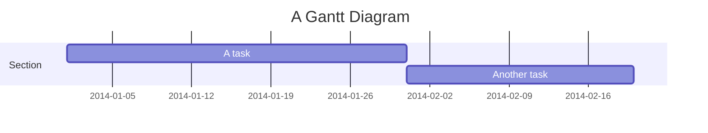

## Синтаксис

### Общая структура

- `title` — необязательный заголовок всей диаграммы.
- `section <имя>` — раздел; имя **обязательно**. Раздел делит задачи на группы (например, разработка и документация).
- Строка задачи: `Название : метаданные`. Двоеточие отделяет название от метаданных, элементы метаданных разделяются запятыми.
- Комментарий — отдельная строка, начинающаяся с `%%`; всё до конца строки игнорируется парсером.

По умолчанию задачи идут последовательно: старт задачи = конец предыдущей.

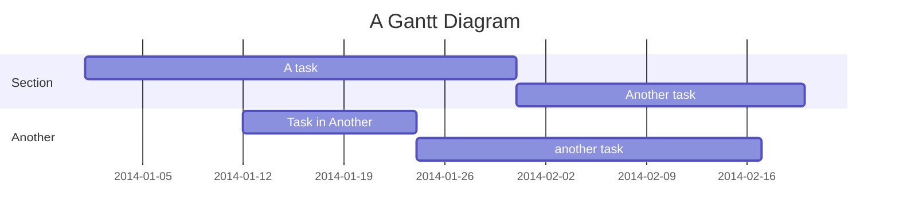

### Теги задачи

Теги идут **первыми** в метаданных: `active`, `done`, `crit`, `milestone` (плюс `vert` — см. ниже). Теги необязательны и комбинируются (`crit, done`).

- `done` — завершённая задача;
- `active` — задача в работе;
- `crit` — критический путь (выделяется цветом);
- `milestone` — веха: точка на оси, а не полоса. Позиция вехи = *начальная дата* + *длительность*/2.

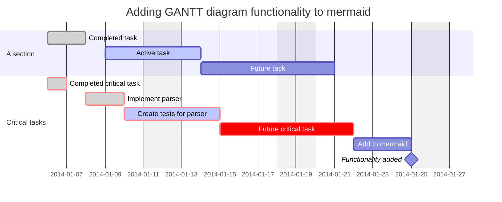

```mermaid
gantt
    dateFormat HH:mm
    axisFormat %H:%M
    Initial milestone : milestone, m1, 17:49, 2m
    Task A : 10m
    Task B : 5m
    Final milestone : milestone, m2, 18:08, 4m
```

### Метаданные: даты, длительности, id

После тегов оставшиеся элементы читаются так:

1. **Один элемент** — конец задачи: либо дата/время, либо длительность (прибавляется к началу задачи с учётом исключённых дней).
2. **Два элемента** — последний трактуется как в п.1; первый задаёт начало: явную дату (в формате `dateFormat`) или ссылку `after <taskID> [<taskID2> ...]` (берётся самая поздняя дата окончания перечисленных задач).
3. **Три элемента** — последние два как в п.2; первый становится id задачи, на который можно ссылаться.

| Синтаксис метаданных | Начало | Конец | ID |
| --- | --- | --- | --- |
| `<taskID>, <startDate>, <endDate>` | `startDate` по `dateFormat` | `endDate` по `dateFormat` | `taskID` |
| `<taskID>, <startDate>, <length>` | `startDate` | начало + `length` | `taskID` |
| `<taskID>, after <otherTaskId>, <endDate>` | конец `otherTaskId` | `endDate` | `taskID` |
| `<taskID>, after <otherTaskId>, <length>` | конец `otherTaskId` | начало + `length` | `taskID` |
| `<taskID>, <startDate>, until <otherTaskId>` | `startDate` | начало `otherTaskId` | `taskID` |
| `<taskID>, after <otherTaskId>, until <otherTaskId>` | конец `otherTaskId` | начало `otherTaskId` | `taskID` |
| `<startDate>, <endDate>` | `startDate` | `endDate` | нет |
| `<startDate>, <length>` | `startDate` | начало + `length` | нет |
| `after <otherTaskID>, <endDate>` | конец `otherTaskId` | `endDate` | нет |
| `after <otherTaskID>, <length>` | конец `otherTaskId` | начало + `length` | нет |
| `<startDate>, until <otherTaskId>` | `startDate` | начало `otherTaskId` | нет |
| `after <otherTaskId>, until <otherTaskId>` | конец `otherTaskId` | начало `otherTaskId` | нет |
| `<endDate>` | конец предыдущей задачи | `endDate` | нет |
| `<length>` | конец предыдущей задачи | начало + `length` | нет |
| `until <otherTaskId>` | конец предыдущей задачи | начало `otherTaskId` | нет |

`until` (v10.9.0+) задаёт задачу, идущую до старта другой задачи или вехи. И `after`, и `until` принимают несколько id:

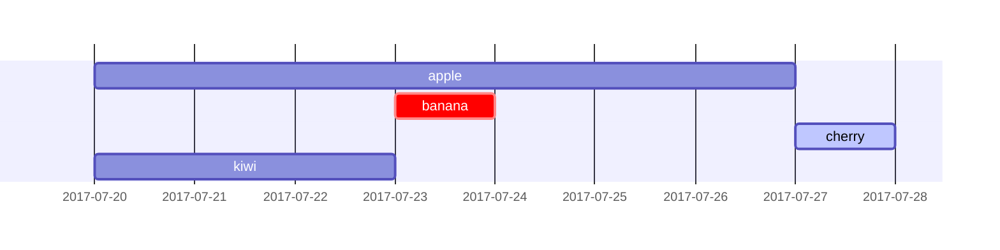

### Длительности

| Единица | Суффикс | Пример |
| ------- | ------- | ------ |
| миллисекунды | `ms` | `500ms` |
| секунды | `s` | `30s` |
| минуты | `m` | `30m` |
| часы | `h` | `4h` |
| дни | `d` | `3d` |
| недели | `w` | `2w` |
| месяцы | `M` | `1M` |
| годы | `y` | `1y` |

Поддерживаются дробные значения (`1.5d`). Некорректный токен длительности (например, `3dX`) молча игнорируется — задача получает нулевую длительность.

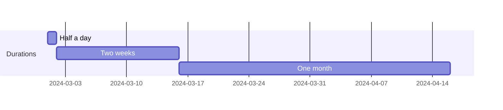

### Формат входных дат: dateFormat

`dateFormat` задаёт формат **ввода** дат (по умолчанию `YYYY-MM-DD`). Разбор — через dayjs.

| Токен | Пример | Описание |
| ----- | ------ | -------- |
| `YYYY` | 2014 | год, 4 цифры |
| `YY` | 14 | год, 2 цифры |
| `Q` | 1..4 | квартал (месяц ставится на первый месяц квартала) |
| `M MM` | 1..12 | номер месяца |
| `MMM MMMM` | January..Dec | название месяца в локали `dayjs.locale()` |
| `D DD` | 1..31 | день месяца |
| `Do` | 1st..31st | день месяца с порядковым суффиксом |
| `DDD DDDD` | 1..365 | день года |
| `X` | 1410715640.579 | unix timestamp (секунды) |
| `x` | 1410715640579 | unix timestamp (миллисекунды) |
| `H HH` | 0..23 | часы, 24-часовой формат |
| `h hh` | 1..12 | часы, 12-часовой формат (с `a A`) |
| `a A` | am pm | до/после полудня |
| `m mm` | 0..59 | минуты |
| `s ss` | 0..59 | секунды |
| `S` / `SS` / `SSS` | 0..9 / 0..99 / 0..999 | доли секунды |
| `Z ZZ` | +12:00 | смещение от UTC (`+-HH:mm`, `+-HHmm`, `Z`) |

```mermaid
gantt
    title Bar chart (gantt as bar chart)
    dateFormat X
    axisFormat %s
    section Issue19062
    71   : 0, 71
    section Issue19401
    36   : 0, 36
    section Issue193
    34   : 0, 34
```

### Формат оси: axisFormat

`axisFormat` задаёт формат **вывода** дат на оси (по умолчанию `YYYY-MM-DD`); синтаксис — d3-time-format.

| Формат | Значение |
| ------ | -------- |
| `%a` / `%A` | сокращённое / полное название дня недели |
| `%b` / `%B` | сокращённое / полное название месяца |
| `%c` | дата и время как `%a %b %e %H:%M:%S %Y` |
| `%d` | день месяца с ведущим нулём [01,31] |
| `%e` | день месяца с ведущим пробелом [ 1,31] |
| `%H` / `%I` | час 24-часовой [00,23] / 12-часовой [01,12] |
| `%j` | день года [001,366] |
| `%m` | месяц [01,12] |
| `%M` | минуты [00,59] |
| `%L` | миллисекунды [000,999] |
| `%p` | AM или PM |
| `%S` | секунды [00,61] |
| `%U` / `%W` | номер недели года (воскресенье / понедельник — первый день) [00,53] |
| `%w` | день недели числом [0(вс),6] |
| `%x` / `%X` | дата как `%m/%d/%Y` / время как `%H:%M:%S` |
| `%y` / `%Y` | год без века [00,99] / год с веком |
| `%Z` | смещение часового пояса, например `-0700` |
| `%%` | литеральный символ `%` |

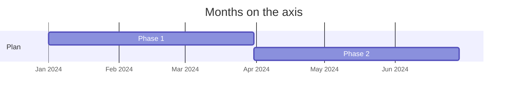

### Шаг делений оси: tickInterval (v10.3.0+)

По умолчанию деления подбираются автоматически. Шаблон значения:

```javascript
/^([1-9][0-9]*)(millisecond|second|minute|hour|day|week|month)$/;
```

То есть `1day`, `2week`, `3month`. Значения `millisecond` и `second` добавлены в v10.3.0. Недельные интервалы по умолчанию начинаются с воскресенья; другой день недели задаёт `weekday`.

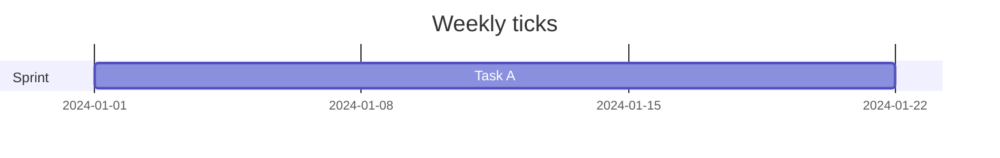

### Исключённые дни: excludes и weekend

`excludes` принимает конкретные даты в формате `dateFormat`, дни недели (`sunday`) или `weekends`; слово `weekdays` не поддерживается. Исключённые дни помечаются на графике и не считаются в длительности: задача удлиняется вправо на число пропущенных дней (разрыва внутри полосы не появляется). Если исключённые дни попадают между двумя последовательными задачами, они просто остаются пустыми.

Строк `excludes` может быть несколько — их токены объединяются, что позволяет разбивать длинные списки на группы с комментариями:

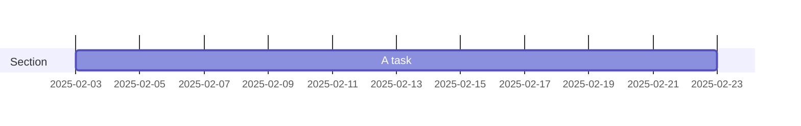

**Выходные (v11.0.0+).** По умолчанию `weekends` — суббота и воскресенье. Атрибут `weekend` отдельной строкой переключает начало выходных: `friday` или `saturday`.

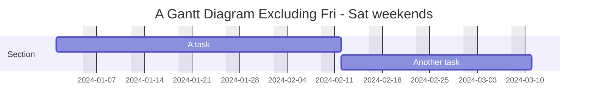

Обратной инструкции `includes` в официальной документации (docs/syntax) нет; парсер 11.16.1 строку `includes <дата>` принимает без ошибки, но поведение не задокументировано — не полагайся на неё.

### Вертикальные маркеры: vert

`vert` рисует вертикальную линию через всю диаграмму (дедлайн, событие, контрольная точка). В отличие от вехи, маркер не занимает строку.

```mermaid
gantt
    dateFormat HH:mm
    axisFormat %H:%M
    Initial vert : vert, v1, 17:30, 2m
    Task A : 3m
    Task B : 8m
    Final vert : vert, v2, 17:58, 4m
```

### Маркер текущей даты: todayMarker

Маркер сегодняшнего дня стилизуется или скрывается ключом `todayMarker`:

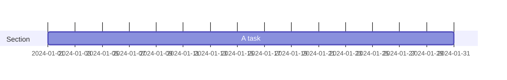


### Компактный режим

`displayMode: compact` укладывает непересекающиеся задачи в одну строку. Задаётся во frontmatter.

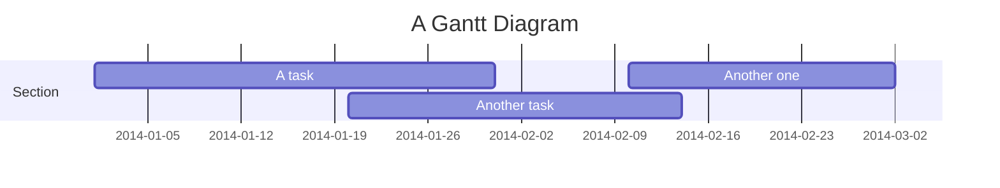

### Конфигурация

Параметры блока `gantt` (в объекте конфигурации или во frontmatter диаграммы):

```javascript
{
  titleTopMargin: 25,        // отступ сверху для заголовка
  barHeight: 20,             // высота полос
  barGap: 4,                 // зазор между полосами
  topPadding: 75,            // отступ между заголовком/осью и диаграммой
  rightPadding: 75,          // место под имя раздела справа
  leftPadding: 75,           // место под имя раздела слева
  gridLineStartPadding: 10,  // вертикальная точка старта линий сетки
  fontSize: 12,              // размер шрифта
  sectionFontSize: 24,       // размер шрифта разделов
  numberSectionStyles: 1,    // число чередующихся стилей разделов
  axisFormat: '%d/%m',       // формат даты/времени на оси
  tickInterval: '1week',     // шаг делений оси
  topAxis: true,             // подписи дат также сверху
  displayMode: 'compact',    // компактный режим
  weekday: 'sunday',         // день начала недельного интервала
}
```

Дополнительно: `mirrorActor` (по умолчанию `false`) — отрисовка акторов и под диаграммой; `bottomMarginAdj` (по умолчанию `1`) — подстройка нижней границы, чтобы широкие рамки не обрезались.

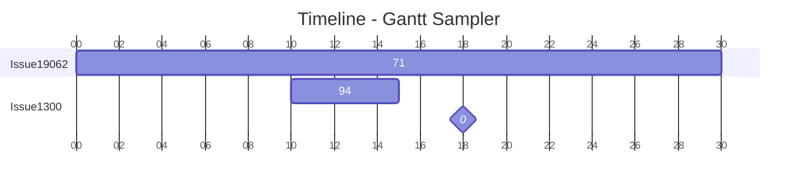

Тема и цвета — см. `theming.md`; общий frontmatter/`%%{init}%%` — см. `config.md`.

### Стилевые CSS-классы

Оформление задаётся CSS-классами (через `themeCSS` в конфиге):

| Класс | Назначение |
| ----- | ---------- |
| `grid.tick` | линии сетки |
| `grid.path` | границы сетки |
| `.taskText` | текст задачи внутри полосы |
| `.taskTextOutsideRight` | текст, вылезающий за полосу вправо |
| `.taskTextOutsideLeft` | текст, вылезающий за полосу влево |
| `todayMarker` | маркер текущей даты |

### Интерактивность

Клик по задаче открывает ссылку или вызывает JS-функцию страницы. Работает только при `securityLevel: 'loose'`, отключено при `'strict'`.

```
click taskId call callback(arguments)
click taskId href URL
```

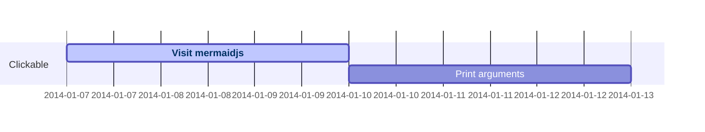

## Ловушки

- **Двоеточие в названии задачи ломает разбор.** `Task: with colon : a1, 2014-01-01, 3d` парсится без ошибки, но названием становится `Task`, а остаток уезжает в метаданные. Двоеточие в названии недопустимо.
- **Теги только в начале метаданных.** `:des1, done, 3d` не даст «завершённую» задачу: `done`, `active`, `crit`, `milestone`, `vert` должны идти первыми.
- **Битая длительность не вызывает ошибку.** `3dX` молча даёт нулевую длительность — полоса схлопывается в точку. Проверяй суффиксы (`ms|s|m|h|d|w|M|y`, регистр важен: `M` — месяц, `m` — минута).
- **`after <id>` с несуществующим id не падает** — задача просто встаёт в начало шкалы. Опечатка в id проявляется только визуально.
- **Формат даты должен совпадать с `dateFormat`.** При `dateFormat YYYY-MM-DD` строка `01-01-2014` разберётся неверно.
- **`excludes weekdays` не поддерживается** — принимаются только конкретные даты, названия дней (`sunday`) и `weekends`; неизвестный токен молча игнорируется.
- **Исключённые дни не разрывают полосу, а удлиняют задачу** вправо на число пропущенных дней.
- **`section` без имени недопустим**, тогда как `title` необязателен.
- **`tickInterval` принимает только `millisecond|second|minute|hour|day|week|month`** с числовым префиксом; `1decade` или `1year` молча игнорируются, ось остаётся автоматической.
- **Веха без длительности всё равно нуждается в позиции**: `milestone, id, <дата>, <длительность>` — точка ставится в *дата + длительность/2*.

## Источник

Дистиллировано из официальной документации mermaid-js/mermaid (docs/syntax), проверено рендером на mermaid-cli 11.16.0 / mermaid 11.16.1.
