# Git graph (gitGraph)

Применять для показа стратегии ветвления: git flow, порядок веток, релизные теги, merge и cherry-pick. НЕ применять для последовательности вызовов между сервисами (`sequenceDiagram`), для шагов CI/CD или произвольных процессов (`flowchart`) и для истории версий во времени с датами (`gantt` / `timeline`) — gitGraph рисует топологию коммитов, а не время.

## Минимальный скелет

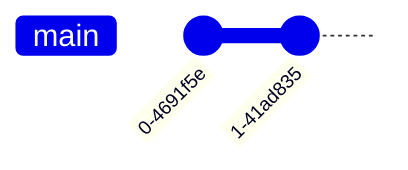

Каждый gitGraph стартует с ветки `main`, она же — текущая ветка по умолчанию. Порядок отрисовки = порядок команд в коде (декларативно, по вставке).

Базовые операции: `commit` (новый коммит на текущей ветке), `branch` (создать ветку и сделать её текущей), `checkout` / `switch` (переключиться на существующую ветку), `merge` (влить существующую ветку в текущую), `cherry-pick` (перенести коммит с другой ветки).

## Синтаксис

### Заголовок и accessibility

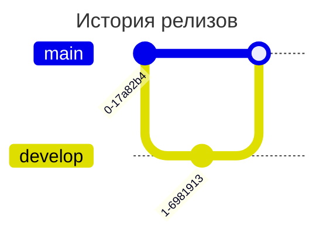

### commit: id

Свой идентификатор задаётся атрибутом `id:` со значением в двойных кавычках. Без него Mermaid генерирует случайный уникальный ID.

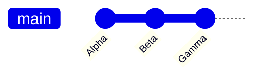

### commit: type (NORMAL | REVERSE | HIGHLIGHT)

- `NORMAL` — по умолчанию, закрашенный круг.
- `REVERSE` — закрашенный круг с крестом (акцент «откат»).
- `HIGHLIGHT` — закрашенный прямоугольник (акцент «важный коммит»).

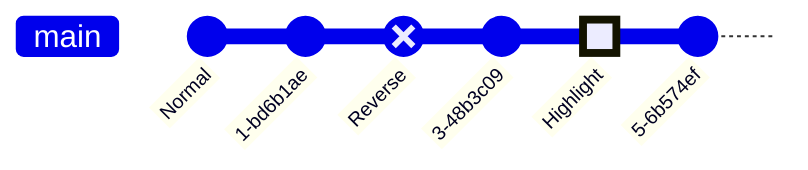

Порядок атрибутов свободный: `commit type: HIGHLIGHT id:"Denver"` тоже валиден.

### commit: tag

`tag:` рисует у коммита ярлык — аналог git-тега / номера релиза. Атрибуты `id`, `type`, `tag` комбинируются в любом сочетании.

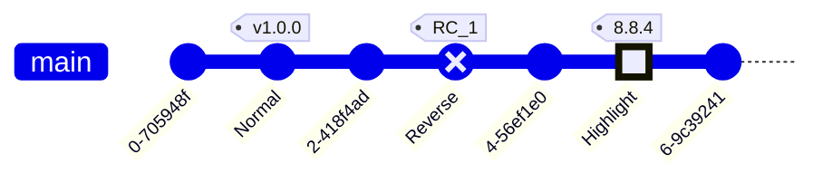

### branch: создание ветки

`branch <имя>` создаёт ветку и сразу делает её текущей (как `git checkout -b`). Имя должно быть уникальным. Имя, похожее на ключевое слово, берётся в двойные кавычки: `branch "cherry-pick"`.

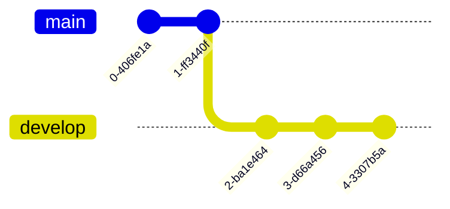

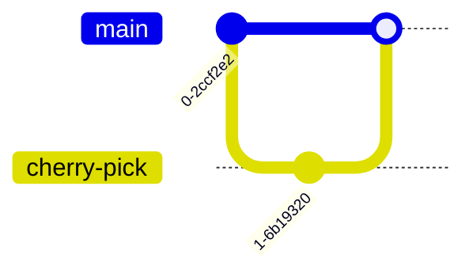

### checkout / switch: переключение ветки

`checkout <имя>` и `switch <имя>` взаимозаменяемы: обе делают существующую ветку текущей.

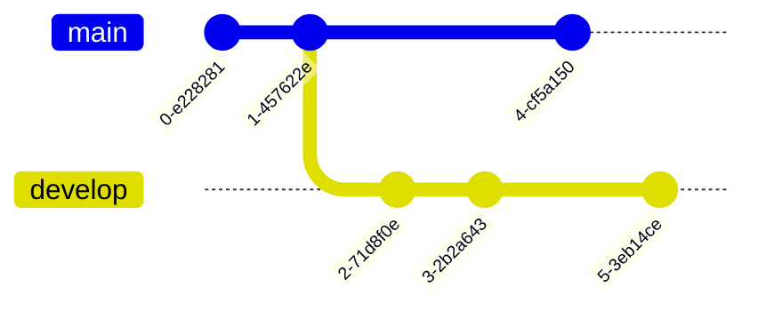

### merge: слияние

`merge <имя-ветки>` вливает head указанной ветки в head текущей. Результат — merge-коммит (закрашенный двойной круг). Merge принимает те же атрибуты, что и commit:

- `id:` — свой ID вместо сгенерированного;
- `tag:` — ярлык на merge-коммите;
- `type:` — переопределить форму merge-коммита любым из типов commit.

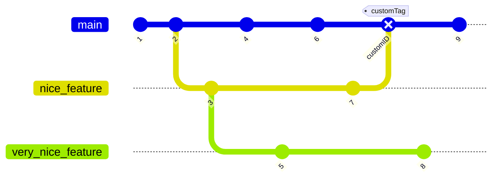

### cherry-pick

`cherry-pick id:"<id-коммита>"` создаёт на текущей ветке коммит-копию коммита с другой ветки. Рисуется «вишенкой» и тегом с исходным ID.

Правила:

1. `id` обязателен и должен указывать на существующий коммит — значит исходный коммит объявляется как `commit id:"..."`.
2. Исходный коммит должен быть на другой ветке, не на текущей.
3. У текущей ветки должен быть хотя бы один коммит.
4. При cherry-pick merge-коммита обязателен атрибут `parent:"<id>"`.
5. Указанный `parent` должен быть непосредственным родителем этого merge-коммита.

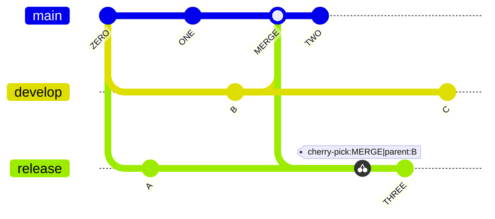

### Ориентация: LR (по умолчанию), TB, BT

Указывается сразу после `gitGraph`, с двоеточием. `LR:` — коммиты слева направо, ветки стопкой (по умолчанию, v10.3.0+). `TB:` — коммиты сверху вниз, ветки колонками (v10.3.0+). `BT:` — снизу вверх, ветки колонками (v11.0.0+).

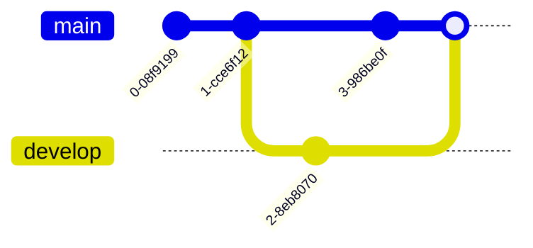

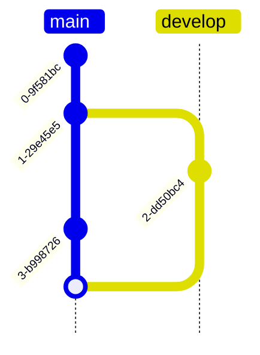

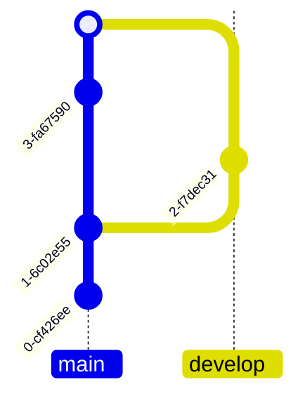

### Конфигурация gitGraph

Задаётся во frontmatter в блоке `config.gitGraph`:

- `showBranches` — Boolean, по умолчанию `true`. `false` убирает имена веток и их линии.
- `showCommitLabel` — Boolean, по умолчанию `true`. `false` убирает подписи коммитов.
- `mainBranchName` — String, по умолчанию `main`. Имя корневой ветки.
- `mainBranchOrder` — позиция главной ветки в списке веток, по умолчанию `0` (первая).
- `parallelCommits` — Boolean, по умолчанию `false`.
- `rotateCommitLabel` — Boolean, по умолчанию `true`.

#### showBranches: false

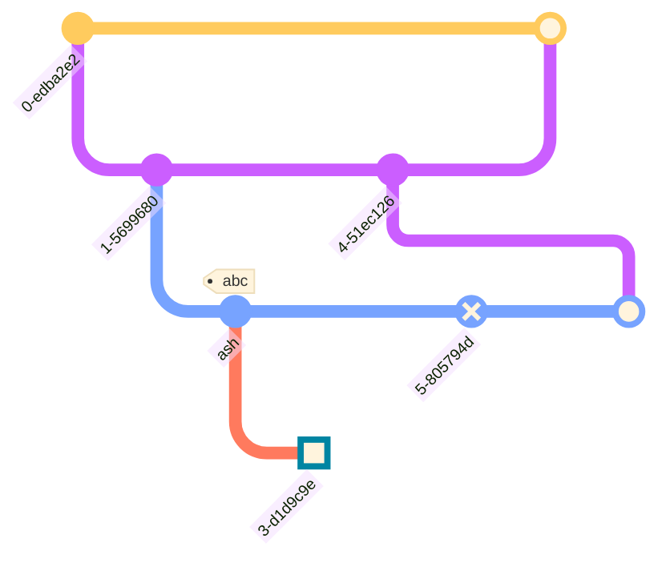

#### showCommitLabel: false

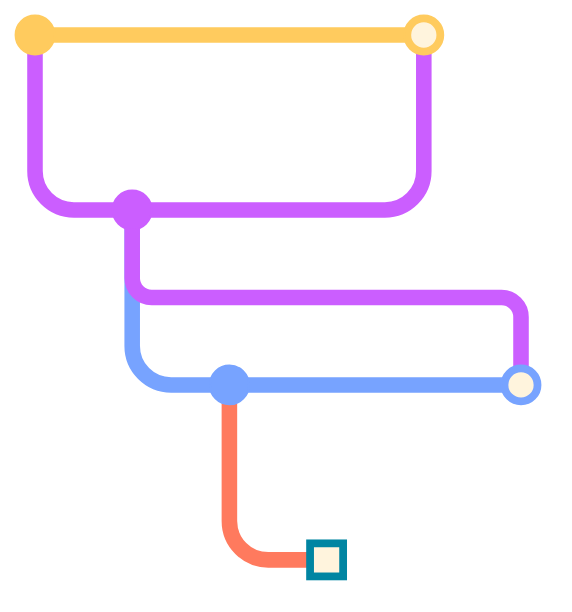

#### mainBranchName

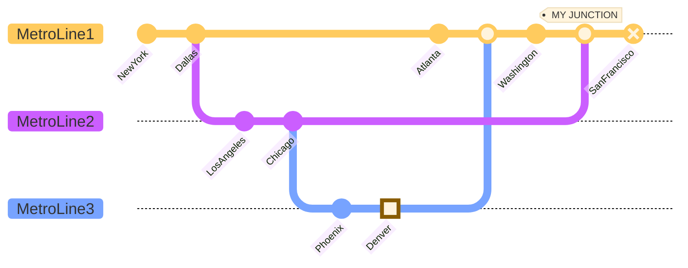

Обрати внимание: после смены `mainBranchName` в `checkout`/`merge` используется новое имя (`MetroLine1`), а не `main`.

#### rotateCommitLabel

По умолчанию `true` — подписи коммитов лежат под кружком, повёрнутые на 45° (удобно для длинных подписей). `false` — подписи горизонтальные, отцентрованные под коммитом (удобно для коротких).

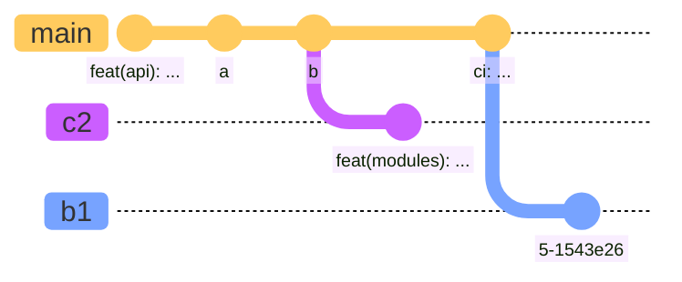

#### parallelCommits (v10.8.0+)

По умолчанию `false`: коммиты расставляются с учётом временного порядка — сделанный раньше стоит ближе к родителю. При `true` коммиты, отстоящие от родителя на одинаковое число шагов, рисуются на одном уровне.

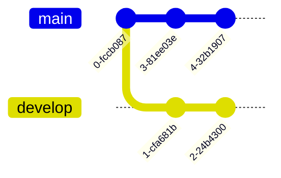

### Порядок веток: order и mainBranchOrder

По умолчанию ветки идут в порядке появления в коде. `order: <положительное число>` после имени ветки задаёт позицию явно. Приоритет:

1. `main` всегда первая (order `0`), пока не переопределена через `mainBranchOrder`;
2. затем ветки без `order` — в порядке появления в коде;
3. затем ветки с `order` — по возрастанию значения.

Полный контроль над порядком возможен только если `order` задан у всех веток.

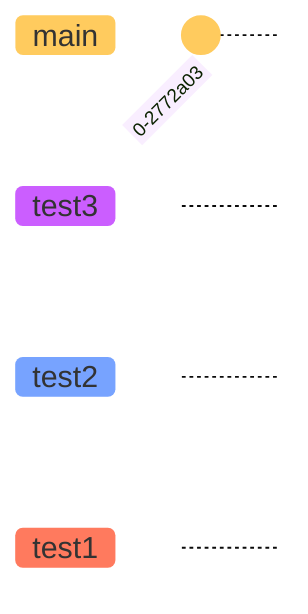

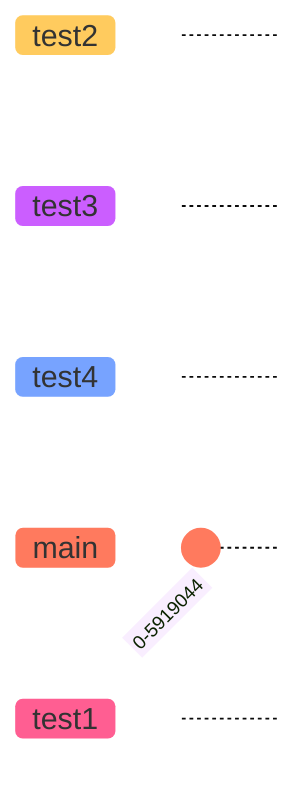

Здесь `test2` и `test3` рисуются первыми (нет `order`, порядок объявления), потом `test4` (order 1), потом `main` (mainBranchOrder 2), последней `test1` (order 3).

### Темы

Поддерживаются `base`, `forest`, `dark`, `default`, `neutral` — задаются через `config.theme` во frontmatter.

```mermaid
---
config:
  theme: 'forest'
---
gitGraph
  commit
  branch develop
  commit tag:"v1.0.0"
  checkout main
  commit type: HIGHLIGHT
  merge develop
```

### Как красить ветки и подписи

Цвета настраиваются через `themeVariables`, а не через классы: `git0`…`git7` — цвета линий/коммитов веток по порядку; `gitBranchLabel0`…`gitBranchLabel7` — цвета подписей веток; `gitInv0`…`gitInv7` — цвета HIGHLIGHT-коммитов на соответствующих ветках; `commitLabelColor`, `commitLabelBackground`, `commitLabelFontSize` — подпись коммита; `tagLabelColor`, `tagLabelBackground`, `tagLabelBorder`, `tagLabelFontSize` — тег.

Переменные покрывают до 8 веток; дальше значения переиспользуются циклически (9-я ветка берёт стиль 1-й). Полный список theme-переменных — см. `theming.md`.

```mermaid
---
config:
  theme: 'default'
  themeVariables:
    'git0': '#ff0000'
    'git1': '#00ff00'
    'git2': '#0000ff'
    'gitInv0': '#ffffff'
    commitLabelColor: '#ff0000'
    commitLabelBackground: '#eeeeee'
    tagLabelColor: '#ffffff'
    tagLabelBackground: '#0000ff'
    tagLabelBorder: '#000000'
---
gitGraph
  commit
  branch develop
  commit tag:"v1.0.0"
  commit
  checkout main
  commit type: HIGHLIGHT
  merge develop
  branch featureA
  commit
```

## Ловушки

Ошибки, подтверждённые прогоном на mermaid 11.16.1 (диаграмма не рендерится вовсе):

- **Слияние ветки с самой собой.** `merge main`, когда текущая ветка — `main`: `Cannot merge branch 'main' into itself.` Перед `merge` всегда переключайся на принимающую ветку.
- **checkout несуществующей ветки.** `Trying to checkout branch which is not yet created.` Ветка должна быть создана через `branch` выше по коду.
- **Повторный `branch` с тем же именем.** `Trying to create an existing branch.` Для возврата на ветку нужен `checkout`/`switch`, а не второй `branch`.
- **cherry-pick с несуществующим id.** `Incorrect usage of "cherryPick". Source commit id should exist and provided.` Исходный коммит обязан быть объявлен как `commit id:"..."`.
- **cherry-pick merge-коммита без `parent:`.** `If the source commit is a merge commit, an immediate parent commit must be specified.` Добавь `parent:"<id-непосредственного-родителя>"`.

Прочее:

- Значения `id`, `tag`, `parent` — только в двойных кавычках; `type` — наоборот, без кавычек (`type: HIGHLIGHT`).
- Ориентация пишется строго с двоеточием (`gitGraph TB:`). Без двоеточия — `Syntax error in text`; причём mmdc завершается с кодом 0 и молча пишет error-SVG, так что ошибку легко пропустить в CI.
- После смены `mainBranchName` имя `main` больше не существует — `checkout main` упадёт.
- Дублирующиеся `commit id` парсер 11.16.1 не отлавливает: диаграмма отрисуется, но cherry-pick по такому id даст непредсказуемый результат. Держи ID уникальными.
- `order` принимает положительное число; ветки без `order` всегда идут раньше веток с `order`, поэтому частичная простановка `order` почти никогда не даёт ожидаемого порядка — задавай его либо всем веткам, либо никому.

## Источник

Дистиллировано из официальной документации mermaid-js/mermaid (docs/syntax), проверено рендером на mermaid-cli 11.16.0 / mermaid 11.16.1.
