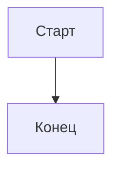
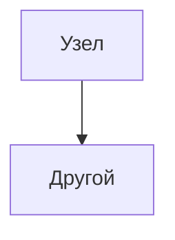
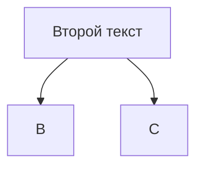
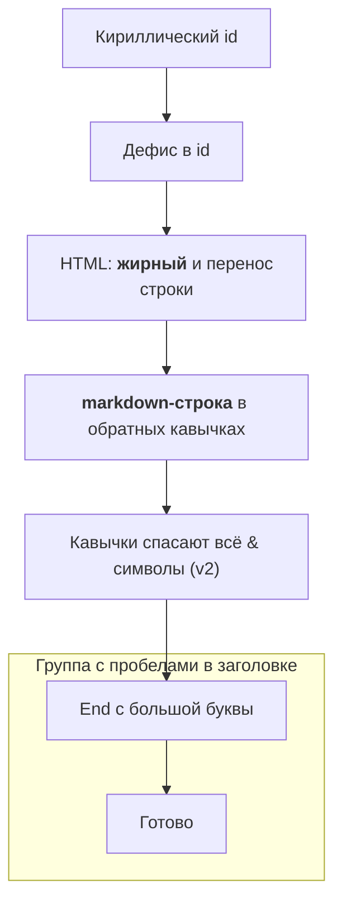

# Ловушки Mermaid

Свод того, на чём реально ломаются диаграммы, написанные LLM. Каждый пункт проверен прогоном через `mmdc` (`@mermaid-js/mermaid-cli` 11.16.0 / `mermaid` 11.16.1) — сообщения парсера приведены как есть.

Легенда: ❌ — parse error, рендера нет · ⚠️ — рендерится, но диаграмма не та, что задумана · ✅ — работает вопреки распространённому опасению.

## Минимальный скелет

Любую проверку начинай с этого — если не рендерится даже он, дело не в диаграмме, а в окружении:



## Синтаксис

### ❌ Ломают рендер

**`end` в нижнем регистре как узел flowchart.**
```
flowchart TD
  A[start] --> end
```
> `Parse error on line 2 ... got 'end'`

Лечение: `End`, `[end]` или `"end"`. Слово зарезервировано закрытием `subgraph`.

**Незакавыченные скобки и спецсимволы в подписи.**
```
flowchart TD
  A[Text (v2)] --> B
```
> `Parse error ... Expecting 'SQE', ... got 'PS'`

Лечение: `A["Text (v2)"]`. Правило простое: **любая подпись, где есть что-то кроме букв, цифр, пробела и дефиса, — в кавычки**.

**Опечатка в заголовке диаграммы.**
```
lowchart TD
  A --> B
```
> `UnknownDiagramError: No diagram type detected matching given configuration`

Тип определяется по первой значимой строке; ошибка в ней обесценивает весь файл.

**Незакрытый блок (`alt`, `loop`, `opt`, `par`, `subgraph`).**
```
sequenceDiagram
  participant A
  A->>B: hi
  alt yes
    A->>B: ok
```
> `Parse error on line 6 ... Expecting ... 'end', ...`

**Комментарий `%%` в конце строки.**
```
flowchart TD
  A --> B %% комментарий
```
> `Parse error ... got 'NODE_STRING'`

`%%` работает **только на отдельной строке**:


**Пробел между идентификатором узла и подписью.**
```
flowchart TD
  A [текст] --> B
```
> `Parse error ... got 'SQS'`

Лечение: `A[текст]` без пробела. По той же причине запрещён пробел внутри id (`my id[Node]`).

**Пробел в имени атрибута ERD.**
```
erDiagram
  USER {
    string full name
  }
```
> `Parse error ... Expecting 'ATTRIBUTE_WORD', '?', got 'BLOCK_STOP'`

Лечение: `string full_name "полное имя"` — человекочитаемое название идёт в комментарий-строку.

### ⚠️ Молчаливо неправильные

Самая опасная категория: рендер зелёный, ревьюер видит картинку — и она врёт.

**`class` со ссылкой на необъявленный `classDef`.** Стиль просто не применяется, ошибки нет:

Проверяй, что для каждого `class X foo` есть `classDef foo ...`.

**Дубликат идентификатора узла — побеждает последняя подпись.**

Отрисуется один узел `A` с текстом «Второй текст». Легко получить не тот текст, когда диаграмму собирают из кусков.

**`#` в `box` sequenceDiagram съедает остаток строки.** `box #ff0000 Red group` рендерится без ошибки, но и без заливки, и без подписи: `#` начинает комментарий. Цвет задавай именем или `rgb()`: `box rgb(255,0,0) Red group`.

**Хвостовой `%%` в sequenceDiagram не комментарий, а текст.** `Alice->>John: hi %% comment` нарисует подпись «hi %% comment».

**Регистр ключа конфигурации.** Секция xy-графика во frontmatter называется `xyChart` (camelCase). Написанный как `xychart` ключ **молча игнорируется** — mermaid проглатывает неизвестные ключи конфига без предупреждения. Это общее правило: опечатка в имени секции конфига не вызывает ошибки, настройки просто не применяются.

**Неверная кардинальность ERD.** `||--||` вместо `||--o{` рендерится идеально и описывает другую предметную область. Сверяйся с таблицей в `er.md`, а не с интуицией.

**Смешение синтаксисов разных типов.** Строка из `sequenceDiagram` внутри `flowchart` либо ломает парсер, либо трактуется как узел со странным именем.

### ✅ Работает (не усложняй зря)

Проверено рендером — эти конструкции валидны, обходить их не нужно:



Плюс: `graph TD` (старое имя `flowchart`) по-прежнему работает; `participant Мой сервис` с пробелами — тоже; `linkStyle 0 stroke:#ff0000` применяется по индексу связи.

### Экранирование подписей — правило одной строки

| Что в тексте | Как писать |
|---|---|
| Скобки, кавычки, `#`, `;`, `:` | `A["Текст (v2); прим."]` |
| Двойная кавычка внутри | `A["Он сказал #quot;да#quot;"]` (HTML-entity) |
| Перенос строки | `A["первая<br/>вторая"]` |
| Жирный/курсив | `A["\`**жирный**\`"]` (markdown-строка в обратных кавычках) |
| Юникод/эмодзи | пишется как есть внутри кавычек |

## Ловушки проверки

**Не проверяй SVG по классу `.error-icon`.** Он присутствует в **любом** mermaid-SVG — это часть встроенной таблицы стилей. Самодельная CI-проверка `grep error-icon` пометит битыми все до единой диаграммы. Достоверные маркеры ошибки — текст `Syntax error in text` и атрибут `aria-roledescription="error"`.

**Ненулевого exit-кода НЕ достаточно.** Обычно при parse error `mmdc` завершается с кодом 1 и SVG не создаёт — но есть подтверждённые исключения, когда он выходит с кодом **0** и записывает error-графику. Проверено: `gitGraph TB` (без двоеточия после направления) → `EXIT=0`, а в SVG лежит `Syntax error in text` и `aria-roledescription="error"`. Поэтому корректная проверка — **exit-код И содержимое SVG**; именно так устроен `mmd-validate.mjs`.

**Готовый валидатор:** `node skills/mermaid-rendering/scripts/mmd-validate.mjs <файл|каталог>` — прогоняет каждый ` ```mermaid ` блок отдельно и печатает `файл:строка` + сообщение парсера. Markdown-режим самого `mmdc` (`-i README.md`) падает на первом же битом блоке, не говоря, на каком именно.

## Ловушки окружения

Самая дорогая ошибка агента здесь — **принять поломку окружения за ошибку диаграммы** и начать переписывать
корректный `.mmd`.

**`mmdc --version` проходит без браузера.** `mmdc` рендерит через headless-Chrome (puppeteer), но своего
браузера не тащит. Проверено: с заведомо несуществующим `PUPPETEER_EXECUTABLE_PATH` команда `mmdc --version`
печатает `11.16.0` и выходит с кодом 0 — а любой экспорт падает. Работающая версия ≠ работающий рендер.

**Exit-код не различает «нет браузера» и «битый синтаксис» — оба дают 1.** Проверено: при отсутствующем
браузере `mmdc` завершается кодом 1, SVG не создаёт — ровно как при parse error. Отличать надо по тексту:

| Текст в выводе | Что это | Что делать |
|---|---|---|
| `Parse error on line N ... got 'X'` | ошибка диаграммы | чинить `.mmd` |
| `UnknownDiagramError: No diagram type detected` | неизвестный/новый тип | проверить заголовок и версию mermaid |
| `Could not find Chrome`, `Tried to find the browser ... no executable was found` | **окружение** | `npx puppeteer browsers install chrome-headless-shell` или `PUPPETEER_EXECUTABLE_PATH=<путь к Chrome>`; `.mmd` не трогать |

`mmd-validate.mjs` делает это различение сам: печатает `SETUP` вместо `FAIL` и выходит с кодом **3**.

**Kroki — не гарантированный запасной аэродром.** Проверено в день написания:

- `POST https://kroki.io/mermaid/pdf` → **HTTP 400**, `Unsupported output format: pdf for mermaid. Must be one of png or svg.` PDF из Mermaid делает только локальный `mmdc`.
- `POST /mermaid/svg` и `/mermaid/png`, как и GET-форма с base64, вернули **HTTP 500** на тривиальной валидной диаграмме — backend Mermaid у Kroki бывает недоступен.

Отсюда правило: при использовании Kroki **проверяй HTTP-код и содержимое ответа**, а не наличие файла — `curl -o`
радостно запишет тело ошибки в `diagram.svg`. Форма запроса без ограничения длины URL:

```bash
curl -sS -X POST -H "Content-Type: text/plain" --data-binary @diagram.mmd \
  -w "HTTP %{http_code}\n" https://kroki.io/mermaid/svg -o diagram.svg
```

## Ловушки версий

Синтаксис версионно-зависим. Новые типы приезжают с суффиксом `-beta`, потом теряют его: `block-beta` → `block`, `xychart-beta` → `xychart`, `packet-beta` → `packet`. Старое имя обычно ещё принимается, новое на старой версии — нет. Поэтому:

- фиксируй версию mermaid в проекте и указывай её рядом с диаграммой;
- перед использованием «свежего» типа прогони минимальный пример через рендер на **своей** версии;
- **документация обгоняет релиз.** В таблице форм узлов flowchart на docs-сайте 53 формы, а в реестре установленного mermaid 11.16.1 — 48: `browser`, `bucket`, `console`, `folder`, `person` падают с `No such shape`. Каталог форм в `flowchart.md` снят с реального реестра пакета, а не с сайта — при апгрейде mermaid его надо переснимать оттуда же;
- `usecase-beta` (UML use case) появляется только в **11.17+** — на 11.16.1 это `UnknownDiagramError`, а не ошибка разметки (см. `modeling.md`);
- на mermaid 11.16.1 проверены все типы из `SKILL.md`, включая `architecture-beta`, `radar-beta`, `treemap-beta`, `venn-beta`, `treeView-beta`, `swimlane-beta`, `cynefin-beta`, `ishikawa-beta`, `wardley-beta`, `railroad-ebnf-beta`, `eventmodeling`, `kanban`.

## Источник

Составлено по результатам собственных прогонов рендера (mermaid-cli 11.16.0 / mermaid 11.16.1); сообщения парсера приведены дословно. Синтаксические правила сверены с официальной документацией mermaid-js/mermaid.
