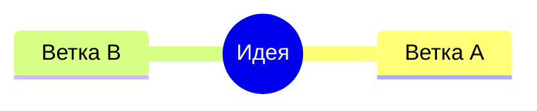
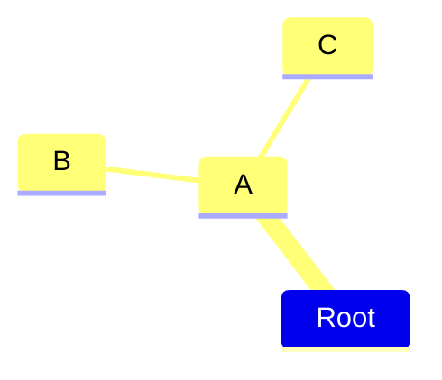
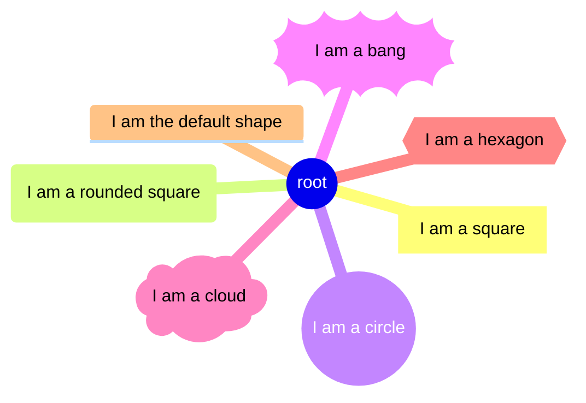
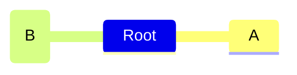
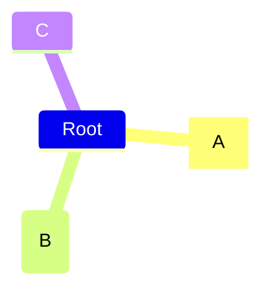
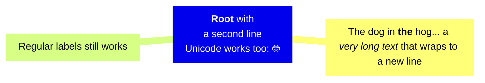
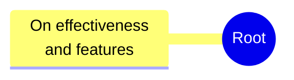
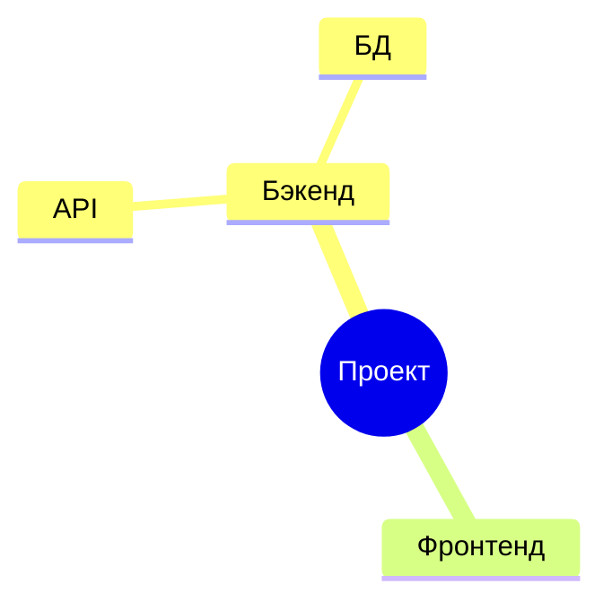
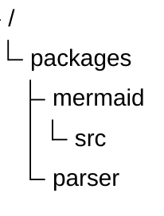

# Иерархии, время и доски: mindmap, treeView, timeline, kanban

Четыре типа с одной общей чертой — **структура задаётся отступами, а не стрелками**. Применяй: `mindmap` — радиальный разбор одной идеи; `treeView` — файловое/каталожное дерево; `timeline` — хронология событий по периодам; `kanban` — доска задач по колонкам. НЕ применяй, если нужны произвольные связи между узлами (граф, а не дерево) — это `flowchart`; если нужны сроки и зависимости — `gantt`.

---

## mindmap

Когда применять: мозговой штурм, декомпозиция одной центральной идеи, оглавление. Когда НЕ применять: у элементов больше одного родителя или есть перекрёстные связи — mindmap физически не умеет рисовать связи вне дерева.

Статус: диаграмма помечена в документации как **экспериментальная** (синтаксис стабилен, экспериментальна интеграция иконок).

### Минимальный скелет



### Синтаксис

#### Иерархия через отступы

Уровень вложенности определяется **только отступом относительно предыдущих строк**. Ключевых слов для связей нет.



Здесь `Root` — корень, `A` — его ребёнок, `B` и `C` — дети `A`.

#### Нестрогие отступы

Абсолютная величина отступа не важна — важно только сравнение с предыдущими строками. Если отступ неоднозначен (меньше, чем у `B`, но больше, чем у `A`), Mermaid берёт **ближайший предыдущий узел с меньшим отступом** как родителя. Ниже `C` становится не ребёнком `B`, а сиблингом `B` — детьми `A`:


#### Формы узлов

Синтаксис как во flowchart: `id` + разделители формы + текст внутри.

| Форма | Синтаксис |
| --- | --- |
| Квадрат | `id[текст]` |
| Скруглённый квадрат | `id(текст)` |
| Круг | `id((текст))` |
| Взрыв (bang) | `id))текст((` |
| Облако | `id)текст(` |
| Шестиугольник | `id{{текст}}` |
| По умолчанию | просто текст без разделителей |



#### Иконки: `::icon(...)`

Иконка задаётся **отдельной строкой** сразу после узла, классы иконочного шрифта — в скобках. Работают Font Awesome (`fa fa-book`) и Material Design (`mdi mdi-skull-outline`).



Шрифты иконок **не входят в mermaid** — их подключает интегратор/администратор сайта. В голом `mmdc` парсер примет строку, но глиф не отрисуется.

#### CSS-классы: `:::`

Тройное двоеточие + классы через пробел, **отдельной строкой** после узла:



Сами классы (`urgent`, `large`) должны быть определены в CSS страницы — внутри диаграммы их объявить нельзя (см. Ловушки).

#### Markdown-строки

Обёртка `["\` … \`"]` (двойная кавычка + бэктик) включает форматирование и автоперенос: `**жирный**`, `*курсив*`, реальные переводы строки вместо `<br>`, Unicode/эмодзи.



В обычных (не markdown) подписях перенос строки делается тегом `<br/>`:



#### Раскладка tidy-tree

Вместо радиальной раскладки можно включить аккуратное дерево через `config.layout`:



### Ловушки

- **Корень должен быть ровно один.** Две строки с нулевым отступом → `Error: There can be only one root. No parent could be found for ("B")`. Проверено рендером.
- **Круглые скобки в неэкранированном тексте молча съедают текст.** Строка `Сервис (v2)` парсится как узел с id `Сервис ` и формой «скруглённый квадрат» с текстом `v2` — в SVG остаётся только `v2`, ошибки нет. Оборачивай в кавычки: `A["Сервис (v2)"]`.
- **`classDef` в mindmap не поддерживается** (mermaid 11.16.1). Строка `classDef urgent fill:#f96` разбирается как обычный узел: с отступом она молча появится на схеме отдельной веткой с текстом «classDef urgent fill:#f96» (проверено рендером), а на нулевом отступе свалит диаграмму ошибкой «There can be only one root». Классы `:::` берутся только из CSS страницы.
- Иконка и класс — **на отдельной строке** после узла, не в той же строке с текстом.
- Отступ у `::icon(...)` / `:::class` не создаёт нового уровня — эти строки относятся к предыдущему узлу.

---

## treeView

Когда применять: структура каталогов проекта, дерево файлов, любая строгая иерархия «папка → содержимое» с подписями. Когда НЕ применять: нужны связи между ветками или радиальная подача — бери `flowchart` или `mindmap`.

Появилась в **v11.14.0+**, ключевое слово — `treeView-beta`.

### Минимальный скелет


### Синтаксис

#### Отступный ввод

Структура зависит **только от отступа**. Подписи бывают голые (без кавычек) и в кавычках — кавычки нужны для имён с пробелами. Завершающий `/` помечает каталог: он рисуется полужирным.



Несколько корней верхнего уровня допустимы — в отличие от mindmap.

#### ASCII-дерево (box-drawing)

Альтернатива отступам: дерево, нарисованное символами рамок. Парсер **сам определяет формат**, ключевого слова или конфига не нужно. Поддержаны обычные (`├──`, `└──`, `│`) и жирные (`┣━━`, `┗━━`, `┃`) варианты.


Глубина выводится из **позиции символа ветки в строке**, поэтому произвольная вложенность работает сама собой:


#### Аннотации

Три вида аннотаций, приписываются после подписи и **комбинируются в любом порядке**:

- `:::className` — CSS-класс; встроенный класс `highlight` есть из коробки;
- `## текст` — видимое описание, рисуется рядом курсивом;
- `icon(name)` — явная иконка.


Аннотации одинаково работают и в ASCII-варианте:


#### Иконки

По умолчанию иконки **скрыты**. Встроенные `file` (файл) и `folder` (каталог) включаются опцией `showIcons: true`:


Иконок по расширению/имени файла mermaid не содержит — карты задаются вручную через `filenameIcons` и `extensionIcons`. Значения резолвятся как ссылки `icon()`: `pack:name` берётся как есть, имя без префикса резолвится в `defaultIconPack`, `none` прячет иконку. Каталоги и неотображённые файлы сохраняют встроенные `folder`/`file`.


Явная `icon(name)` рисуется **всегда**, даже при выключенном `showIcons`. Встроенные `file`/`folder` можно указывать без префикса пакета: `icon(folder)`. Наоборот, `icon()` или `icon(none)` прячет иконку конкретного узла при включённом `showIcons`:


#### Эмодзи вместо иконок

Подписи рисуются ровно как написаны — Unicode и подряд идущие пробелы сохраняются. Поскольку встроенные иконки по умолчанию выключены, эмодзи отлично работают как инлайновые иконки:

```mermaid
treeView-beta
    🚀 rocket-app/
        📦 packages/
            🎨 ui/
            🛠️ utils/
        🧪 tests/
        📝 README.md
        ⚙️ config.yaml
```

#### Комментарии

Обычный для Mermaid `%%` — строка не рисуется:

```mermaid
treeView-beta
    %% Сгенерировано — не редактировать
    src/
        generated/
        index.js
```

#### Конфиг и тема

```mermaid
---
config:
    treeView:
        rowIndent: 80
        lineThickness: 3
    themeVariables:
        treeView:
            labelFontSize: '20px'
            labelColor: '#FF0000'
            lineColor: '#00FF00'
---
treeView-beta
    "packages"
        "mermaid"
            "src"
        "parser"
```

Опции блока `config.treeView`:

| Опция | Назначение | По умолчанию |
| --- | --- | --- |
| `rowIndent` | Отступ каждой строки | `10` |
| `paddingX` | Горизонтальный padding строки | `5` |
| `paddingY` | Вертикальный padding строки | `5` |
| `lineThickness` | Толщина линии | `1` |
| `showIcons` | Показывать встроенные file/folder-иконки (явный `icon()` рисуется всегда) | `false` |
| `defaultIconPack` | Зарегистрированный iconify-пак для имён без префикса | `''` |
| `filenameIcons` | Карта «имя файла → иконка» | `{}` |
| `extensionIcons` | Карта «расширение → иконка» | `{}` |

Переменные темы в `themeVariables.treeView`:

| Переменная | Назначение | По умолчанию |
| --- | --- | --- |
| `labelFontSize` | Размер шрифта подписи | `'16px'` |
| `labelColor` | Цвет подписи | `'black'` |
| `lineColor` | Цвет линии | `'black'` |
| `iconColor` | Цвет иконок (для использующих `currentColor`) | `'#546e7a'` |
| `descriptionColor` | Цвет описания после `##` | `'#6a9955'` |
| `highlightBg` | Заливка подсветки | `rgba(255,193,7,0.15)` |
| `highlightStroke` | Обводка подсветки | `#ffc107` |

Общие переменные темы — см. `theming.md`.

### Ловушки

- **Ключевое слово только `treeView-beta`.** Без суффикса: `UnknownDiagramError: No diagram type detected matching given configuration for text: treeView`. Проверено рендером.
- **Иконпаки не поставляются с mermaid.** `logos:react`, `material-icon-theme:*` и т. п. требуют `registerIconPacks` на стороне встраивающего сайта; незарегистрированная иконка рисуется знаком вопроса. Рендер при этом не падает — в `mmdc` такие примеры проходят, но иконки не появляются.
- Табы автоматически разворачиваются в пробелы; в сообщениях об ошибках номера строк соответствуют **исходному** вводу.
- Каталог помечается завершающим `/` — без него запись отрисуется как файл (обычным шрифтом).
- Имена с пробелами — только в кавычках, иначе разбор подписи поедет.

---

## timeline

Когда применять: хронология событий/релизов/истории по периодам, где важен только порядок. Когда НЕ применять: нужны длительности, даты начала-конца и зависимости — это `gantt`.

Статус: диаграмма помечена в документации как **экспериментальная**.

### Минимальный скелет

```mermaid
timeline
    title История социальных сетей
    2002 : LinkedIn
    2004 : Facebook
```

### Синтаксис

#### Периоды и события

После `timeline` опционально идёт `title`, дальше строки вида:

```
{период} : {событие}
{период} : {событие} : {событие}
```

Событий на период может быть сколько угодно; продолжение выносится на следующие строки, начинающиеся с двоеточия:

```mermaid
timeline
    title История социальных сетей
    2002 : LinkedIn
    2004 : Facebook
         : Google
    2005 : YouTube
    2006 : Twitter
```

Эквивалентная запись в одну строку:

```mermaid
timeline
    title История социальных сетей
    2002 : LinkedIn
    2004 : Facebook : Google
    2005 : YouTube
    2006 : Twitter
```

И период, и событие — **произвольный текст**, не только числа. Порядок значим: первый период — слева (или сверху), последний — справа (снизу); первое событие внутри периода — сверху, последнее — снизу.

#### Секции (эпохи)

`section <имя>` группирует все последующие периоды до следующей `section`. Все периоды и события одной секции получают общую цветовую схему. Без секций всё попадает в секцию по умолчанию.

```mermaid
timeline
    title Timeline of Industrial Revolution
    section 17th-20th century
        Industry 1.0 : Machinery, Water power, Steam <br>power
        Industry 2.0 : Electricity, Internal combustion engine, Mass production
        Industry 3.0 : Electronics, Computers, Automation
    section 21st century
        Industry 4.0 : Internet, Robotics, Internet of Things
        Industry 5.0 : Artificial intelligence, Big data, 3D printing
```

#### Перенос текста

Длинный текст периода или события переносится автоматически, чтобы не выйти за границы диаграммы. Принудительный перенос — `<br>` (работает и в заголовке секции):

```mermaid
timeline
        title MermaidChart 2023 Timeline
        section 2023 Q1 <br> Release Personal Tier
          Bullet 1 : sub-point 1a : sub-point 1b
               : sub-point 1c
          Bullet 2 : sub-point 2a : sub-point 2b
        section 2023 Q2 <br> Release XYZ Tier
          Bullet 3 : sub-point <br> 3a : sub-point 3b
               : sub-point 3c
          Bullet 4 : sub-point 4a : sub-point 4b
```

#### Направление (v11.14.0+)

Ключевое слово ставится **сразу после `timeline`**: `LR` — слева направо (по умолчанию), `TD` — сверху вниз.

```mermaid
timeline TD
  title MermaidChart 2023 Timeline
    section 2023 Q1 <br> Release Personal Tier
      Bullet 1 : sub-point 1a : sub-point 1b
      Bullet 2 : sub-point 2a : sub-point 2b
    section 2023 Q2 <br> Release XYZ Tier
      Bullet 3 : sub-point <br> 3a : sub-point 3b
      Bullet 4 : sub-point 4a : sub-point 4b
```

#### Цвета

Без секций **по умолчанию каждый период красится в свой цвет**. Отключается опцией `timeline.disableMulticolor` — тогда всё уходит в одну схему:

```mermaid
---
config:
  theme: 'base'
  timeline:
    disableMulticolor: true
---
timeline
    title История социальных сетей
      2002 : LinkedIn
      2004 : Facebook : Google
      2005 : YouTube
```

Палитра задаётся переменными темы `cScale0`…`cScale11` (фон) и `cScaleLabel0`…`cScaleLabel11` (цвет текста): `cScale0` — первая секция/период, `cScale1` — вторая и т. д., до 12 штук.

```mermaid
---
config:
  theme: 'default'
  themeVariables:
    cScale0: '#ff0000'
    cScaleLabel0: '#ffffff'
    cScale1: '#00ff00'
    cScale2: '#0000ff'
    cScaleLabel2: '#ffffff'
---
timeline
    title История социальных сетей
      2002 : LinkedIn
      2004 : Facebook : Google
      2005 : YouTube
      2006 : Twitter
      2007 : Tumblr
      2008 : Instagram
      2010 : Pinterest
```

Предустановленные темы: `base`, `forest`, `dark`, `default`, `neutral` — задаются через `config.theme`. Значения `cScale*` по умолчанию берутся из выбранной темы; подробности — `theming.md`.

```mermaid
---
config:
  theme: 'forest'
---
timeline
    title История социальных сетей
      2002 : LinkedIn
      2004 : Facebook : Google
      2005 : YouTube
```

### Ловушки

- **Двоеточие внутри текста события разрезает его на два события.** `2024 : Релиз: первая версия` даёт две отдельные подписи — `Релиз` и `первая версия`. Ошибки нет, содержимое молча искажается. Проверено рендером: в SVG появляются оба текста как самостоятельные события. Экранирования двоеточия в timeline нет — переформулируй подпись.
- Строка-продолжение должна начинаться с `:` — иначе она будет прочитана как **новый период** без событий.
- Секций больше 12 → палитра `cScale*` начинает повторяться по кругу.
- `disableMulticolor` действует только при отсутствии секций; при наличии секций цвет и так общий внутри секции.
- Направление указывается только сразу после `timeline` (`timeline TD`), отдельной строкой `direction TD` timeline не управляется.

---

## kanban

Когда применять: доска задач по стадиям (Todo / In progress / Done) со снимком состояния — кто делает, по какому тикету, с каким приоритетом. Когда НЕ применять: нужны сроки, длительности и последовательность — `gantt`; нужна логика переходов — `stateDiagram`.

### Минимальный скелет

```mermaid
kanban
  column1[Column Title]
    task1[Task Description]
```

### Синтаксис

#### Колонки

Колонка = стадия процесса. Задаётся уникальным идентификатором и заголовком в квадратных скобках: `columnId[Column Title]`. Заголовок можно оставить и без id.

```mermaid
kanban
  todo[Todo]
  wip[In progress]
  done[Done]
```

#### Задачи

Задачи перечисляются **с отступом** под своей колонкой, синтаксис тот же: `taskId[Task Description]`. Допустима и запись без id — `[Create Documentation]`.

```mermaid
kanban
  todo[Todo]
    docs[Create Documentation]
    blog[Create Blog about the new diagram]
  done[Done]
    [define getData]
```

#### Метаданные задачи: `@{ ... }`

Дополнительные поля задаются после подписи в фигурных скобках с `@` — пары «ключ: значение» через запятую. Значения можно писать в одинарных кавычках или без них. Метаданные попадают в отрисовку узла.

Поддерживаемые ключи:

- `assigned` — исполнитель;
- `ticket` — номер тикета/задачи;
- `priority` — срочность; допустимые значения: `'Very High'`, `'High'`, `'Low'`, `'Very Low'`.

```mermaid
kanban
todo[Todo]
  id3[Update Database Function]@{ ticket: MC-2037, assigned: 'knsv', priority: 'High' }
```

#### Ссылки на тикеты: `ticketBaseUrl`

Единственная конфигурационная опция kanban. `#TICKET#` в шаблоне заменяется значением `ticket` из метаданных, и номер тикета в диаграмме становится ссылкой во внешнюю систему.

```mermaid
---
config:
  kanban:
    ticketBaseUrl: 'https://yourproject.atlassian.net/browse/#TICKET#'
---
kanban
  todo[Todo]
    id1[Починить экспорт]@{ ticket: MC-2040, assigned: 'knsv', priority: 'Very High' }
```

#### Полный пример

```mermaid
---
config:
  kanban:
    ticketBaseUrl: 'https://mermaidchart.atlassian.net/browse/#TICKET#'
---
kanban
  Todo
    [Create Documentation]
    docs[Create Blog about the new diagram]
  [In progress]
    id6[Create renderer so that it works in all cases. We also add some extra text here for testing purposes.]
  id9[Ready for deploy]
    id8[Design grammar]@{ assigned: 'knsv' }
  id10[Ready for test]
    id4[Create parsing tests]@{ ticket: MC-2038, assigned: 'K.Sveidqvist', priority: 'High' }
    id66[last item]@{ priority: 'Very Low', assigned: 'knsv' }
  id11[Done]
    id5[define getData]
    id2[Title of diagram is more than 100 chars when user duplicates diagram]@{ ticket: MC-2036, priority: 'Very High'}
    id3[Update DB function]@{ ticket: MC-2037, assigned: knsv, priority: 'High' }
```

#### Комментарии

```mermaid
kanban
  %% доска спринта 42
  todo[Todo]
    t1[Написать тесты]
```

### Ловушки

- **Отступ обязателен.** Задача, записанная на одном уровне с колонкой, сама становится пустой колонкой — ошибки нет, доска молча разваливается на столбцы. Проверено рендером: в SVG появляются два кластера `section-1` / `section-2` вместо колонки с карточкой.
- **Идентификаторы держи уникальными** во всей диаграмме — это прямое требование документации; парсер повтор не отвергает, но соответствие карточек колонкам перестаёт быть предсказуемым.
- `priority` вне списка `'Very High' | 'High' | 'Low' | 'Very Low'` парсер пропускает без ошибки (проверено рендером), но стиль приоритета применён не будет.
- `ticket` без настроенного `ticketBaseUrl` отрисуется как обычный текст, ссылки не появится.
- `@{ ... }` пишется **вплотную** к закрывающей `]` подписи, без пробела перед `@`.

---

## Источник

Дистиллировано из официальной документации mermaid-js/mermaid (docs/syntax), проверено рендером на mermaid-cli 11.16.0 / mermaid 11.16.1.
