# Инженерное и бизнес-моделирование

Девять редких и новых типов Mermaid: `requirementDiagram`, `journey`, `swimlane-beta`, `eventmodeling`,
`cynefin-beta`, `ishikawa-beta`, `wardley-beta`, `railroad-*-beta`, `usecase-beta`. Все примеры проверены
рендером — кроме раздела `usecase`, который требует mermaid новее нашей 11.16.1 (см. пометку в нём).

---

## requirementDiagram

Применять для трассировки требований (SysML v1.6) и их связей с элементами — документами, тестами, симуляциями. НЕ применять для потока управления или архитектуры компонентов — там `flowchart` / `C4`.

### Минимальный скелет

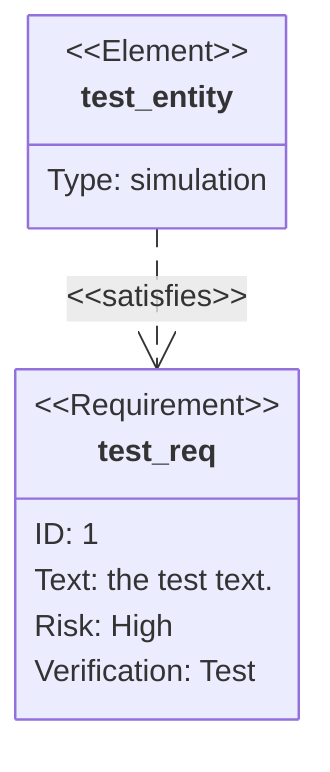

### Синтаксис

**Требование.** Блок вида `<type> имя { ... }` с четырьмя полями:

```
<type> user_defined_name {
    id: user_defined_id
    text: user_defined text
    risk: <risk>
    verifymethod: <method>
}
```

| Ключ | Допустимые значения |
| --- | --- |
| Type | `requirement`, `functionalRequirement`, `interfaceRequirement`, `performanceRequirement`, `physicalRequirement`, `designConstraint` |
| Risk | `Low`, `Medium`, `High` (регистр не важен) |
| VerificationMethod | `Analysis`, `Inspection`, `Test`, `Demonstration` (регистр не важен) |

**Элемент.** Все три части задаёт пользователь; поле `docref` (принимается и `docRef`) — лёгкая ссылка на внешний документ.

```
element user_defined_name {
    type: user_defined_type
    docref: user_defined_ref
}
```

**Связи.** Источник, тип, приёмник. Тип — один из `contains`, `copies`, `derives`, `satisfies`, `verifies`, `refines`, `traces`. Обе формы эквивалентны, метка связи рисуется на стрелке:

```
{источник} - <type> -> {приёмник}
{приёмник} <- <type> - {источник}
```

**Направление.** Оператор `direction` со значениями `TB` (по умолчанию), `BT`, `LR`, `RL`.

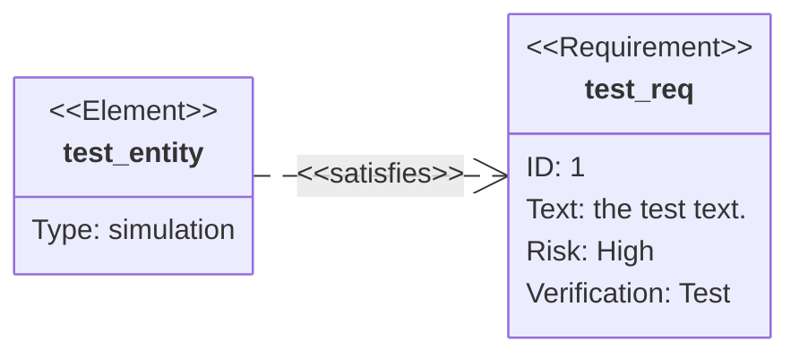

**Кавычки и Markdown.** Любой пользовательский текст (имя, `text`, `docref`) можно взять в кавычки, внутри кавычек работает Markdown-разметка `**bold**` и `*italics*`. Ссылаться на узел потом надо ровно тем же написанием, включая кавычки.

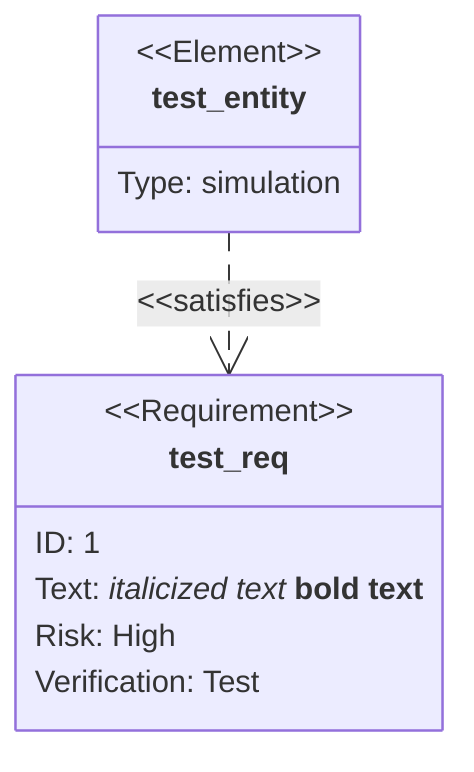

**Стилизация.** Три механизма, как во flowchart: `style` (прямые CSS-свойства), `classDef` + `class` (переиспользуемые классы, принимают списки имён через запятую) и краткая форма `:::` (много классов, но только одному узлу). Класс с именем `default` применяется ко всем узлам; конкретные стили объявляй после него, чтобы перекрыть.

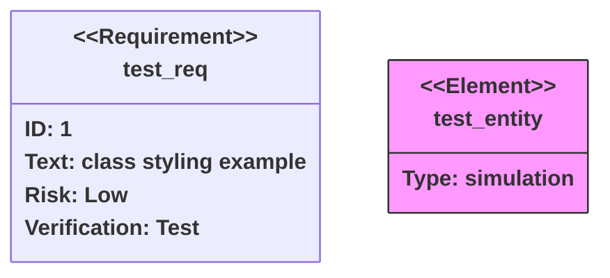

Краткая форма для элемента после объявления — отдельной строкой `test_elem:::myClass`:

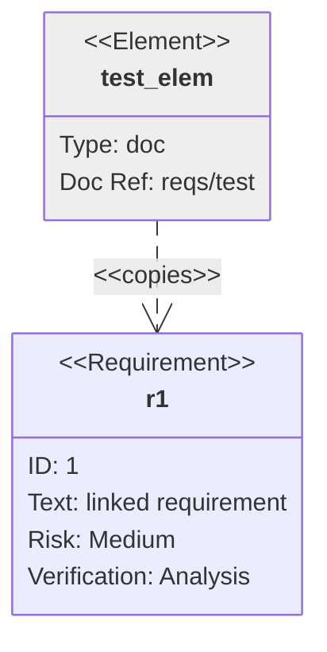

### Ловушки

- Некавыченный пользовательский текст ломает парсер, если внутри встретится ключевое слово (`id`, `text`, `risk`, `type`, `docref`, имя типа требования). Сомневаешься — ставь кавычки.
- Имя в связи должно совпадать с объявлением посимвольно: если требование объявлено как `"__test_req__"`, то и в связи пиши `"__test_req__"`.
- `classDef` сам по себе ничего не красит — нужен `class`, `:::` или имя `default`.

---

## journey

Применять для высокоуровневого пути пользователя с оценкой удовлетворённости на каждом шаге. НЕ применять, когда важны ветвления, условия или обмен сообщениями.

### Минимальный скелет

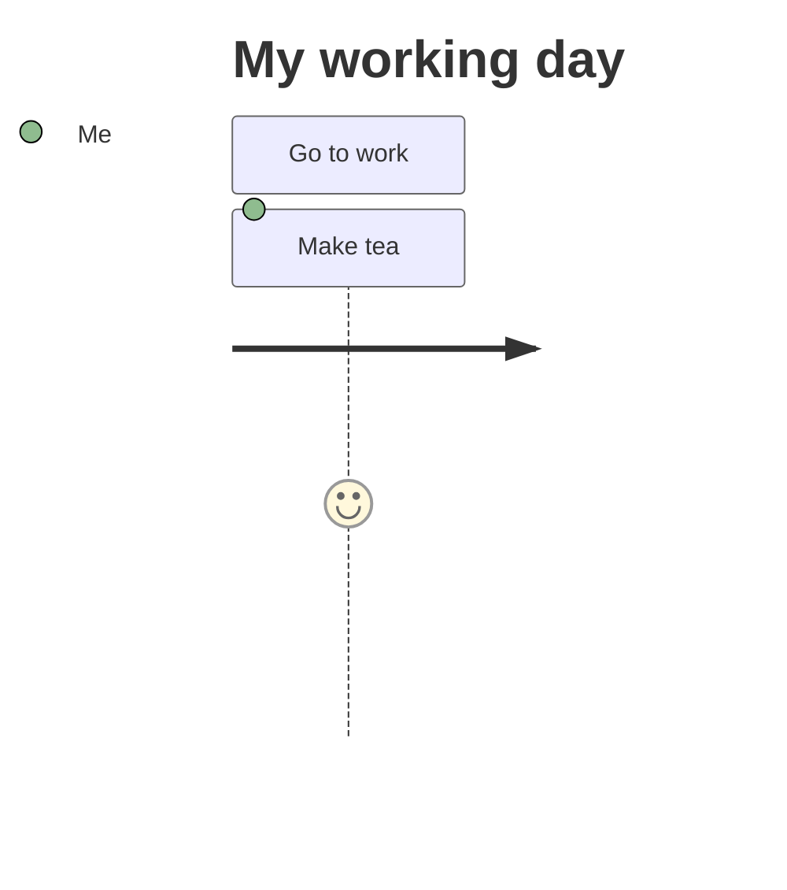

### Синтаксис

Синтаксис задачи — `Task name: <score>: <список актёров через запятую>`. Score — целое от 1 до 5 включительно. Задачи группируются в `section` — этапы задачи, которую решает пользователь. Поддерживаются `accTitle:` / `accDescr:`.

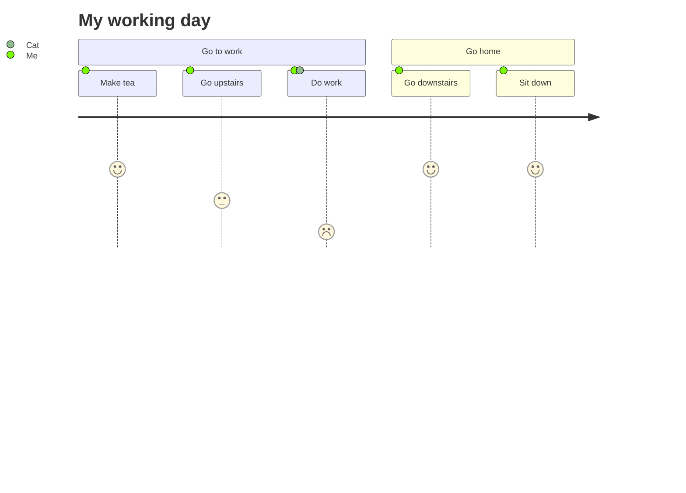

### Ловушки

- Score вне диапазона 1–5 не имеет смысла — шкала фиксирована.
- Актёры перечисляются через запятую в третьем поле; отдельного объявления участников нет.
- Ветвлений, стрелок и стилей у типа нет вообще — только `title`, `section` и строки задач.

---

## swimlane

`swimlane-beta`, появился в mermaid 11.16.0. Применять, когда важно не только «что дальше», но и «кто владеет шагом»: согласования, поддержка, поставка, процессы через несколько команд. НЕ применять, если владение неважно (`flowchart`), если фокус на сообщениях во времени (`sequenceDiagram`) или на смене состояний одной сущности (`stateDiagram`).

### Минимальный скелет

```mermaid
swimlane-beta
  subgraph Sales
    lead[Qualify lead]
    quote[Prepare quote]
  end
```

### Синтаксис

**Заголовок и направление.** `swimlane-beta` опционально с направлением: `TB` (по умолчанию), `TD` (то же, что `TB`), `BT`, `LR`, `RL`.

**Дорожки.** Дорожка — это top-level `subgraph`, закрывается `end`. Можно задать внутренний id и отдельную подпись: `subgraph id [Подпись]` — id остаётся стабильным для стилей и ссылок, подпись можно менять.

```mermaid
swimlane-beta LR
  subgraph sales [Sales team]
    lead[Qualify lead]
    quote[Prepare quote]
  end

  subgraph finance [Finance team]
    review[Review terms]
    approve[Approve quote]
  end

  lead --> quote --> review --> approve
```

**Узлы.** Формы — как во flowchart: сначала id, потом подпись внутри формы.

| Синтаксис | Форма | Типичное применение |
| --- | --- | --- |
| `id[Text]` | прямоугольник | задача / активность |
| `id(Text)` | скруглённый | шаг / событие |
| `id([Text])` | стадион | начало или конец |
| `id{Text}` | ромб | ветвление |
| `id((Text))` | круг | коннектор / маркер |

Полный каталог форм, иконки, картинки, markdown-строки — см. справочник по `flowchart`.

**Рёбра.** Тоже flowchart-синтаксис, связывают узлы внутри одной дорожки и между дорожками: `A --> B` (стрелка), `A --- B` (линия без наконечника), `A -->|Label| B` (стрелка с меткой), `A -.-> B` (пунктир), `A ==> B` (жирная).

```mermaid
swimlane-beta TB
  subgraph Intake
    start([Start])
    task[Do work]
  end
  subgraph Review
    decision{Ready?}
    done((Done))
  end
  start --> task --> decision
  decision -->|Yes| done
  decision -.->|No| task
  task ==> done
```

**Стили и accessibility.** Работают `classDef` / `class` и директивы `accTitle:` / `accDescr:`.

```mermaid
swimlane-beta LR
  accTitle: Support escalation
  accDescr: A request starts with the customer, is triaged by support, and may be escalated to engineering.

  subgraph ops [Operations]
    intake[Receive request]
    plan[Plan work]
  end

  subgraph legal [Legal]
    review[Review contract]
  end

  intake --> plan --> review

  classDef attention fill:#fff2cc,stroke:#d6a500,color:#111;
  class review attention;
```

### Полноценный пример

Решение размещено в дорожке, которая им владеет; исходы разведены в дорожки, которые действуют по результату; межполосные переходы подписаны.

```mermaid
swimlane-beta LR
  subgraph Applicant
    apply[Submit application]
    sign[Sign agreement]
  end

  subgraph Reviewer
    screen[Screen application]
    decide{Approved?}
  end

  subgraph System
    create[Create account]
    notify[Send welcome email]
  end

  apply -->|Application received| screen
  screen --> decide
  decide -->|Approved| create --> notify --> sign
  decide -->|Needs changes| apply
```

### Ловушки

- Дорожками становятся ТОЛЬКО top-level `subgraph`. Узел вне какого-либо `subgraph` не принадлежит ни одной дорожке.
- Одна дорожка = один вид владения. Мешать команды, фазы и статусы в одном наборе дорожек — верный путь к нечитаемой схеме.
- Тип помечен beta: синтаксис может измениться в будущих версиях, и до 11.16.0 его нет вообще.

---

## eventmodeling

Появился в mermaid 11.15.0. Применять для Event Modeling: как информация менялась во времени и что видит пользователь в каждый момент. НЕ применять для потока управления или структуры кода.

### Минимальный скелет

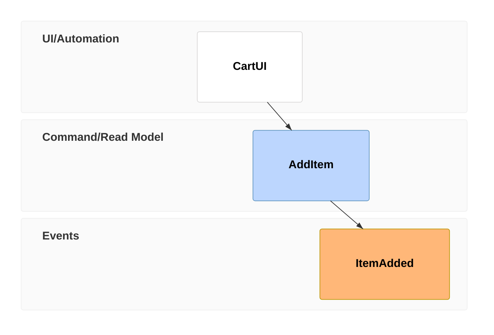

### Синтаксис

**Timeline и Time Frame.** Диаграмма собирается из Time Frame — по одному на строку. Компактная запись — токен `tf`, расслабленная — `timeframe`; они взаимозаменяемы. Формат: `tf <номер> <тип> <ИдентификаторСущности>`. Номер должен быть уникален в пределах таймлайна (он же — якорь для ссылок); порядок номеров не важен, важна уникальность. Один Идентификатор Сущности можно использовать многократно — например, для повторных вызовов одного события в разные моменты.

**Типы сущностей** (третья колонка) и их дорожки:

| Токен | Сущность | Дорожка |
| --- | --- | --- |
| `ui` | UI | UI/Automation |
| `pcr` / `processor` | Processor | UI/Automation |
| `cmd` / `command` | Command | Command/Read Model |
| `rmo` / `readmodel` | Read Model | Command/Read Model |
| `evt` / `event` | Event | Events |

Связи между сущностями по умолчанию выводятся автоматически (inference).

**Inline Data.** Пример данных в фигурных скобках на той же строке:

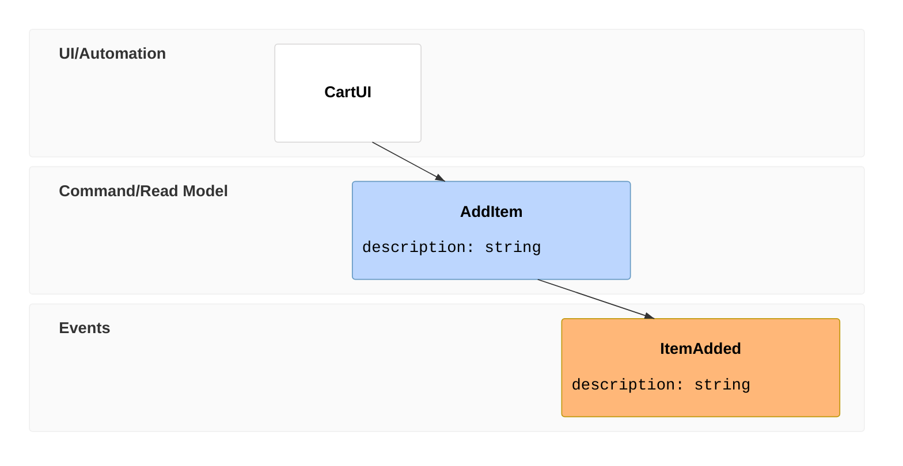

**Data Block.** Для сложных данных объявляй блок отдельно и ссылайся на него из Time Frame через `[[идентификатор]]` (как wiki-ссылка). Если сущность повторяется, суффиксируй идентификатор блока номером.

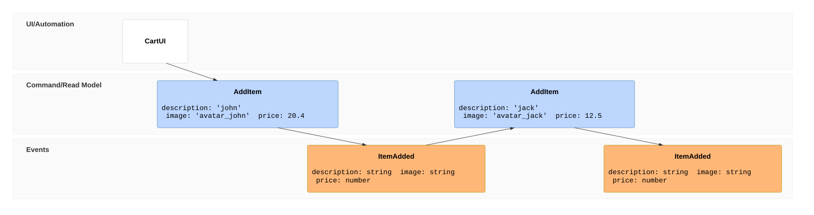

**Тип данных.** Данные (и inline, и блок) можно предварить типом в обратных кавычках: `` `json` ``, `` `jsobj` ``, `` `figma` ``, `` `salt` ``, `` `uri` ``, `` `md` ``, `` `html` ``, `` `text` ``. На отрисовку тип сейчас не влияет.

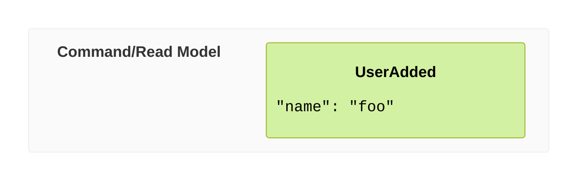

**Reset Frame.** Токен `rf` / `resetframe` разрывает автоматический вывод связей — нужен, когда моделируешь сложный бизнес-поток.

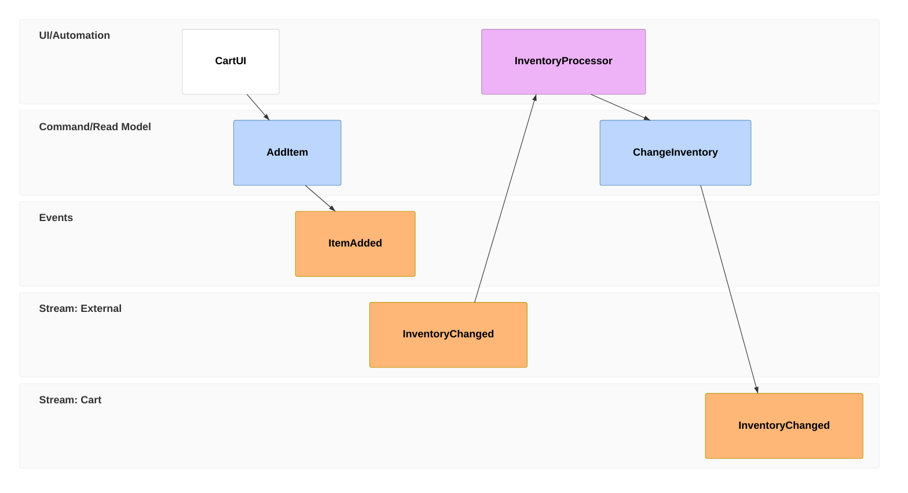

**Множественные связи.** Токен `->>` со ссылкой на номера Time Frame — например, когда Read Model строится из нескольких Event.

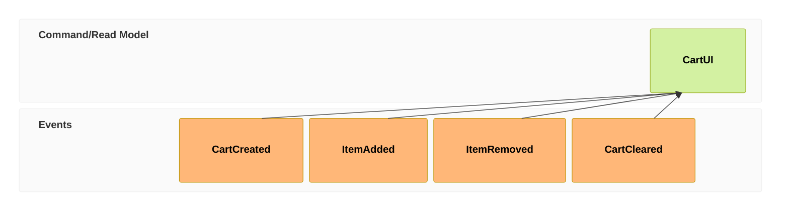

**Namespace.** Первая часть Идентификатора Сущности до точки — namespace. Каждая пара «namespace + тип сущности» образует новую дорожку; порядок объявления в тексте задаёт порядок дорожек на схеме.

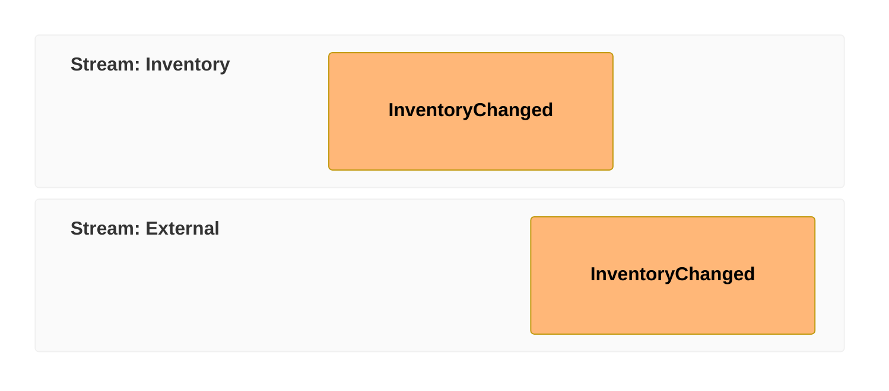

### Паттерны

State Change — `ui` → `cmd` → `evt`. State View — `evt` → `rmo` → `ui`. Translation — внешний `evt` → `pcr` → `cmd` → внутренний `evt`.

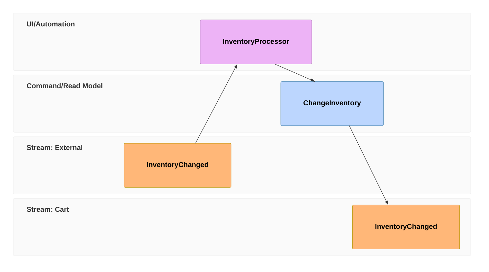

### Ловушки

- Номер Time Frame обязан быть уникальным. Повторный номер ломает и ссылки `->>`, и `[[...]]`.
- `->>` ссылается на НОМЕРА Time Frame, а не на имена сущностей.
- Идентификатор Data Block должен быть уникальным: при повторе одной сущности с разными данными добавляй суффикс (`AddItem01`, `AddItem02`).
- Точка в идентификаторе — не декорация, а объявление namespace: `Cart.InventoryChanged` и `External.InventoryChanged` попадут в разные дорожки.

---

## cynefin

`cynefin-beta`, появился в mermaid 11.16.0. Применять, чтобы разложить задачи/проблемы по доменам сложности и подобрать способ реакции. НЕ применять для процессов и последовательностей.

### Минимальный скелет

```mermaid
cynefin-beta
  complex
    "Adaptive work"
```

### Синтаксис

**Домены.** Ровно пять фиксированных ключевых слов — других нет. Порядок объявления не влияет на расположение: Complex — слева вверху, Complicated — справа вверху, Chaotic — слева внизу, Clear — справа внизу, Confusion — в центре.

| Ключевое слово | Домен | Модель решения / практики |
| --- | --- | --- |
| `clear` | Clear (бывш. Obvious/Simple) | Sense → Categorise → Respond, best practices |
| `complicated` | Complicated | Sense → Analyse → Respond, good practices |
| `complex` | Complex | Probe → Sense → Respond, emergent practices |
| `chaotic` | Chaotic | Act → Sense → Respond, novel practices |
| `confusion` | Confusion / Disorder | домен неизвестен — цель вывести элемент в один из четырёх |

Ещё есть `title` — необязательный заголовок.

**Элементы.** Строки в кавычках внутри блока домена; каждая рисуется как текстовый бейдж в области домена.

**Переходы.** Объявляются на верхнем уровне через `-->` между двумя именами доменов, метка — через `: "текст"`.

```mermaid
cynefin-beta
  title Strategy Categorization

  complex
    "Market research"

  complicated
    "Competitive analysis"

  clear
    "Standard pricing"

  chaotic
    "Crisis management"

  complex --> complicated : "Pattern identified"
  complicated --> clear : "Best practice codified"
  clear --> chaotic : "Complacency"
  chaotic --> complex : "Stabilized"
```

Типичные переходы: Complex → Complicated (паттерн проявился и поддаётся анализу), Chaotic → Complex (кризис стабилизирован настолько, что можно пробовать), Clear → Chaotic (самоуспокоенность или переограничение — тот самый «обрыв»), Complicated → Clear (анализ кодифицирован в стандартную практику).

**Пустой каркас.** Домены отрисовываются и без элементов — годится как шаблон-воркшит.

```mermaid
cynefin-beta
  title Cynefin Framework

  complex
  complicated
  clear
  chaotic
```

**Конфигурация** — под ключом `cynefin`:

| Опция | Тип | По умолчанию | Смысл |
| --- | --- | --- | --- |
| `width` | number | `800` | ширина в пикселях |
| `height` | number | `600` | высота в пикселях |
| `padding` | number | `40` | отступ вокруг диаграммы |
| `showDomainDescriptions` | boolean | `true` | подписи модели решения и типа практик под названием домена |
| `boundaryAmplitude` | number | `8` | амплитуда «волнистости» границ в пикселях (`0` — прямые линии) |
| `seed` | number | `0` | детерминированное зерно волнистости; `0` хеширует SVG-id, так что каждая диаграмма выглядит уникально. Ненулевое значение фиксирует рисунок границ между рендерами — нужно для стабильных визуальных regression-тестов |

```mermaid
---
config:
  cynefin:
    width: 1000
    showDomainDescriptions: false
---
cynefin-beta
  complex
    "Adaptive work"
```

**Тема.** Переменные переопределяются через `themeVariables.cynefin`: `complexBg`, `complicatedBg`, `clearBg`, `chaoticBg`, `confusionBg`, `boundaryColor`, `boundaryWidth`, `cliffColor`, `cliffWidth`, `arrowColor`, `arrowWidth`, `labelColor`, `textColor`, `domainFontSize`, `itemFontSize`. Общий механизм тем — см. `theming.md`.

**Accessibility.** Поддерживаются стандартные `accTitle:` / `accDescr:`.

```mermaid
cynefin-beta
  accTitle: Cynefin framework for software delivery decisions
  accDescr: A Cynefin map categorizing software tasks by complexity domain

  complex
    "New feature discovery"
```

### Ловушки

- Имена доменов — жёсткие ключевые слова. Своих доменов быть не может.
- Переход «домен сам в себя» (`complex --> complex`) молча игнорируется: концы перехода должны быть разными доменами.
- `confusion` — компактный эллипс в центре: показываются максимум 3 элемента, остальные схлопываются в бейдж `+N more`. Четыре квадранта, наоборот, не обрезают содержимое — длинные списки визуально вылезают за границы, держи по несколько элементов на домен.
- Режим `look: handDrawn` для этого типа не поддерживается.

---

## ishikawa

`ishikawa-beta`, появился в mermaid 11.12.3. Применять для разбора причин одной проблемы («рыбья кость», cause-and-effect). НЕ применять, если нужны связи между причинами или временной порядок — это дерево, а не граф.

### Минимальный скелет

```mermaid
ishikawa-beta
    Deploy failed
    Process
        No rollback plan
```

### Синтаксис

- Первая строка после ключевого слова — событие (проблема), «голова рыбы».
- Последующие строки — причины.
- Структура «костей» задаётся ТОЛЬКО отступами: строки без дополнительного отступа — категории причин (главные кости), с отступом — их подпричины, ещё глубже — подпричины подпричин.

### Полноценный пример

```mermaid
ishikawa-beta
    Blurry Photo
    Process
        Out of focus
        Shutter speed too slow
        Protective film not removed
        Beautification filter applied
    User
        Shaky hands
    Equipment
        LENS
            Inappropriate lens
            Damaged lens
            Dirty lens
        SENSOR
            Damaged sensor
            Dirty sensor
    Environment
        Subject moved too quickly
        Too dark
```

### Ловушки

- Никаких стрелок, id и меток связей: сломанный отступ = сломанная иерархия.
- Ровно одна проблема на диаграмму — это всегда первая строка.
- Тип помечен beta: синтаксис может измениться в будущих версиях.

---

## wardley

`wardley-beta`, появился в mermaid 11.14.0. Применять для стратегического анализа: цепочка ценности, зрелость компонентов, решения build/buy/outsource, инерция. НЕ применять как обычную схему архитектуры — здесь координаты несут смысл.

### Минимальный скелет

```mermaid
wardley-beta
title Tea Shop

anchor Business [0.95, 0.63]
component Cup of Tea [0.79, 0.61]

Business -> Cup of Tea
```

### Синтаксис

**Оси и координаты.** Формат OnlineWardleyMaps (OWM): `[visibility, evolution]`.

- Первое значение — Visibility, 0.0–1.0, снизу вверх, это ось Y (0.0 — инфраструктура, 1.0 — то, что видит пользователь).
- Второе значение — Evolution, 0.0–1.0, слева направо, это ось X (0.0 — genesis/новое, 1.0 — commodity/утилита).

Это ОБРАТНО привычной записи (x, y).

**Объявление.** `wardley-beta` обязателен; `title` — необязательный заголовок; `size [ширина, высота]` — размер холста в пикселях, по умолчанию `[1100, 600]`.

**Компоненты и якоря.**

```
component Name [visibility, evolution]
component Name [visibility, evolution] label [offsetX, offsetY]
component Name [visibility, evolution] (decorator)
anchor Name [visibility, evolution]
```

`anchor` — пользователь/заказчик, подпись рисуется жирным. Смещение подписи `label [offsetX, offsetY]`: отрицательный X влево, положительный вправо; отрицательный Y вверх, положительный вниз. Имена могут содержать дефисы (`real-time processing`, `end-user`) без кавычек; кавычки нужны, только если имя начинается не с буквы или содержит символ, который грамматика иначе не принимает.

**Декораторы.** `(inertia)` — компонент сопротивляется изменению. Стратегия источника: `(build)` — треугольник, `(buy)` — ромб, `(outsource)` — квадрат, `(market)` — круг. Декораторы комбинируются.

```mermaid
wardley-beta
title Sourcing Strategy

anchor Customer [0.80, 0.95]
component Custom App [0.45, 0.85] (build)
component Off-the-shelf Tool [0.85, 0.65] (buy)
component Managed Service [0.60, 0.40] (outsource)
component Cloud Platform [0.95, 0.25] (market)
component Legacy Store [0.50, 0.45] (buy) (inertia)
component Database [0.40, 0.85] label [-50, 10]

Customer -> Custom App
Custom App -> Managed Service
Custom App -> Legacy Store
Off-the-shelf Tool -> Cloud Platform
```

**Связи.**

| Запись | Смысл |
| --- | --- |
| `A -> B` | зависимость |
| `A --> B` | зависимость (альтернативная запись) |
| `A -> B; label` | зависимость с аннотацией |
| `A -.-> B` | пунктирный поток |
| `A +> B` | поток со стрелкой |
| `A +< B` | обратный поток |
| `A +<> B` | двунаправленный поток |
| `A +'text'> B` | поток с меткой |

```mermaid
wardley-beta
title Link Types

component User [0.90, 0.95]
component App [0.75, 0.75]
component API [0.60, 0.60]
component Cache [0.65, 0.45]
component Database [0.15, 0.80]

User -> App
App +> API
API -> Database
API +<> Cache
Cache +'backup'> Database
```

**Эволюция.** `evolve Имя целеваяЭволюция` рисует красную пунктирную стрелку в будущее положение компонента.

```mermaid
wardley-beta
title Evolution

component Database [0.40, 0.50]
component API [0.55, 0.60]

Database -> API

evolve Database 0.75
evolve API 0.80
```

**Pipeline.** Компоненты пайплайна имеют одну visibility и различаются только эволюцией, поэтому внутри блока указывается ОДНО число.

```mermaid
wardley-beta
title Pipeline Evolution

component Database [0.40, 0.60]

pipeline Database {
  component "File System" [0.25]
  component "SQL DB" [0.50]
  component "NoSQL" [0.70]
  component "Cloud DB" [0.85]
}
```

**Свои стадии эволюции.** `evolution A -> B -> C -> D` меняет подписи оси X. Поддерживаются двойные подписи через `/` и явные границы через `@`.

```mermaid
wardley-beta
title Custom Stages

evolution Genesis@0.25 -> Custom@0.5 -> Product@0.75 -> Commodity@1.0

component Novel [0.75, 0.15]
component Bespoke [0.70, 0.35]
component Product [0.65, 0.65]
component Utility [0.60, 0.90]
```

```mermaid
wardley-beta
title Dual Label Stages

evolution Genesis / Concept -> Custom / Emerging -> Product / Converging -> Commodity / Accepted

component Novel Idea [0.05, 0.20]
component Custom Solution [0.35, 0.50]
component Product [0.65, 0.70]
component Utility [0.95, 0.90]
```

**Заметки, нумерованные аннотации, силы.** `note "текст" [visibility, evolution]` — заметка в точке. `annotations [x, y]` задаёт положение блока с расшифровкой номеров, `annotation N,[x, y] "текст"` — сам номер на карте. Текст заметок и аннотаций обязан быть в кавычках. `accelerator "текст" [vis, evo]` и `deaccelerator "текст" [vis, evo]` — силы, ускоряющие и тормозящие эволюцию.

**Trend Indicators** (`Component -.- (x, y)`, предсказанное будущее положение в обычном порядке (x, y)) описаны в документации, но НЕ поддерживаются в mermaid 11.16.1 — любая форма записи даёт «Syntax error in text». Используй `evolve`.

### Полноценный пример

```mermaid
wardley-beta
title Software Platform Strategy
size [1100, 800]

evolution Genesis@0.25 -> Custom@0.5 -> Product@0.75 -> Commodity@1.0

anchor Customer [0.90, 0.95]

component "Mobile App" [0.80, 0.85] (build)
component "Web App" [0.75, 0.80] label [-60, 10] (build)
component "API Gateway" [0.70, 0.65] (buy)
component "Auth Service" [0.60, 0.55] (outsource)
component "Database" [0.50, 0.45] (buy) (inertia)
component "Cloud Platform" [0.30, 0.95] (market)

Customer -> "Mobile App"
Customer -> "Web App"
"Mobile App" -> "API Gateway"
"Web App" -> "API Gateway"
"API Gateway" -> "Auth Service"
"API Gateway" -> "Database"
"Database" -> "Cloud Platform"

evolve "API Gateway" 0.85
evolve "Database" 0.75

accelerator "Cloud Native" [0.20, 0.85]
deaccelerator "Legacy Data" [0.45, 0.35]

annotations [0.10, 0.20]
annotation 1,[0.78, 0.82] "User touchpoints"
annotation 2,[0.70, 0.60] "Integration layer"
annotation 3,[0.50, 0.40] "Data persistence"

note "Build mobile-first experience" [0.85, 0.90]
note "Migrate to cloud-native database" [0.60, 0.50]
```

### Ловушки

- Порядок координат — `[visibility, evolution]`, то есть [Y, X]. Перепутал — карта осмысленно отрендерится, но покажет не то.
- Trend-индикаторы `-.-` не работают в 11.16.1 (см. выше).
- Текст в `note`, `annotation`, `accelerator`, `deaccelerator` обязан быть в кавычках.
- Внутри `pipeline` у компонента ОДНА координата (эволюция), а не две.
- Режим `look: handDrawn` не поддерживается: у типа собственный D3-рендерер, а не общая система форм.

---

## railroad

Появился в mermaid 11.16.0. Применять для визуализации контекстно-свободных грамматик (синтаксические диаграммы). НЕ применять для потоков данных или процессов.

Четыре ключевых слова — по одному на нотацию:

| Тип | Ключевое слово | Нотация |
| --- | --- | --- |
| EBNF | `railroad-ebnf-beta` | Extended Backus–Naur Form (стили W3C и ISO 14977) |
| ABNF | `railroad-abnf-beta` | Augmented Backus–Naur Form (RFC 5234) |
| PEG | `railroad-peg-beta` | Parsing Expression Grammar |
| IR (примитивы) | `railroad-beta` | внутреннее представление mermaid, явные конструкторы |

### Минимальный скелет

```mermaid
railroad-ebnf-beta
title "Digit Definition"

digit = "0" | "1" | "2" | "3" | "4" | "5" | "6" | "7" | "8" | "9" ;
```

### Общая структура

Все четыре типа устроены одинаково: ключевое слово нотации на первой строке; необязательный `title` со строкой; необязательные `accTitle:` / `accDescr:`; одно правило на утверждение, каждое правило заканчивается точкой с запятой `;`. Оператор присваивания и операторы внутри определения зависят от нотации.

### EBNF (`railroad-ebnf-beta`)

Правила пишутся как `rule_name = definition ;` (оператор `::=` тоже принимается). Терминалы — литералы в кавычках, нетерминалы — идентификаторы-ссылки на другие правила.

| Возможность | W3C | ISO 14977 | Смысл |
| --- | --- | --- | --- |
| Терминал | `"text"` / `'text'` | `"text"` / `'text'` | литеральная строка |
| Нетерминал | `identifier` | `identifier` | ссылка на правило |
| Последовательность | `A B` | `A , B` | конкатенация |
| Выбор | `A \| B` | `A \| B` | альтернатива |
| Опционально | `A?` | `[ A ]` | ноль или один |
| Повтор 0+ | `A*` | `{ A }` | ноль или больше |
| Повтор 1+ | `A+` | — | один или больше |
| Группировка | `( A B )` | `( A B )` | группа элементов |
| Комментарий | `/* text */` | `(* text *)` | игнорируется парсером |
| Special sequence | — | `? text ?` | то, что не выражается в EBNF |
| Исключение | `A - B` | `A - B` | «A, но не B» |

```mermaid
railroad-ebnf-beta
title "Identifier with Repetition"

identifier = letter ( letter | digit | "_" )* ;
letter = "a" | "b" | "c" | "d" | "e" ;
digit = "0" | "1" | "2" ;
```

ISO-стиль, комментарии, исключение и special sequence в одном примере:

```mermaid
railroad-ebnf-beta
(* ISO 14977 style *)
number = digit , { digit } ;
signed = [ "-" ] , number ; /* W3C comment */
digit = "0" | "1" | "2" ;
letter = "a" | "b" | "c" ;
consonant = letter - "a" ;
raw = ? any unicode character ? ;
```

Развёрнутый пример — грамматика JSON:

```mermaid
railroad-ebnf-beta
title "JSON Grammar"

json = element ;
element = object | array | string | number | "true" | "false" | "null" ;
object = "{" [ member ( "," member )* ] "}" ;
array = "[" [ element ( "," element )* ] "]" ;
member = string ":" element ;
```

### ABNF (`railroad-abnf-beta`)

Нотация IETF-спецификаций, правила `name = definition ;`.

- Альтернатива — `/` (не `|`): `A / B`
- Конкатенация — через пробел: `A B`
- Повтор — префиксом: `*A` (0+), `1*A` (1+), `2*4A` (от 2 до 4), `3A` (ровно 3)
- Группировка — `( A B )`, опциональная группа — `[ A ]`
- Терминалы — строки в кавычках (`"text"`) или числовые значения `%x41`, `%d65`, `%b1000001`, включая диапазоны вида `%x30-39`
- Комментарии начинаются с `;` и идут до конца строки

```mermaid
railroad-abnf-beta
title "Email Address"

address = local-part "@" domain ;
local-part = 1*( ALPHA / DIGIT / "." / "-" ) ;
domain = label *( "." label ) ;
label = 1*( ALPHA / DIGIT / "-" ) ;
```

```mermaid
railroad-abnf-beta
title "Numeric Terminals"

hex = %x30-39 / %x41-46 ;
letter-a = %b1000001 ;
letter-A = %d65 ;
phone = [ "+" country-code ] subscriber ;
country-code = 1*DIGIT ;
subscriber = 1*( DIGIT / "-" / " " ) ;
```

### PEG (`railroad-peg-beta`)

Рекурсивный спуск с упорядоченным выбором, правила `Name <- definition ;`.

- Упорядоченный выбор — `/`: `A / B` (сначала пробуется `A`)
- Последовательность — через пробел: `A B`
- Постфиксы: `A?` (опционально), `A*` (0+), `A+` (1+)
- Префиксные предикаты: `&A` (lookahead), `!A` (негативный lookahead)
- Группировка — `( A B )`, `.` — любой одиночный символ
- Терминалы — строки в кавычках `"text"` / `'text'`
- Комментарии начинаются с `#` и идут до конца строки

```mermaid
railroad-peg-beta
title "Calculator Grammar"

Expression <- Term (("+" / "-") Term)* ;
Term <- Factor (("*" / "/") Factor)* ;
Factor <- Number / "(" Expression ")" ;
Number <- Digit+ ;
Digit <- "0" / "1" / "2" / "3" / "4" / "5" / "6" / "7" / "8" / "9" ;
```

```mermaid
railroad-peg-beta
title "Identifiers (keywords excluded)"

Identifier <- !Keyword Letter Letter* ;
Keyword <- "if" / "else" / "while" ;
Letter <- "a" / "b" / "c" / "_" ;
Any <- . ;
Ahead <- &"a" "ab" ;
```

### IR-примитивы (`railroad-beta`)

Прямой доступ к внутреннему представлению: каждая конструкция пишется явным конструктором. Нужен, когда раскладка не ложится на одну грамматическую нотацию. Правила — `rule_name = expression ;`.

| Конструктор | Смысл |
| --- | --- |
| `terminal("text")` | терминал (литерал) |
| `nonterminal("name")` | нетерминал (ссылка на правило) |
| `sequence(a, b, ...)` | последовательность |
| `choice(a, b, ...)` | альтернативы |
| `optional(a)` | ноль или один |
| `zeroOrMore(a)` | ноль или больше |
| `oneOrMore(a)` | один или больше |
| `special("text")` | special sequence |

```mermaid
railroad-beta
title Expression Grammar

expression = sequence(
    nonterminal("term"),
    zeroOrMore(sequence(
        choice(terminal("+"), terminal("-")),
        nonterminal("term")
    ))
) ;
term = sequence(
    nonterminal("factor"),
    zeroOrMore(sequence(
        choice(terminal("*"), terminal("/")),
        nonterminal("factor")
    ))
) ;
factor = choice(
    nonterminal("number"),
    sequence(terminal("("), nonterminal("expression"), terminal(")"))
) ;
number = oneOrMore(nonterminal("digit")) ;
digit = choice(terminal("0"), terminal("1"), terminal("2"), terminal("3")) ;
```

### Визуальные элементы

Терминалы — скруглённые прямоугольники, нетерминалы — обычные прямоугольники, начало/конец правила — маленькие кружки, выбор — изогнутые ветви, повтор — обратные петли. Всё наследует активную тему mermaid; точечные правки — через блок конфигурации `railroad`.

### Ловушки

- Каждое правило обязано заканчиваться `;` — без точки с запятой парсер падает.
- Не смешивай нотации: `|` работает в EBNF, но в ABNF и PEG альтернатива — `/`; ключевое слово диаграммы должно соответствовать нотации всего текста.
- В ABNF `;` одновременно завершает правило и начинает комментарий до конца строки — комментарий пиши после точки с запятой.
- Режим `look: handDrawn` для railroad не поддерживается.

---

## usecase

UML use case: как акторы взаимодействуют с системой и её сценариями. Применять для границ системы и ролей пользователей на раннем анализе. НЕ применять для последовательности шагов (`sequenceDiagram`) и для внутренней структуры (`classDiagram`).

> ⚠️ **Требует mermaid ≥ 11.17.** На нашей опорной версии 11.16.1 тип не зарегистрирован: рендер падает с
> `UnknownDiagramError: No diagram type detected` (проверено). Поэтому примеры ниже намеренно НЕ помечены как
> `mermaid`-блоки — они не пройдут валидатор на 11.16.1. Перед использованием подними mermaid и прогони
> минимальный скелет через реальный рендер.

### Минимальный скелет

```
usecase-beta
direction LR
actor Customer("Customer")
systemBoundary "Order system"
  Checkout("Place order")
end
Customer --> Checkout
```

### Синтаксис

- `usecase-beta` — обязательная первая строка; `direction` — `TD`/`TB`/`BT`/`LR`/`RL`.
- Акторы: `actor Name("Подпись")` — по умолчанию человечек. Варианты через `@{ ... }`:
  `@{ type: hollow }`, `@{ type: awesome }`, `@{ icon: "fa:user" }`, `@{ business: true }` (деловая косая черта).
  Стереотип — `<<Employee>>` после объявления.
- Сценарии: `Name("подпись")` — эллипс, `Name[подпись]` — прямоугольник.
- Границы системы: `systemBoundary id["Заголовок"] ... end`; по умолчанию `rect`, иначе `@{ type: package }`.
- Заметки: `note for <цель> "текст"` — цепляется к актору или сценарию.
- JSON-таблица узлом: `json <id>@{ ... }`, вложенное адресуется путями (`address.city`, `items[0].name`).
- Стили — как везде: `classDef`, `class`, `style`, суффикс `:::`.

| Оператор | Смысл |
|---|---|
| `-->`, `--`, `<--` | ассоциация |
| `--o`, `o--` | ассоциация с кружком |
| `--x`, `x--` | ассоциация с крестом |
| `..>` + `: include X` | включение |
| `..>` + `: extend X` | расширение |
| `--\|>` | обобщение (частное → общее) |

### Ловушки

- **Комментарий только `%%`.** `//` и `#` в usecase-диаграммах комментариями НЕ являются и уедут в текст.
- Тип отсутствует до mermaid 11.17 — на более старой версии это не синтаксическая ошибка диаграммы, а
  `UnknownDiagramError`; не переписывай разметку, поднимай версию.

---

## Источник

Дистиллировано из официальной документации mermaid-js/mermaid (docs/syntax), проверено рендером на mermaid-cli 11.16.0 / mermaid 11.16.1. Раздел `usecase` дополнительно сверен с публичным описанием типа; на 11.16.1 он не рендерится и помечен как требующий mermaid ≥ 11.17.
