# Sequence diagram

Обмен сообщениями между участниками во времени: API-вызовы, протоколы, сценарии авторизации, взаимодействие сервисов — кто кому что шлёт и в каком порядке. НЕ применять для статической структуры (`classDiagram`), для жизненного цикла одного объекта (`stateDiagram-v2`) и для алгоритма/ветвлений без участников (`flowchart`).

## Минимальный скелет

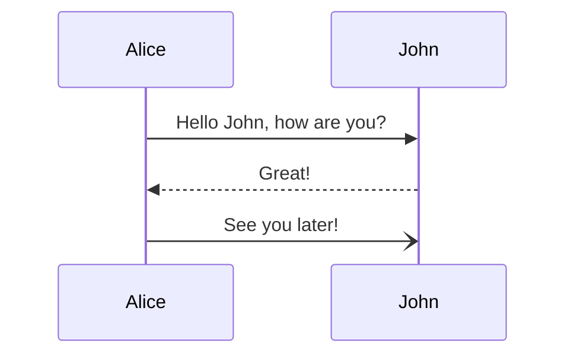

## Синтаксис

### Участники: participant и actor

Участники рендерятся в порядке появления в исходнике. Объявляй их явно через `participant`, если нужен другой порядок, чем порядок первых сообщений.

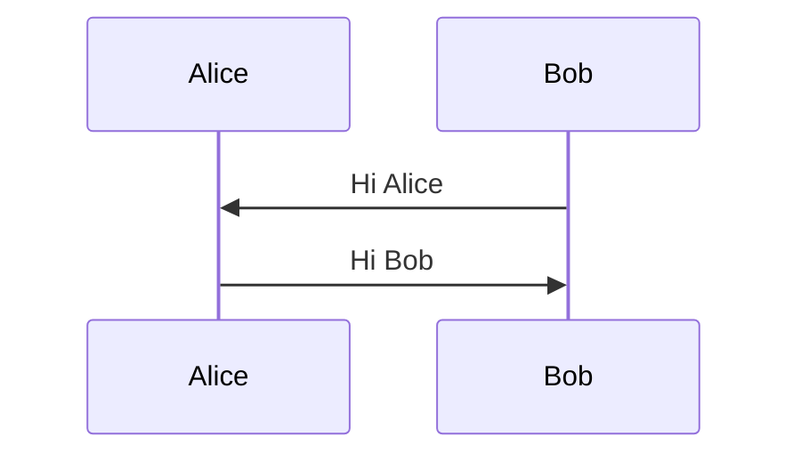

`actor` вместо прямоугольника рисует фигурку человечка.

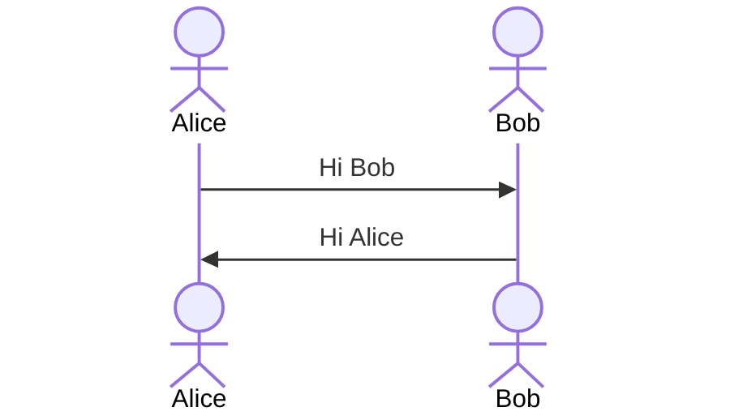

### Стереотипы участников (типы)

Тип задаётся JSON-конфигом после идентификатора: `participant Id@{ "type": "<тип>" }`. Доступны `boundary`, `control`, `entity`, `database`, `collections`, `queue`.

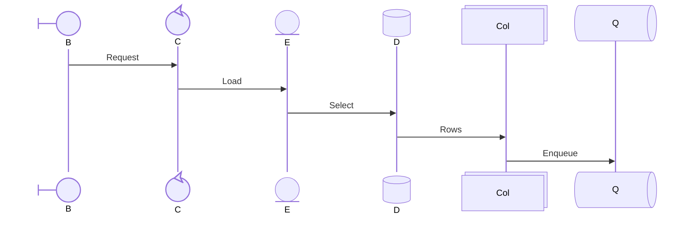

### Псевдонимы

Внешний синтаксис — ключевое слово `as` после объявления: короткий id для стрелок, читаемая подпись на схеме.

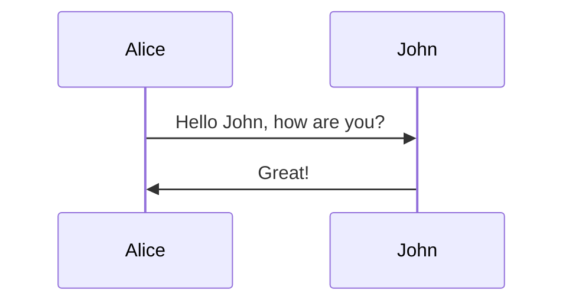

`as` комбинируется со стереотипом:

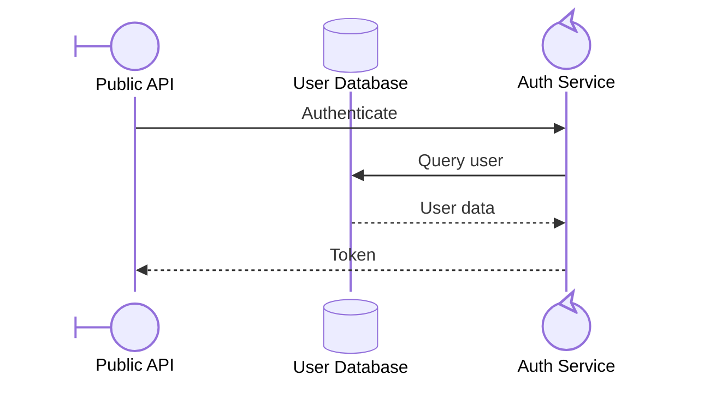

Альтернатива — инлайновое поле `"alias"` внутри конфига (работает и для `participant`, и для `actor`):

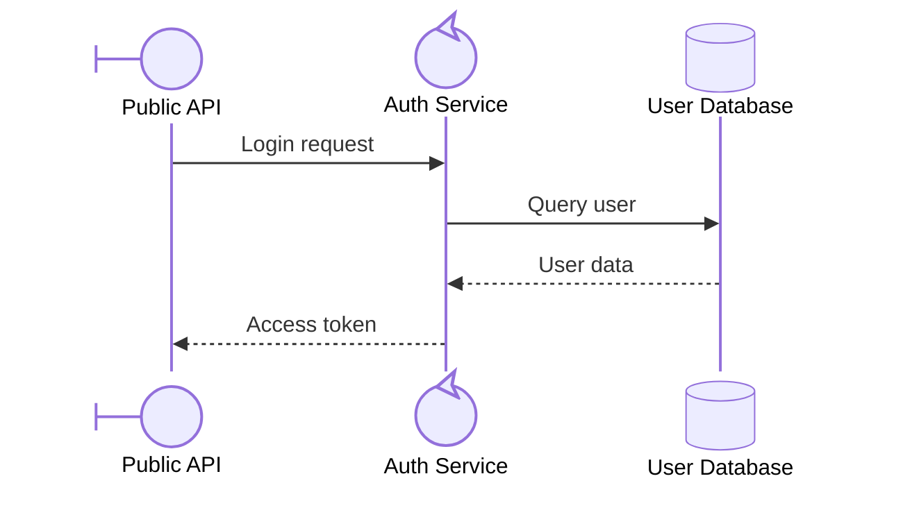

Если заданы оба, **внешний `as` побеждает** — ниже отобразятся «External Name» и «External DB».

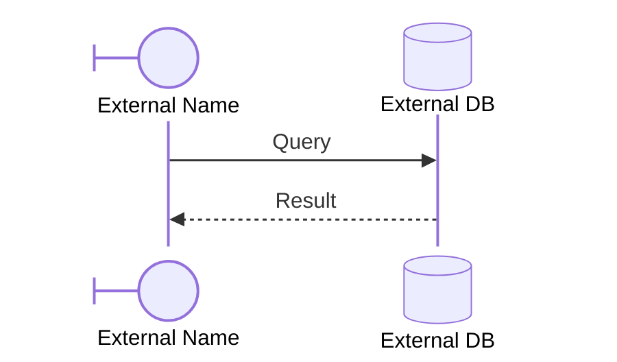

### Создание и уничтожение участников (v10.3.0+)

Директива `create participant|actor <id> [as <label>]` ставится **перед** сообщением, которое создаёт участника; `destroy <id>` — перед сообщением, которое его уничтожает. Создавать можно только получателя сообщения; уничтожать — и отправителя, и получателя.

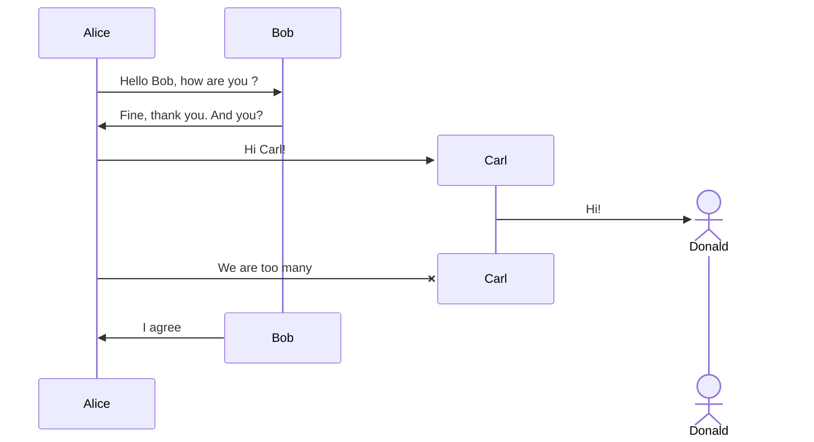

Ошибка «The destroyed participant … does not have an associated destroying message after its declaration», которая не лечится правкой кода и воспроизводится на любых диаграммах, означает слишком старую версию mermaid — нужен v10.7.0+.

### Группировка: box

Участников можно объединять в вертикальные блоки. Синтаксис: `box [цвет] [описание]` … `end`. Цвет — **до** описания; без цвета блок прозрачный. Поддерживаются `rgb()`, `rgba()`, `hsl()`, `hsla()` и именованные цвета.

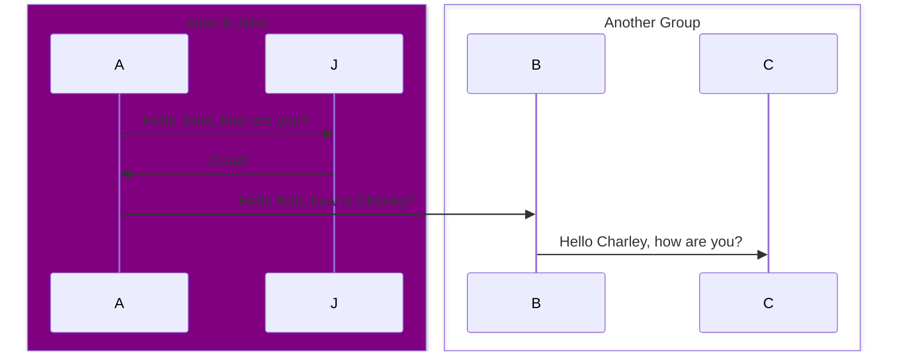

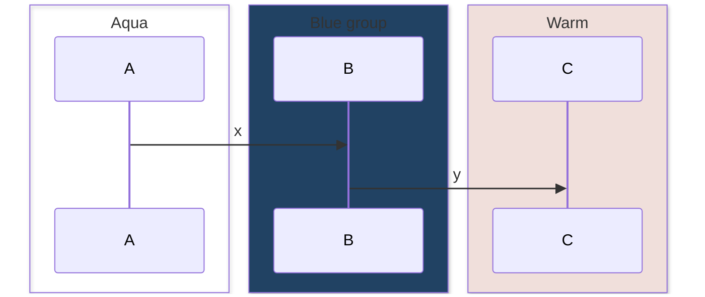

`box transparent Aqua` — способ заставить название-цвет («Aqua») читаться как описание, а не как заливку.

### Сообщения и типы стрелок

Общая форма: `[Actor][Arrow][Actor]:Message text`.

| Тип | Описание |
|---|---|
| `->` | Сплошная линия без стрелки |
| `-->` | Пунктирная линия без стрелки |
| `->>` | Сплошная линия со стрелкой |
| `-->>` | Пунктирная линия со стрелкой |
| `<<->>` | Сплошная линия с двунаправленными стрелками (v11.0.0+) |
| `<<-->>` | Пунктирная линия с двунаправленными стрелками (v11.0.0+) |
| `-x` | Сплошная линия с крестиком на конце |
| `--x` | Пунктирная линия с крестиком на конце |
| `-)` | Сплошная линия с открытой стрелкой (асинхронный вызов) |
| `--)` | Пунктирная линия с открытой стрелкой (асинхронный вызов) |

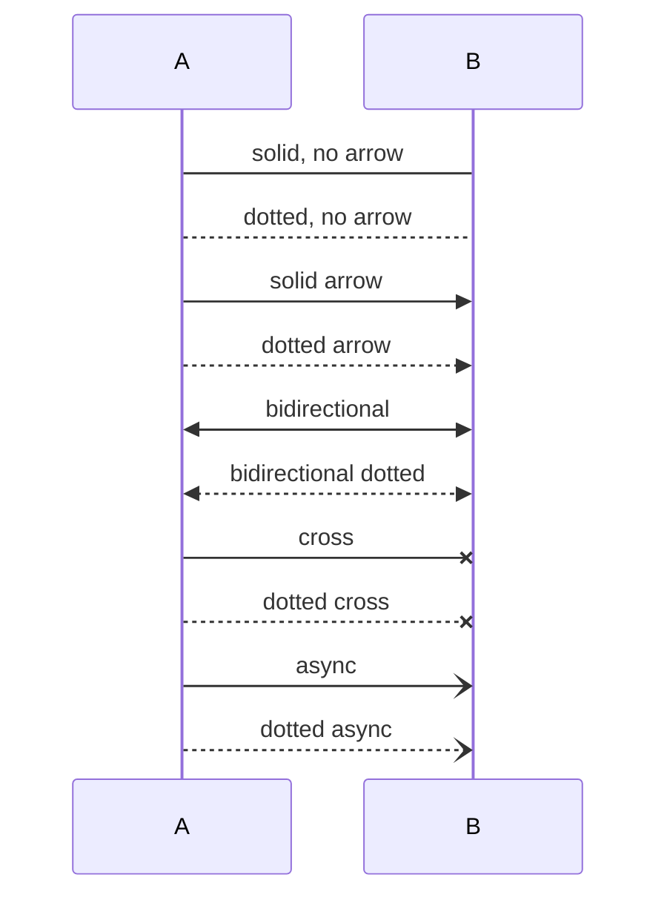

### Полустрелки (v11.12.3+)

Половинчатые наконечники. Пунктирный вариант получается удвоением дефиса (`-` → `--`).

| Тип | Описание |
|---|---|
| `-\|\` / `--\|\` | Верхняя половина наконечника |
| `-\|/` / `--\|/` | Нижняя половина наконечника |
| `/\|-` / `/\|--` | Обратная (наконечник у отправителя), верхняя половина |
| `\\-` / `\\--` | Обратная, нижняя половина |
| `-\\` / `--\\` | Верхняя половина «палочкой» (stick) |
| `-//` / `--//` | Нижняя половина «палочкой» |
| `//-` / `//--` | Обратная верхняя «палочкой» |

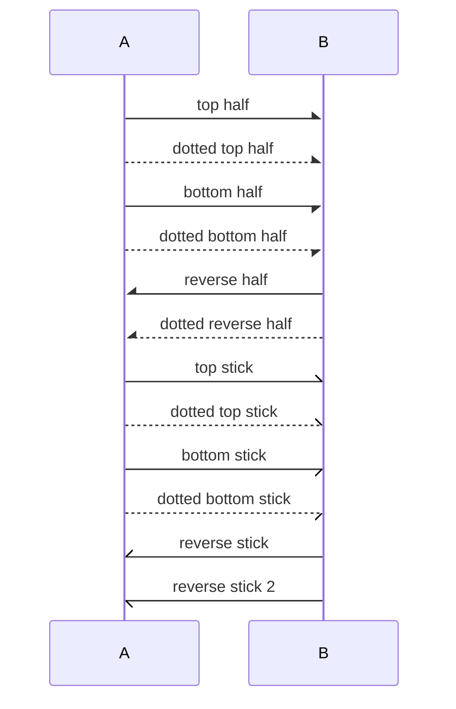

Дополнительно рендером подтверждены `\|-` и `\|--` (обратная полустрелка, зеркальная к `/|-`); в таблице официальной документации строка `\\-` продублирована дважды с разными описаниями — это опечатка документации.

### Центральные соединения (v11.12.3+)

`()` перед или после стрелки означает подключение к центральной точке линии жизни, а не напрямую к участнику.

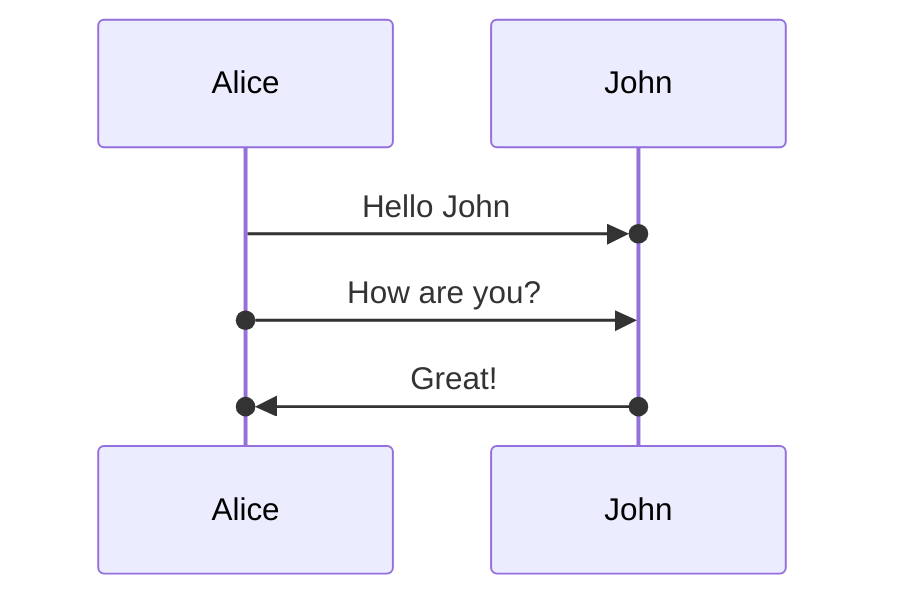

### Активации

Явные `activate <actor>` / `deactivate <actor>`:

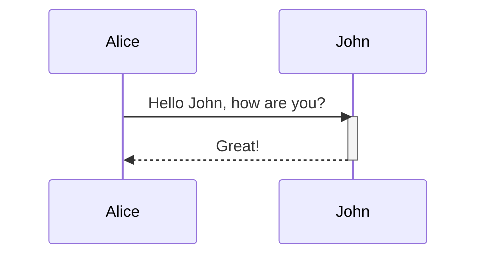

Сокращение — суффиксы `+`/`-` у стрелки; активации одного участника можно вкладывать друг в друга:

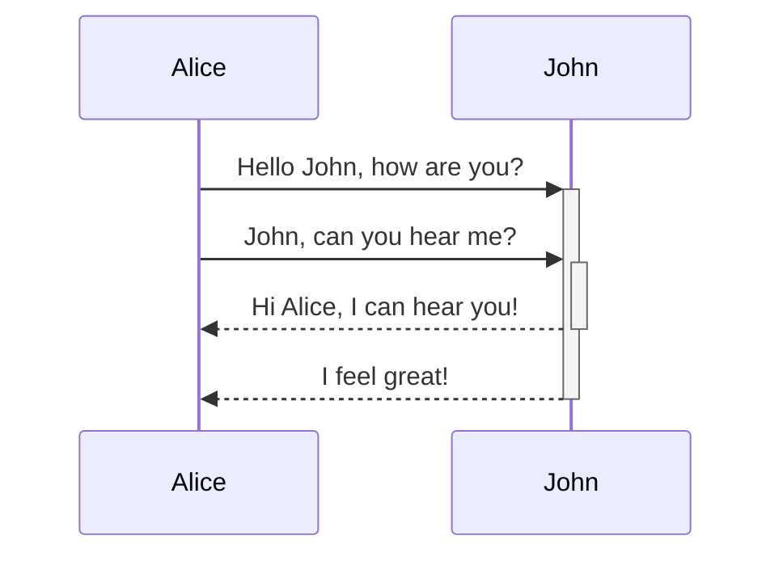

### Заметки

`Note [right of | left of | over] <Actor>: текст`. Через `over A,B` заметка растягивается на двух участников.

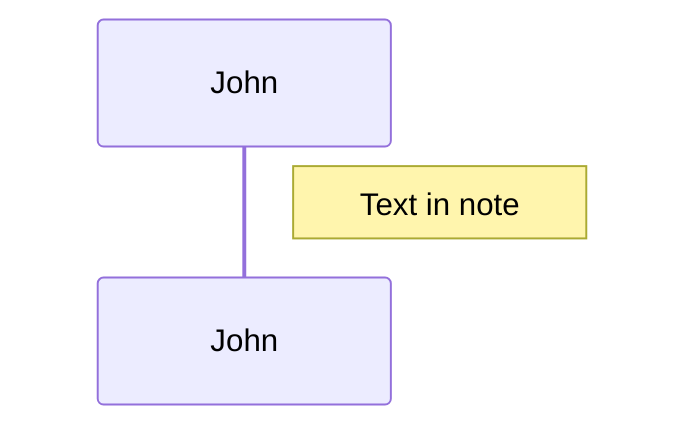

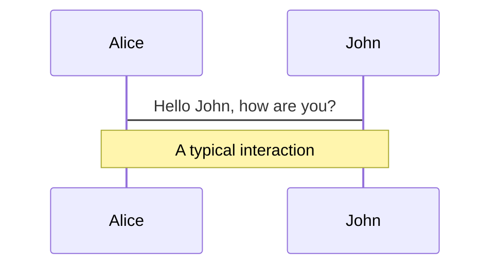

### Переносы строк

`<br/>` работает в тексте сообщений и заметок. Для переноса в имени участника нужен псевдоним.

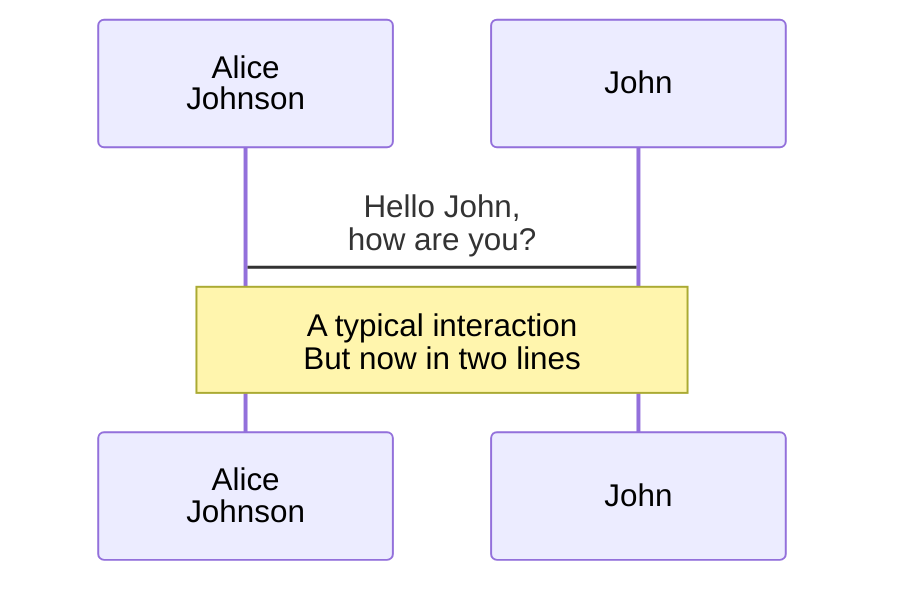

### Циклы: loop

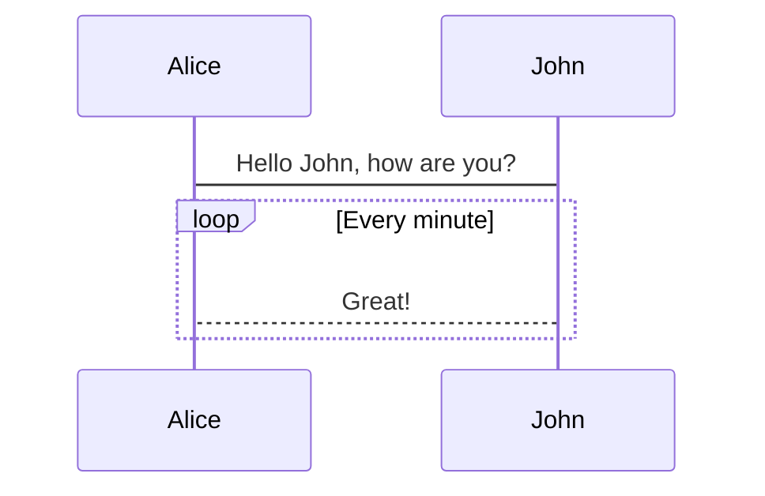

### Ветвления: alt / else / opt

`alt <текст>` … `else <текст>` … `end` — альтернативные пути; `opt <текст>` … `end` — необязательный блок (if без else).

```mermaid
sequenceDiagram
    Alice->>Bob: Hello Bob, how are you?
    alt is sick
        Bob->>Alice: Not so good :(
    else is well
        Bob->>Alice: Feeling fresh like a daisy
    end
    opt Extra response
        Bob->>Alice: Thanks for asking
    end
```

### Параллельность: par / and

```mermaid
sequenceDiagram
    par Alice to Bob
        Alice->>Bob: Hello guys!
    and Alice to John
        Alice->>John: Hello guys!
    end
    Bob-->>Alice: Hi Alice!
    John-->>Alice: Hi Alice!
```

Блоки `par` вкладываются:

```mermaid
sequenceDiagram
    par Alice to Bob
        Alice->>Bob: Go help John
    and Alice to John
        Alice->>John: I want this done today
        par John to Charlie
            John->>Charlie: Can we do this today?
        and John to Diana
            John->>Diana: Can you help us today?
        end
    end
```

### Критическая секция: critical / option

Действие, которое обязано выполниться, плюс обработка обстоятельств.

```mermaid
sequenceDiagram
    critical Establish a connection to the DB
        Service-->DB: connect
    option Network timeout
        Service-->Service: Log error
    option Credentials rejected
        Service-->Service: Log different error
    end
```

`option` можно не указывать вовсе; `critical` вкладывается так же, как `par`.

```mermaid
sequenceDiagram
    critical Establish a connection to the DB
        Service-->DB: connect
    end
```

### Прерывание: break

Останов последовательности внутри потока — обычно моделирует исключение.

```mermaid
sequenceDiagram
    Consumer-->API: Book something
    API-->BookingService: Start booking process
    break when the booking process fails
        API-->Consumer: show failure
    end
    API-->BillingService: Start billing process
```

### Подсветка фона: rect

`rect <цвет>` … `end`, цвета задаются через `rgb()` / `rgba()`. Блоки вкладываются.

```mermaid
sequenceDiagram
    participant Alice
    participant John

    rect rgb(191, 223, 255)
    note right of Alice: Alice calls John.
    Alice->>+John: Hello John, how are you?
    rect rgba(0, 0, 255, .1)
    Alice->>+John: John, can you hear me?
    John-->>-Alice: Hi Alice, I can hear you!
    end
    John-->>-Alice: I feel great!
    end
    Alice ->>+ John: Did you want to go to the game tonight?
    John -->>- Alice: Yeah! See you there.
```

### Комментарии

Строка целиком, начинается с `%%`. Всё до конца строки игнорируется парсером, включая синтаксис диаграммы.

```mermaid
sequenceDiagram
    Alice->>John: Hello John, how are you?
    %% this is a comment
    John-->>Alice: Great!
```

### Экранирование через entity-коды

`#<число>;` (десятичное) или `#<имя>;` — HTML-имена сущностей поддерживаются. `#` кодируется как `#35;`. Точка с запятой в тексте сообщения обязана быть `#59;`, иначе она разберётся как перенос строки.

```mermaid
sequenceDiagram
    A->>B: I #9829; you!
    B->>A: I #9829; you #infin; times more!
    Note over A,B: semicolon #59; inside text
```

### Нумерация сообщений: autonumber

```mermaid
sequenceDiagram
    autonumber
    Alice->>John: Hello John, how are you?
    loop HealthCheck
        John->>John: Fight against hypochondria
    end
    Note right of John: Rational thoughts!
    John-->>Alice: Great!
    John->>Bob: How about you?
    Bob-->>John: Jolly good!
```

Стартовое значение и шаг (v11.15.0+): `autonumber <start> <increment>`. Оба значения допускают дробную часть до сотых.

```mermaid
sequenceDiagram
    autonumber 10 5
    Alice->>Bob: one
    Bob->>Alice: two
    Bob->>Alice: three
```

Эквивалент через конфиг — `sequence.showSequenceNumbers: true`.

### Ссылки и меню участников

`link <actor>: <label> @ <url>` — по строке на пункт всплывающего меню.

```mermaid
sequenceDiagram
    participant Alice
    participant John
    link Alice: Dashboard @ https://dashboard.contoso.com/alice
    link Alice: Wiki @ https://wiki.contoso.com/alice
    link John: Dashboard @ https://dashboard.contoso.com/john
    Alice->>John: Hello John, how are you?
    John-->>Alice: Great!
```

Расширенная форма — `links <actor>: <JSON с парами имя–url>`:

```mermaid
sequenceDiagram
    participant Alice
    participant John
    links Alice: {"Dashboard": "https://dashboard.contoso.com/alice", "Wiki": "https://wiki.contoso.com/alice"}
    links John: {"Dashboard": "https://dashboard.contoso.com/john", "Wiki": "https://wiki.contoso.com/john"}
    Alice->>John: Hello John, how are you?
    John-->>Alice: Great!
```

### Конфигурация

Параметры живут в секции `sequence` — во frontmatter диаграммы или в `%%{init}%%`.

```mermaid
---
config:
  sequence:
    mirrorActors: true
    showSequenceNumbers: true
    diagramMarginX: 50
    diagramMarginY: 10
    messageMargin: 35
    noteMargin: 10
    boxTextMargin: 5
    actorFontSize: 14
    messageFontSize: 16
    noteAlign: center
---
sequenceDiagram
    Alice->>Bob: Hello Bob
    Bob-->>Alice: Hello Alice
```

| Параметр | Описание | По умолчанию |
|---|---|---|
| `mirrorActors` | Рисовать участников и снизу диаграммы тоже | `false` |
| `bottomMarginAdj` | Подгонка нижней границы графа (широкие рамки могут обрезаться) | `1` |
| `diagramMarginX` / `diagramMarginY` | Внешние поля диаграммы | `50` / `10` |
| `boxTextMargin` | Отступ текста в блоке | `5` |
| `noteMargin` | Отступ заметки | `10` |
| `messageMargin` | Отступ между сообщениями | `35` |
| `actorFontSize` | Размер шрифта подписи участника | `14` |
| `actorFontFamily` | Шрифт подписи участника | `"Open Sans", sans-serif` |
| `actorFontWeight` | Начертание подписи участника | — |
| `noteFontSize` | Размер шрифта заметок | `14` |
| `noteFontFamily` | Шрифт заметок | `"trebuchet ms", verdana, arial` |
| `noteFontWeight` | Начертание заметок | — |
| `noteAlign` | Выравнивание текста заметок | `center` |
| `messageFontSize` | Размер шрифта сообщений | `16` |
| `messageFontFamily` | Шрифт сообщений | `"trebuchet ms", verdana, arial` |
| `messageFontWeight` | Начертание сообщений | — |
| `showSequenceNumbers` | Нумерация стрелок (аналог `autonumber`) | `false` |

### Стилизация

Оформление задаётся CSS-классами темы (`src/themes/sequence.scss`). Переопределять их — через `themeCSS`/тему, см. `theming.md`.

| Класс | Что оформляет |
|---|---|
| `actor` | Прямоугольник участника |
| `actor-top` / `actor-bottom` | Фигура/бокс участника сверху / снизу диаграммы |
| `text.actor` | Текст всех участников |
| `text.actor-box` / `text.actor-man` | Текст в боксе / у фигурки человечка |
| `actor-line` | Вертикальная линия жизни |
| `messageLine0` / `messageLine1` | Сплошная / пунктирная линия сообщения |
| `messageText` | Текст на стрелках |
| `labelBox` / `labelText` | Бокс и текст метки слева в блоке `loop` |
| `loopText` / `loopLine` | Текст и линии блока `loop` |
| `note` / `noteText` | Бокс и текст заметки |

### Accessibility

`accTitle` и `accDescr` добавляют доступное имя и описание в SVG. Многострочное описание — в фигурных скобках. Проверено рендером.

```mermaid
sequenceDiagram
    accTitle: Схема авторизации пользователя
    accDescr: Клиент отправляет учётные данные, сервис проверяет их в базе и возвращает токен
    Client->>Auth: POST /login
    Auth->>DB: SELECT user
    DB-->>Auth: user row
    Auth-->>Client: token
```

```mermaid
sequenceDiagram
    accTitle: Схема авторизации
    accDescr {
      Клиент отправляет учётные данные.
      Сервис проверяет их в базе и возвращает токен.
    }
    Client->>Auth: POST /login
    Auth-->>Client: token
```

## Альтернатива: zenuml

`zenuml` — второй, code-style рендерер сиквенса с синтаксисом, похожим на код. Полезен, когда диаграмма описывает вызовы методов с вложенностью. Синтаксис несовместим с `sequenceDiagram`. Рендерится mermaid-cli 11.16.0 (проверено).

```mermaid
zenuml
    title Demo
    Alice->John: Hello John, how are you?
    John->Alice: Great!
    Alice->John: See you later!
```

**Участники** объявляются необязательно — просто именем на отдельной строке (порядок = порядок появления). Аннотатор `@Actor`, `@Database` и т. п. перед именем даёт символ вместо прямоугольника. Псевдоним — `A as Alice`.

```mermaid
zenuml
    title Participants
    @Actor Alice
    @Database Bob
    C as Charlie
    Alice->Bob: Hi Bob
    Bob->Charlie: Hi Charlie
```

**Сообщения** бывают четырёх видов: синхронные (`A.method()`), асинхронные (`A->B: text`), создающие (`new A`) и ответные.

```mermaid
zenuml
    title Messages
    A.SyncMessage
    A.SyncMessage(with, parameters) {
      B.nestedSyncMessage()
    }
    Alice->Bob: async message
    new A1
    new A2(with, parameters)
```

**Ответ** выражается тремя способами: присваиванием переменной (опционально с типом), ключевым словом `return` внутри блока и аннотатором `@return` / `@reply` над асинхронным сообщением (нужен, чтобы вернуть на уровень выше).

```mermaid
zenuml
    a = A.SyncMessage()
    SomeType b = A.SyncMessage()
    A.SyncMessage() {
      return result
    }
    @return
    A->B: result
```

**Вложенность** — синхронные и создающие сообщения вкладываются через `{}`. **Комментарии** — `// текст`, рендерятся над сообщением или фрагментом (поддерживают Markdown); комментарий к участнику игнорируется.

```mermaid
zenuml
    // a comment on a message.
    // **Markdown** is supported.
    A.method() {
      B.nested_sync_method()
      B->C: nested async message
    }
```

**Фрагменты**: циклы — `while(...)`, `for(...)`, `forEach(...)`/`foreach(...)`, `loop(...)`; ветвление — `if(...) { } else if(...) { } else { }`; `opt { }`; `par { }`; исключения — `try { } catch { } finally { }` (аналог `break`).

```mermaid
zenuml
    Alice->John: Hello John, how are you?
    while(true) {
      John->Alice: Great!
    }
    if(is_sick) {
      Bob->Alice: Not so good :(
    } else {
      Bob->Alice: Feeling fresh like a daisy
    }
    opt {
      Bob->Alice: Thanks for asking
    }
    par {
        Alice->Bob: Hello guys!
        Alice->John: Hello guys!
    }
    try {
      Consumer->API: Book something
    } catch {
      API->Consumer: show failure
    } finally {
      API->BookingService: rollback status
    }
```

## Ловушки

**sequenceDiagram**

- **Слово `end` в подписях и именах опасно** — парсер может принять его за закрытие блока. Заключай в `()`, `""`, `{}` или `[]`: `(end)`, `[end]`, `{end}`.
- **Hex-цвета в `box` не работают**: `#` начинает комментарий. `box #ff0000 Red group` рендерится **без ошибки**, но и без заливки и без подписи «Red group» (проверено рендером). Используй `rgb()`, `rgba()`, `hsl()`, `hsla()` или именованные цвета.
- **В `box` цвет идёт строго перед описанием.** Если описание само является названием цвета, ставь `box transparent Aqua`.
- **Точка с запятой в тексте = перенос строки.** Внутри сообщения пиши `#59;`.
- **`create` работает только для получателя сообщения**, `destroy` — для отправителя или получателя; директива обязана стоять непосредственно перед соответствующим сообщением.
- **Комментарий `%%` должен занимать строку целиком.** Хвостовой `%%` ошибки не вызывает, но молча становится частью подписи: `Alice->>John: hi %% comment` рисует текст «hi %% comment» (проверено рендером).
- **`+`/`-` у стрелки и `activate`/`deactivate` должны балансироваться**: лишняя активация оставляет незакрытый прямоугольник, лишняя деактивация ломает рендер.
- **Перенос строки в имени участника требует псевдонима** — `<br/>` работает только в подписи после `as` (или в `"alias"`).
- **`Note over A,B` перечисляет участников через запятую** (пробелы вокруг запятой допустимы) и работает только с уже существующими участниками; `Note` без `right of`/`left of`/`over` не разбирается.
- **Стереотип задаётся строго JSON-объектом** `@{ "type": "database" }` — ключи и значения в двойных кавычках.
- **`autonumber <start> <increment>` доступен с v11.15.0**, полустрелки и центральные соединения `()` — с v11.12.3, двунаправленные `<<->>` — с v11.0.0, `create`/`destroy` — с v10.3.0.

**zenuml**

- **Комментарий — `//`, а не `%%`.** Синтаксис `sequenceDiagram` тут не действует.
- **`end` не используется** — блоки закрываются `}`.
- **Ключевые слова `sequenceDiagram` (`Note`, `autonumber`, `box`, `activate`) в zenuml не ключевые** — ошибки не будет, они молча превратятся в участников и сообщения (проверено рендером).
- **Доступен не во всех вьюерах**: zenuml подключается как внешняя диаграмма через `registerExternalDiagrams`.

## Источник

Дистиллировано из официальной документации mermaid-js/mermaid (docs/syntax), проверено рендером на mermaid-cli 11.16.0 / mermaid 11.16.1.
