# State diagram

Поведение системы, представимой конечным числом состояний: сами состояния и переходы между ними (жизненный цикл заказа, статусы задачи, конечный автомат протокола). НЕ применять для обмена сообщениями между участниками (`sequenceDiagram`), для потока обработки/ветвлений алгоритма (`flowchart`) и для статической структуры классов (`classDiagram`).

## Минимальный скелет

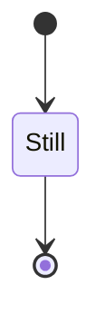

## Синтаксис

### Заголовок диаграммы

`stateDiagram-v2` — актуальный рендерер, использовать по умолчанию. `stateDiagram` — старый рендерер, синтаксис тот же, отличается раскладка.

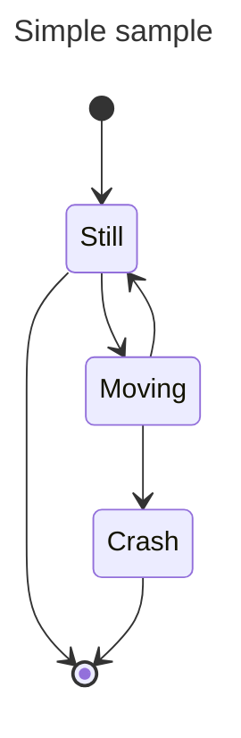

### Состояния

Три способа объявления. Простейший — только идентификатор:

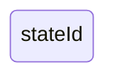

Через `state ... as ...` с описанием:

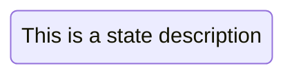

Через идентификатор, двоеточие и описание:


### Переходы

Переход — ребро `-->`. Если состояние ещё не объявлено, оно создаётся из идентификатора в переходе; описание можно добавить позже.

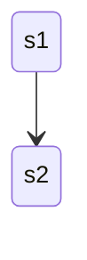

Подпись перехода — после двоеточия:

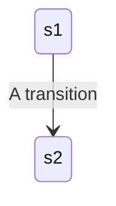

### Начало и конец

`[*]` — специальное состояние; направление перехода определяет, старт это или финиш.

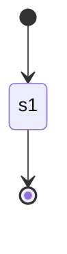

### Составные состояния (composite)

Ключевое слово `state`, идентификатор и тело в `{}`. Имя составного состояния задаётся отдельной строкой так же, как у простого.

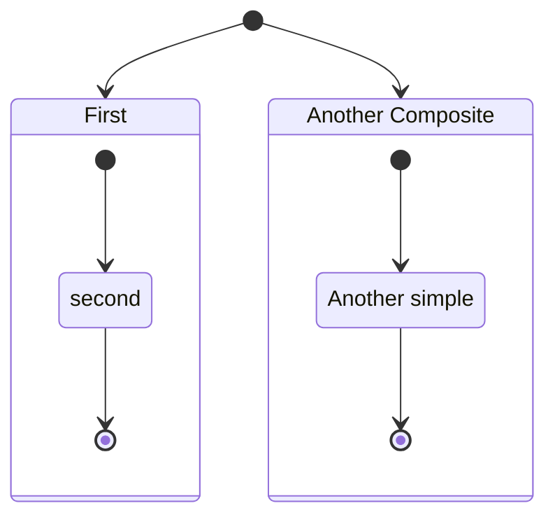

Вложенность произвольной глубины:

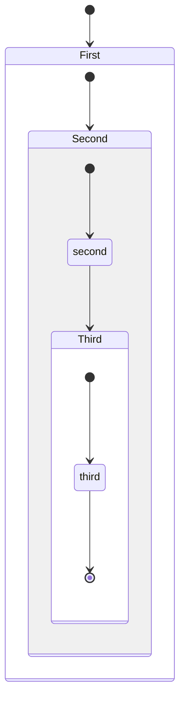

Переходы между самими составными состояниями допустимы:

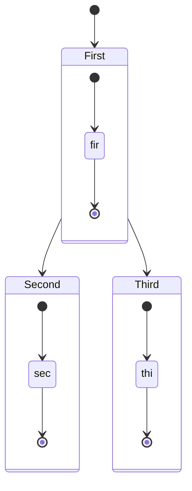

Переходы между внутренними состояниями, принадлежащими **разным** составным состояниям, определить нельзя.

### Выбор (choice)

Псевдосостояние `<<choice>>` моделирует развилку на два и более пути; условия пишутся подписями исходящих переходов.

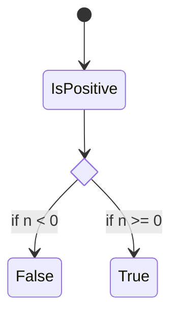

### Fork и join

Параллельное ветвление и слияние — псевдосостояния `<<fork>>` и `<<join>>`.

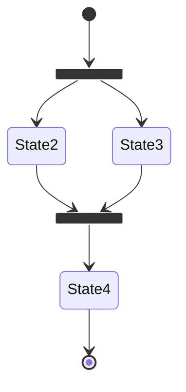

### Заметки

Заметка ставится справа или слева от узла: `note right of <state>` / `note left of <state>`. Многострочная форма закрывается `end note`; однострочная пишется через двоеточие.

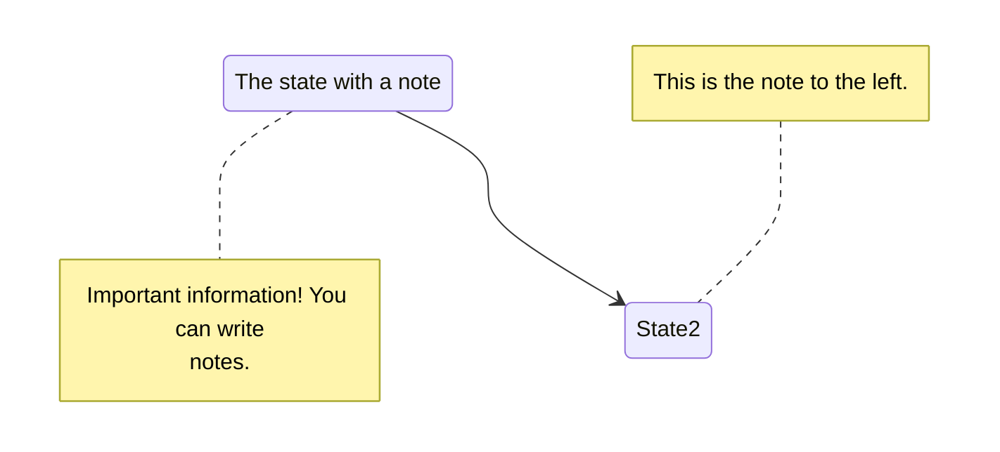

### Параллельность (concurrency)

Внутри составного состояния регионы разделяются символом `--` на отдельной строке (как в PlantUML). Каждый регион имеет собственный `[*]` и работает параллельно остальным.

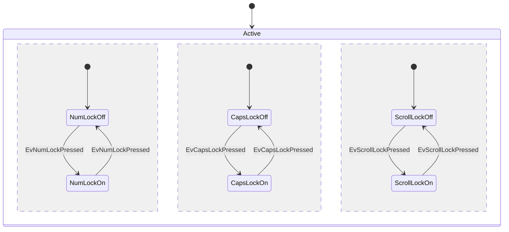

### Направление

`direction TB | BT | LR | RL`. Указывается на верхнем уровне и, независимо, внутри составного состояния.

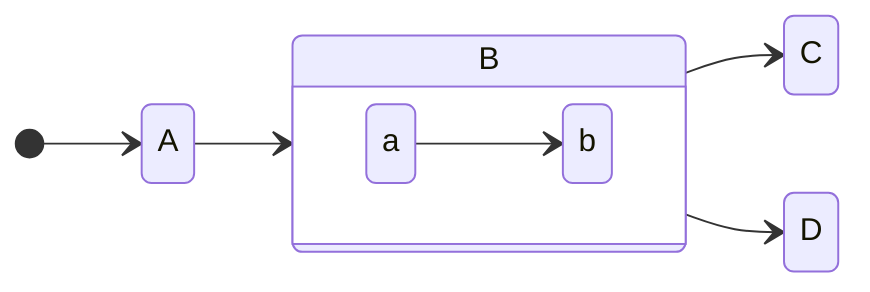

### Пробелы в именах состояний

Идентификатор не может содержать пробелы — объявите состояние с коротким id и описанием, а дальше ссылайтесь на id.

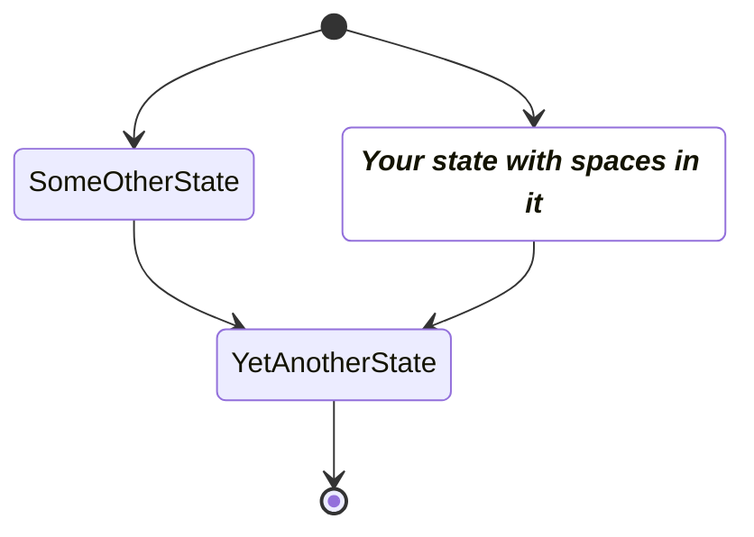

### Комментарии

Начинаются с `%%`; текст до конца строки игнорируется, включая любой синтаксис диаграммы. Допустимы как на отдельной строке, так и в конце инструкции.

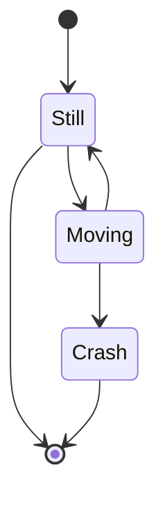

### Стилизация: classDef

`classDef <имя> <свойство>:<значение>[,<свойство>:<значение>...]` — свойства это валидные CSS-свойства.

```txt
classDef movement font-style:italic;
classDef badBadEvent fill:#f00,color:white,font-weight:bold,stroke-width:2px,stroke:yellow
```

Текущие ограничения classDef в state-диаграммах:

1. Нельзя применять к состояниям начала/конца (`[*]`) через `class`.
2. Нельзя применять к составным состояниям и внутри них.

**Способ 1 — инструкция `class`.** Форма: `class <состояния через запятую> <имя стиля>`. К одному состоянию можно применить несколько classDef.

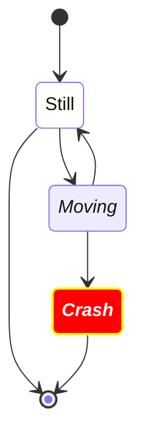

**Способ 2 — оператор `:::`.** Форма: `[state]:::[имя стиля]` прямо в инструкции перехода. В отличие от `class`, работает и на состояниях, участвующих в переходах со стартом/финишем.


### Accessibility

`accTitle:` — доступный заголовок, `accDescr:` — доступное описание; многострочное описание оформляется блоком `accDescr { ... }`.

```mermaid
stateDiagram-v2
    accTitle: Order lifecycle
    accDescr {
        An order starts as New, is Paid, then Shipped,
        and finally reaches the terminal state.
    }
    [*] --> New
    New --> Paid
    Paid --> Shipped
    Shipped --> [*]
```

### Конфигурация и тема

Задаются frontmatter-блоком перед `stateDiagram-v2`; полный список параметров — `config.md`, палитра переменных — `theming.md`.

```mermaid
---
config:
  theme: forest
---
stateDiagram-v2
    [*] --> Idle
    Idle --> Working
    Working --> [*]
```

## Ловушки

- **Пробелы в идентификаторе состояния запрещены.** `[*] --> My State` не соберётся так, как ожидается: объявляйте `s1 : My State` и ссылайтесь на `s1`.
- **Нет переходов между внутренностями разных composite-состояний** — только между самими составными состояниями.
- **`classDef` не применяется к `[*]` через `class`** и не работает для составных состояний и их содержимого; для стартового/финишного узла используйте `:::` в инструкции перехода.
- **`class` требует именно имени состояния, а не описания**: `class Still notMoving`, где `Still` — id.
- **`--` внутри `{}` — разделитель параллельных регионов**, а не переход; вне составного состояния он смысла не имеет.
- **`<<choice>>`, `<<fork>>`, `<<join>>` объявляются через `state <id> <<...>>` до использования** — иначе узел отрисуется обычным состоянием.
- **Подпись перехода отделяется двоеточием** (`s1 --> s2: text`); текст без двоеточия будет разобран как продолжение идентификатора.
- **`stateDiagram` (v1) и `stateDiagram-v2` — разные рендереры**: у v1 иная раскладка и хуже поддержка вложенности; при сомнениях берите `-v2`.

## Источник

Дистиллировано из официальной документации mermaid-js/mermaid (docs/syntax), проверено рендером на mermaid-cli 11.16.0 / mermaid 11.16.1.
