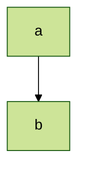
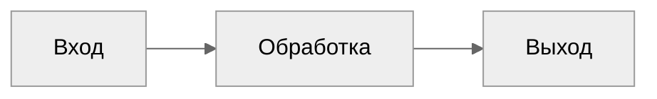
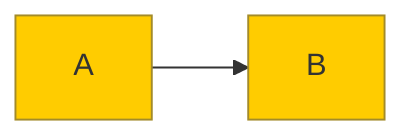
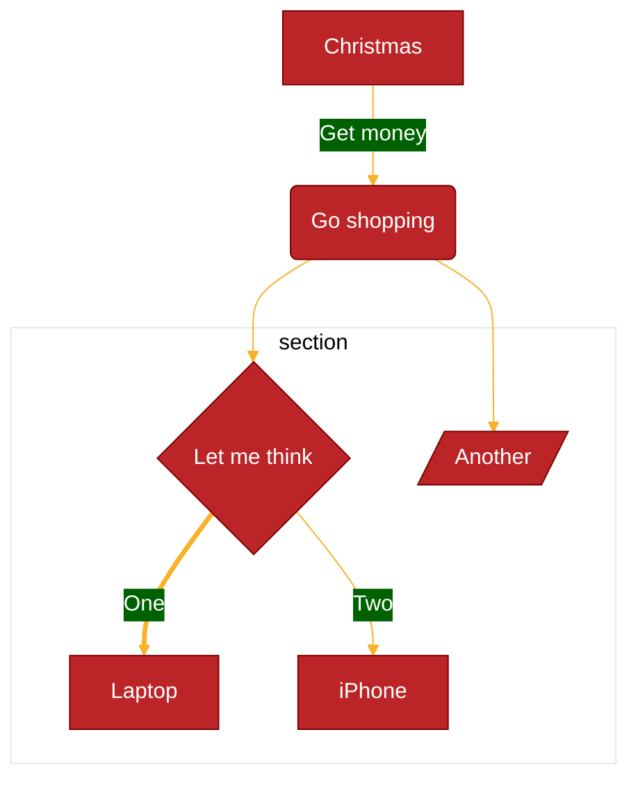
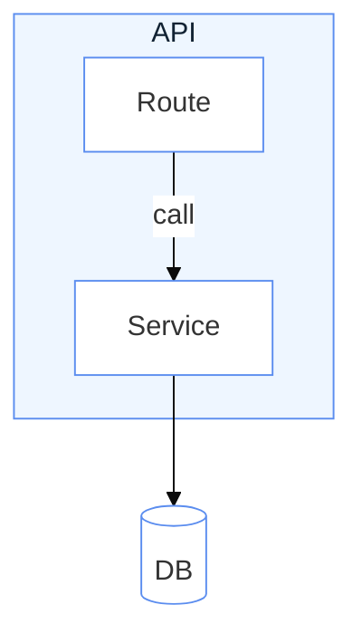
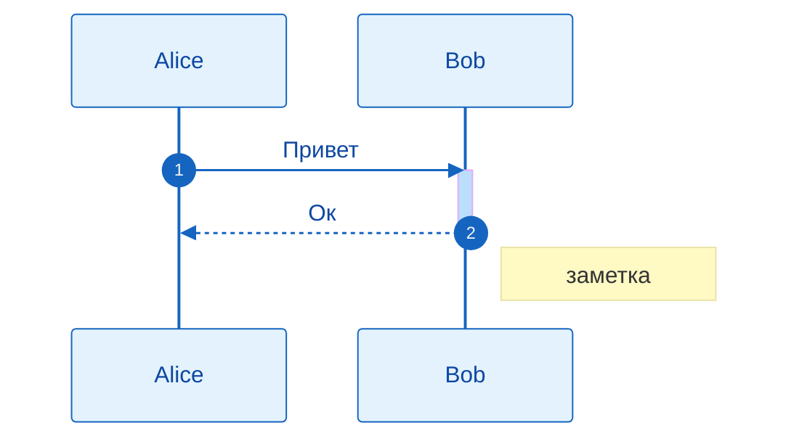
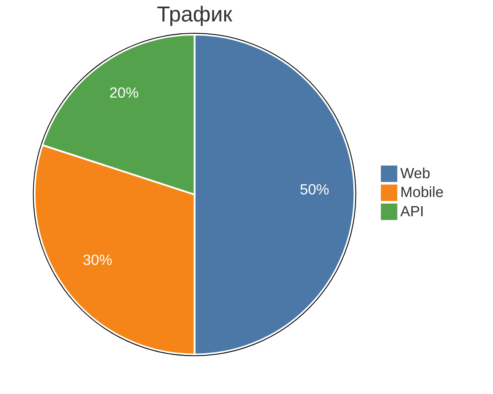
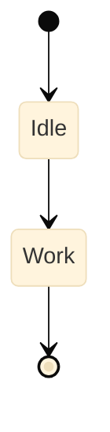
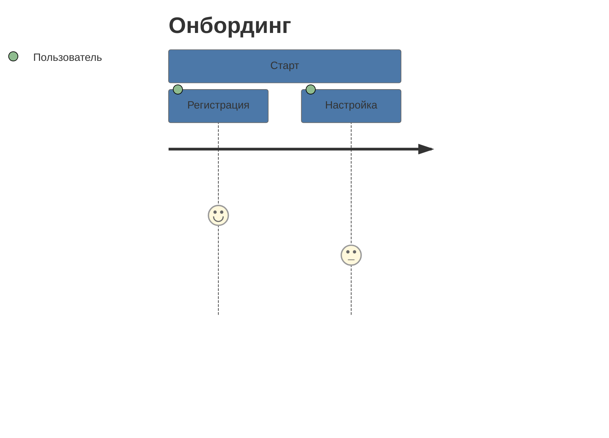
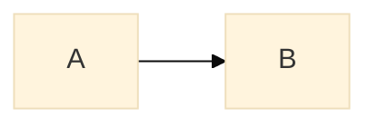

# Темы и themeVariables

Применять, когда диаграмма должна лечь в бренд, в тёмную страницу или в чёрно-белую печать. НЕ применять для смысловой подсветки отдельных узлов — для этого есть `classDef`/`style` внутри самой диаграммы: они точнее и не ломаются при смене темы.

## Минимальный скелет

## Синтаксис

### Встроенные темы

В официальной документации описаны пять:

| Тема | Для чего |
|---|---|
| `default` | тема по умолчанию для всех диаграмм |
| `neutral` | чёрно-белые документы, печать |
| `dark` | тёмные страницы и dark-mode. Дополнительно ставят `darkMode: true`, чтобы производные цвета считались под тёмный фон |
| `forest` | оттенки зелёного |
| `base` | **единственная изменяемая** тема; берётся за основу кастомизации |

В mermaid 11.16.1 набор шире — движок принимает также `neo`, `neo-dark`, `redux`, `redux-dark`, `redux-color`, `redux-dark-color` и `null`. Все проверены рендером и дают разный SVG; исключение — `redux-dark` и `redux-dark-color`, которые на flowchart в 11.16.1 отрисовываются идентично. Кастомизировать через `themeVariables` по-прежнему можно только `base`.

### Где задавать тему

- **Для одной диаграммы** — frontmatter `config: { theme: ... }`. Основной способ.
- **Для всего сайта** — вызов `mermaid.initialize({ theme: 'base' })` интегратором.
- **Легаси** — директива `%%{init: { "theme": "forest" } }%%` (перекрывает frontmatter).

### themeVariables

`themeVariables` — объект точечных переопределений поверх темы `base`. Ходовые переменные:

| Переменная | Дефолт | Что красит |
|---|---|---|
| `primaryColor` | `#fff4dd` | фон узлов; от него выводится большинство остальных цветов |
| `primaryTextColor` | из `darkMode`: `#ddd` / `#333` | текст в узлах на `primaryColor` |
| `primaryBorderColor` | вычисляется из `primaryColor` | рамка узлов |
| `secondaryColor` | вычисляется из `primaryColor` | второй по частоте фон (активации, вторые секции) |
| `tertiaryColor` | вычисляется из `primaryColor` | третий фон; из него по умолчанию берётся фон подграфов |
| `lineColor` | вычисляется из `background` | линии и стрелки |
| `background` | `#f4f4f4` | опорный фон, от которого считаются контрастные цвета |
| `mainBkg` | вычисляется из `primaryColor` | фон фигур: прямоугольники/круги flowchart, классы, актёры |
| `nodeBorder` | `primaryBorderColor` | рамка узла flowchart |
| `nodeTextColor` | `primaryTextColor` | текст внутри узла |
| `clusterBkg` | `tertiaryColor` | фон подграфа (`subgraph`) |
| `clusterBorder` | `tertiaryBorderColor` | рамка подграфа |
| `titleColor` | `tertiaryTextColor` | заголовки |
| `edgeLabelBackground` | вычисляется из `secondaryColor` | подложка подписи на стрелке |
| `textColor` | вычисляется из `primaryTextColor` | текст поверх фона: подписи, сигналы sequence, заголовок Gantt |
| `defaultLinkColor` | `lineColor` | цвет связей |
| `noteBkgColor` / `noteTextColor` / `noteBorderColor` | `#fff5ad` / `#333` / вычисляется | заметки |
| `fontFamily` | `trebuchet ms, verdana, arial` | шрифт текста диаграммы |
| `fontSize` | `16px` | размер шрифта |
| `darkMode` | `false` | переключает формулы вывода производных цветов на тёмный фон |
| `errorBkgColor` / `errorTextColor` | `tertiaryColor` / `tertiaryTextColor` | сообщение о синтаксической ошибке |

Полный перечень (≈100 переменных, включая специфичные для каждого типа диаграмм) — в официальной документации mermaid, раздел Theme Configuration.

### Производные цвета и правило hex

Большинство переменных не имеют собственного дефолта, а **вычисляются** из других: меняете `primaryColor` — mermaid сам пересчитает `primaryBorderColor`, `secondaryColor`, `tertiaryColor`, `mainBkg` (инверсия, сдвиг тона, осветление/затемнение на 10% и т.п.). Поэтому обычно достаточно задать 3–6 переменных, а не все.

Движок тем понимает **только hex**: `#ff0000` работает, `red` — нет.

### Рецепт: бренд-тема за 5 строк

Порядок действий: `theme: base` → `primaryColor` (фирменный фон) → `primaryTextColor` (контрастный текст) → `primaryBorderColor` → `lineColor` → при необходимости `secondaryColor`/`tertiaryColor`. Всё остальное движок досчитает.

### Тёмная тема под тёмную страницу

### Покраска flowchart

Переменные, специфичные для flowchart: `nodeBorder`, `clusterBkg`, `clusterBorder`, `defaultLinkColor`, `titleColor`, `edgeLabelBackground`, `nodeTextColor`.

### Покраска sequence

`actorBkg` (дефолт `mainBkg`), `actorBorder` (`primaryBorderColor`), `actorTextColor` (`primaryTextColor`), `actorLineColor` (`actorBorder`), `signalColor` и `signalTextColor` (`textColor`), `labelBoxBkgColor` (`actorBkg`), `labelBoxBorderColor` (`actorBorder`), `labelTextColor` (`actorTextColor`), `loopTextColor` (`actorTextColor`), `activationBkgColor` (`secondaryColor`), `activationBorderColor` (вычисляется из `secondaryColor`), `sequenceNumberColor` (вычисляется из `lineColor`).

### Покраска pie

Сектора: `pie1` … `pie12` (`pie1` = `primaryColor`, `pie2` = `secondaryColor`, `pie3` — из `tertiary`, дальше вычисляются). Текст и обводка: `pieTitleTextSize` (`25px`), `pieTitleTextColor`, `pieSectionTextSize` (`17px`), `pieSectionTextColor` (`textColor`), `pieLegendTextSize` (`17px`), `pieLegendTextColor`, `pieStrokeColor` (`black`), `pieStrokeWidth` (`2px`), `pieOuterStrokeColor` (`black`), `pieOuterStrokeWidth` (`2px`), `pieOpacity` (`0.7`).

### Покраска state, class, journey

- **state**: `labelColor` (`primaryTextColor`), `altBackground` (`tertiaryColor`) — фон глубоко вложенных композитных состояний.
- **class**: `classText` (`textColor`) — цвет текста в классах.
- **journey**: `fillType0` … `fillType7` — заливка 1-й…8-й секции (нечётные наследуют `primaryColor`, чётные — `secondaryColor`).

### themeCSS

Сырой CSS поверх темы — для того, что не покрыто переменными.

## Ловушки

- **`themeVariables` работают только с `theme: base`.** Проверено рендером: `theme: default` + `primaryColor: '#00ff00'` даёт байт-в-байт тот же SVG, что и без переменных вовсе. Ошибки при этом нет.
- **Только hex-цвета.** `red`, `rgb(255,0,0)`, `var(--brand)` движок тем не понимает.
- **Переопределение одной переменной тянет за собой соседние.** Задали `primaryColor` — поменялись `primaryBorderColor`, `secondaryColor`, `tertiaryColor`, `mainBkg`. Проверяйте контраст текста после каждой правки.
- **Тёмная тема ≠ тёмный фон.** `theme: dark` красит саму схему; фон страницы задаёт `darkMode: true` и `background`.
- **Директива перекрывает frontmatter.** Если в файле есть и `%%{init}%%`, и `config:` — победит директива.
- **`theme` и `themeVariables` — конфиг диаграммы, а не стиль узла.** Смысловую покраску («ошибка красная, успех зелёный») делайте через `classDef`/`class`/`style`, иначе она поедет при смене темы.
- **`fontFamily` есть и в `themeVariables`, и на верхнем уровне конфига.** Верхнеуровневый надёжнее — он влияет на весь текст диаграммы.
- **Тема не переносится между рендерерами.** GitHub и часть вьюеров игнорируют `config:` или подменяют тему своей; для гарантированного результата отдавайте готовый SVG.

## Источник

Дистиллировано из официальной документации mermaid-js/mermaid (docs/syntax), проверено рендером на mermaid-cli 11.16.0 / mermaid 11.16.1.
